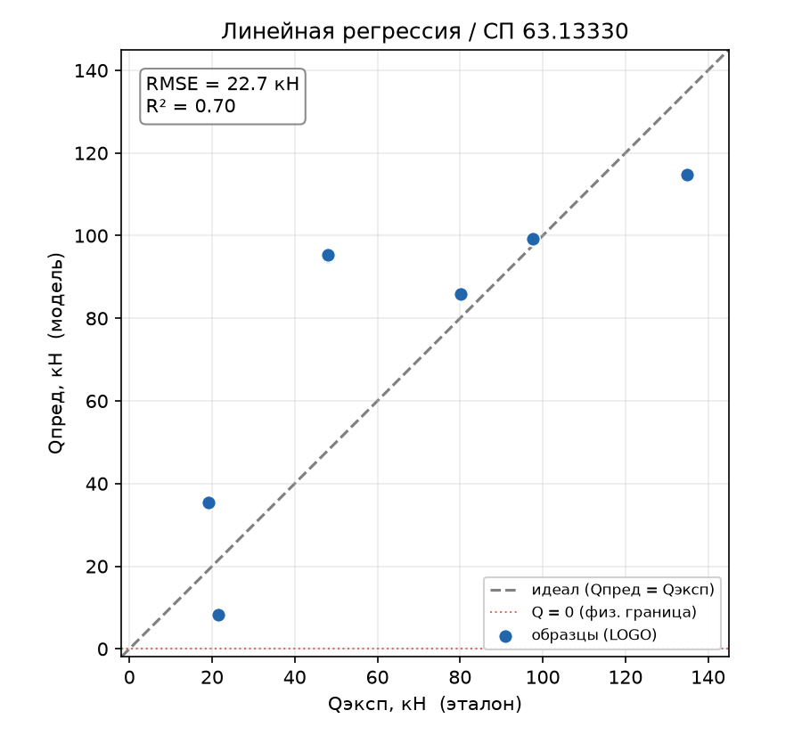
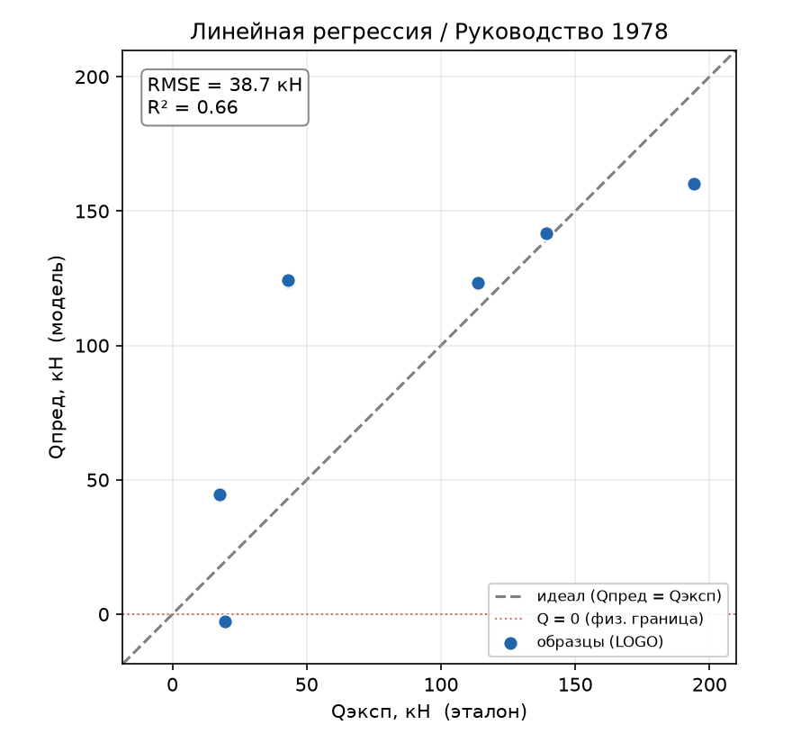
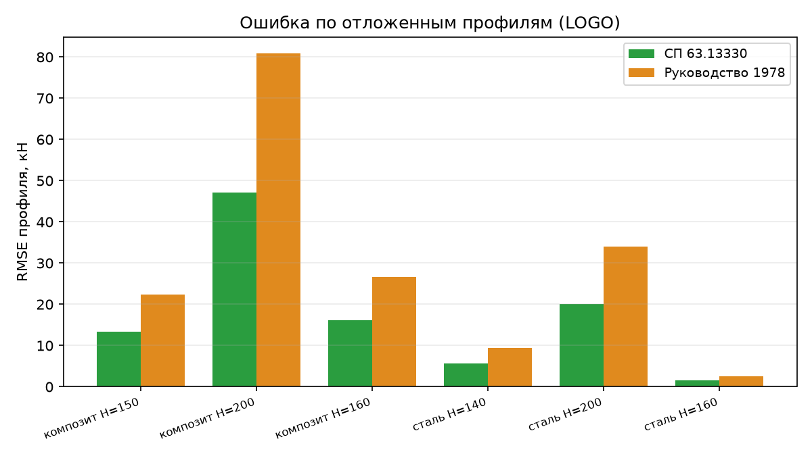

# Линейная регрессия

## 1. Метод линейной регрессии

Линейная регрессия описывает целевую величину как взвешенную сумму входных признаков плюс свободный член. Это простейшая параметрическая модель: она предполагает, что вклад двутавра $Q_\text{дв}$ линейно зависит от каждого входа.

В работе она играет роль базовой линии – планки снизу. Смысл: если сложный метод (нейросеть, символьная регрессия, GPR) не превосходит линейную модель, для данной задачи он неоправдан. Поэтому корректная оценка линейной регрессии – точка отсчёта для всех дальнейших сравнений, а её слабые места прямо указывают, какие свойства обязаны закрывать следующие методы.

## 2. Как работает

### 2.1. Модель

$$Q_\text{пред} = \beta_0 + \sum_{i=1}^{6} \beta_i \, \tilde{x}_i, \qquad \tilde{x}_i = \frac{x_i - \mu_i}{\sigma_i}$$

Входные признаки $x_i$: относительный пролёт среза `a/h₀`, тип материала `is_steel` (1 – сталь, 0 – композит), высота `H`, толщина стенки `s`, прочность `R`, модуль упругости `E`. Коэффициенты $\beta_i$ подбираются методом наименьших квадратов – минимизацией суммы квадратов отклонений на обучающих образцах:

$$\min_{\beta} \sum_k \big(Q^{(k)}_\text{эксп} - Q^{(k)}_\text{пред}\big)^2$$

### 2.2. Стандартизация

Признаки предварительно приводятся к нулевому среднему и единичному разбросу. На сами предсказания МНК это не влияет, но даёт два эффекта:

1. коэффициенты $\beta_i$ становятся сопоставимыми по модулю и пригодны как грубая мера влияния признака;
2. масштаб перестаёт мешать регуляризованным вариантам (Ridge/Lasso), которые появятся следующими.

### 2.3. Схема оценки

Обучение и проверка идут по схеме Leave-One-Group-Out по 6 геометрическим профилям: модель учится на 5 профилях и предсказывает отложенный 6-й. Каждый профиль содержит 3 образца (три значения `a/h₀`: 1.6, 2.5, 3.2), итого 18 реальных точек. Обычное train/test-разбиение неприменимо – оно завысило бы точность из-за близких образцов. Метрики считаются только по реальным образцам; синтетические участвуют лишь в обучении.

## 3. Метрики: какие есть и что показывают

| Метрика | Что означает | Идеал |
|---------|--------------|:-----:|
| $Q_\text{эксп}/Q_\text{пред}$ (среднее) | систематическое смещение: >1 – модель занижает (в запас), <1 – завышает | ≈ 1 |
| `CV` | коэффициент вариации отношения – разброс относительной точности | → 0 |
| `within15` | доля предсказаний в пределах ±15 % | → 100 % |
| `MAPE` | средняя абсолютная процентная ошибка | → 0 |
| `MAE` | средняя абсолютная ошибка, кН | → 0 |
| `MedianAE` | медианная абсолютная ошибка (устойчива к выбросам), кН | → 0 |
| `RMSE` | среднеквадратичная ошибка – штрафует крупные промахи, кН | → 0 |
| `RMSE_worst` | RMSE худшего из отложенных профилей – устойчивость в наихудшем случае | → 0 |
| `MaxError` | максимальная абсолютная ошибка, кН | → 0 |
| `pct_negative` | доля физически невозможных отрицательных предсказаний | 0 % |
| `pct_conservative` | доля предсказаний «в запас» ($Q_\text{пред} \le Q_\text{эксп}$) | – |
| `R²` | доля объяснённой дисперсии на отложенных профилях (LOGO) | → 1 |
| `R²_train` | то же на обучающих данных | → 1 |
| `overfit` | $R^2_\text{train} - R^2_\text{LOGO}$ – величина переобучения | → 0 |

## 4. Результаты

### 4.1. Основной прогон (синтез включён, 15 образцов на профиль)

| Метрика | СП 63.13330 | Руководство 1978 |
|---------|:-----------:|:----------------:|
| $Q_\text{эксп}/Q_\text{пред}$ | 1.13 | −0.56 |
| CV | 0.63 | −5.34 |
| within15 | 33 % | 33 % |
| MAPE | 44.6 % | 80.1 % |
| MAE, кН | 17.3 | 29.3 |
| RMSE, кН | 22.7 | 38.7 |
| RMSE_worst, кН | 47.1 | 80.8 |
| pct_negative | 0 % | 16.7 % |
| $R^2$ (LOGO) | 0.703 | 0.656 |
| $R^2$ (обучение) | 0.990 | 0.989 |
| overfit | 0.288 | 0.333 |

### 4.2. Что показывает метод

СП 63.13330 – приемлемая базовая линия. $R^2 = 0.70$, RMSE ≈ 22.7 кН, ни одного отрицательного предсказания. Среднее отношение $Q_\text{эксп}/Q_\text{пред} = 1.13$ означает, что в среднем модель занижает $Q_\text{дв}$ примерно на 13 % – склонность к запасу, – но разброс велик (`CV` 0.63, лишь треть предсказаний в ±15 %). Для планки снизу это адекватно.

Руководство 1978 – линейная регрессия несостоятельна. Формальный $R^2 = 0.66$ не хуже СП63, но метрики деградируют: 16.7 % предсказаний отрицательны (модель предсказывает отрицательный вклад двутавра – физически невозможно). Из-за отрицательных $Q_\text{пред}$ среднее отношение уходит в минус (−0.56), а `CV` теряет смысл. Цель РУК78 требует более гибкой модели и/или явного ограничения $Q \ge 0$.

### 4.3. Графики

Диаграмма «эксперимент – предсказание» (scatter). По горизонтали – эталонное значение $Q_\text{эксп}$ из исходной таблицы, по вертикали – предсказание модели $Q_\text{пред}$, полученное когда данный профиль был отложен (LOGO).

- Синие точки – отдельные образцы балок. Каждая видимая точка – это фактически три совпавших образца (три значения `a/h₀`), поскольку $Q_\text{дв}$ от `a/h₀` не зависит; поэтому на графике 6 точек, а не 18.
- Серая пунктирная линия – линия идеала $Q_\text{пред} = Q_\text{эксп}$. Точка на линии = безошибочное предсказание. Чем дальше точка от линии по вертикали, тем больше ошибка: выше линии – модель завышает, ниже – занижает.
- Красный пунктир $Q = 0$ – физическая граница: вклад двутавра не может быть отрицательным. Точки ниже неё физически невозможны.
- RMSE в рамке – среднеквадратичная ошибка: корень из среднего квадрата вертикальных отклонений точек от линии идеала, в кН. По сути – «типичный» промах предсказания; чем плотнее облако точек к пунктиру, тем меньше RMSE.

*Рисунок 1 – Диаграмма эксперимент–предсказание, СП 63.13330*

На СП63 точки лежат близко к линии идеала, ни одна не опускается ниже нуля – облако компактное, RMSE = 22.7 кН.

*Рисунок 2 – Диаграмма эксперимент–предсказание, Руководство 1978*

На РУК78 картина хуже: облако шире (RMSE = 38.7 кН), а один образец (малый композитный профиль) проваливается ниже красной линии $Q = 0$ – это и есть физически невозможное отрицательное предсказание, из-за которого ломается метрика $Q_\text{эксп}/Q_\text{пред}$.

Столбчатая диаграмма RMSE по профилям. Показывает, на каком из 6 отложенных профилей ошибка максимальна (высота столбца – RMSE этого профиля, в кН).

*Рисунок 3 – RMSE по отложенным профилям*

Хорошо видно, что стальные профили предсказываются точно (низкие столбцы), а вся крупная ошибка – на композитных, с максимумом на крайнем профиле H=200 (широкая экстраполяция по высоте).

## 5. Поведение метода

### 5.1. Коэффициенты и важность признаков

Стандартизованные коэффициенты (подгонка на 18 реальных образцах), по убыванию модуля:

| Признак | СП63 | РУК78 |
|---------|:----:|:-----:|
| `H` – высота двутавра | +20.1 | +30.4 |
| `is_steel` – тип материала | +12.3 | +19.0 |
| `R` – прочность | +12.3 | +19.0 |
| `E` – модуль упругости | +12.3 | +19.0 |
| `s` – толщина стенки | −3.3 | −11.9 |
| `a/h₀` – пролёт среза | ≈ 0 | ≈ 0 |
| свободный член $\beta_0$ | 66.9 | 87.9 |

1. Высота `H` доминирует на обеих целях – физически ожидаемо: вклад двутавра растёт с его высотой.
2. `is_steel`, `R`, `E` имеют строго одинаковые коэффициенты – прямой признак мультиколлинеарности. В выборке всего два типа материала, и каждый жёстко задаёт свои `R` и `E`; поэтому три формально разных признака несут одну и ту же информацию (по сути один бинарный признак материала). Треть признакового пространства избыточна.
3. `a/h₀` получает нулевой вес – потому что в данных он не влияет на $Q_\text{дв}$. Значение вклада двутавра одинаково для всех трёх значений `a/h₀` каждой геометрии (например, композит H=150 → $Q_\text{дв}$ = 21.6 кН при `a/h₀` = 1.6, 2.5 и 3.2). Физически это осмысленно: пролёт среза влияет на полную несущую способность балки, но не на собственный вклад двутавра. Линейная модель корректно обнулила иррелевантный для данной цели признак. Прямое следствие: 18 образцов сводятся к 6 уникальным целевым точкам (6 геометрий × 3 повтора по `a/h₀`) – эффективный объём выборки ещё меньше, чем кажется.

### 5.2. Разбор наблюдений

RMSE и среднее отношение по каждому отложенному профилю (синтез 15):

| Профиль | СП63 RMSE | СП63 ratio | РУК78 RMSE | РУК78 ratio |
|---------|:---------:|:----------:|:----------:|:-----------:|
| Сталь, H=160 | 1.5 | 0.99 | 2.5 | 0.98 |
| Сталь, H=140 | 5.6 | 0.93 | 9.5 | 0.92 |
| Сталь, H=200 | 20.1 | 1.18 | 34.0 | 1.21 |
| Композит, H=150 | 13.4 | 2.63 | 22.3 | −7.24 |
| Композит, H=160 | 16.2 | 0.54 | 26.7 | 0.40 |
| Композит, H=200 | 47.1 | 0.50 | 80.8 | 0.35 |

Два устойчивых наблюдения:

- Стальные профили предсказываются хорошо (RMSE мал, отношение ≈ 1), а вся крупная ошибка сосредоточена на композитных. Линейная модель плохо переносит материал с иной жёсткостью.
- Худший профиль – композит H=200 (RMSE 47 / 81 кН), крайняя точка по высоте: при её изъятии модель вынуждена экстраполировать за пределы обучающего диапазона `H`, а поскольку `H` – доминирующий фактор, промах максимален.
- Отрицательные предсказания РУК78 идут от композита H=150 (отношение −7.24) – наименьшего профиля: линейная экстраполяция уводит $Q_\text{пред}$ ниже нуля.

### 5.3. Переобучение на малой выборке

На обеих целях $R^2$ на обучении ≈ 0.99 против 0.66–0.70 на LOGO (overfit 0.29–0.33). При 6 признаках и всего 6 профилях модель близка к переопределённой: почти идеально подгоняется под обучение, но заметно теряет на отложенном профиле. Это ещё один довод в пользу регуляризации и сокращения размерности.

## 6. Численные эксперименты

Чтобы отделить свойства метода от случайностей конкретного прогона, выполнено три серии экспериментов.

### 6.1. Эффект синтеза данных

| | СП63 $R^2$ | СП63 RMSE | РУК78 $R^2$ | РУК78 RMSE |
|---|:---:|:---:|:---:|:---:|
| без синтеза (18 реальных) | 0.639 | 25.04 | 0.598 | 41.86 |
| с синтезом (15/профиль) | 0.703 | 22.72 | 0.656 | 38.71 |

Синтез даёт заметный прирост на обеих целях (рост $R^2$, снижение RMSE), не меняя качественной картины (РУК78 остаётся несостоятельной). Это подтверждает заложенный в ТЗ смысл синтеза – повышение устойчивости за счёт регуляризующего шума.

### 6.2. Влияние объёма синтеза

$R^2$ / RMSE в зависимости от числа синтетических образцов на профиль:

| Образцов/профиль | СП63 $R^2$ | СП63 RMSE | РУК78 $R^2$ | РУК78 RMSE |
|:---:|:---:|:---:|:---:|:---:|
| 0 | 0.639 | 25.04 | 0.598 | 41.86 |
| 5 | 0.700 | 22.83 | 0.652 | 38.96 |
| 15 | 0.703 | 22.72 | 0.656 | 38.71 |
| 30 | 0.695 | 23.01 | 0.646 | 39.28 |
| 50 | 0.705 | 22.64 | 0.656 | 38.71 |
| 100 | 0.713 | 22.32 | 0.665 | 38.23 |

Эффект насыщается быстро: почти весь выигрыш достигается уже при 5 образцах на профиль, дальше кривая выходит на плато (незначительный рост к 100). Значит синтез работает как регуляризатор, а не как источник новой информации – что согласуется с оговоркой ТЗ: синтез не заполняет пробелы между профилями. Значение по умолчанию (15) лежит на плато и выбрано разумно.

### 6.3. Устойчивость к случайности синтеза

Синтез стохастичен, поэтому важно проверить, не является ли выигрыш артефактом одного удачного зерна. Прогон на 30 различных значениях `SEED` (синтез 15):

| Цель | $R^2$ (среднее ± σ) | диапазон $R^2$ | RMSE (среднее ± σ) |
|------|:-------------------:|:--------------:|:------------------:|
| СП63 | 0.709 ± 0.010 | 0.693 … 0.732 | 22.47 ± 0.41 |
| РУК78 | 0.661 ± 0.010 | 0.644 … 0.680 | 38.47 ± 0.59 |

Разброс по зерну мал (σ ≈ 0.01 по $R^2$). Прирост от синтеза (0.64 → 0.70 для СП63) на порядок превышает эту случайную вариацию – то есть улучшение статистически устойчиво, а не результат везения. Основной прогон ($R^2 = 0.703$) лежит внутри полученного распределения.

## 7. Выводы

- СП63: линейная регрессия даёт разумную базовую линию – $R^2 \approx 0.70$, RMSE ≈ 22.7 кН, смещение $Q_\text{эксп}/Q_\text{пред} \approx 1.13$ (в запас), без физически невозможных предсказаний. Это планка, которую обязаны превзойти сложные методы.
- РУК78: линейная модель непригодна – 16.7 % отрицательных предсказаний, сосредоточенных на малых композитных профилях. Валидный отрицательный результат.
- Причины установлены количественно: мультиколлинеарность материала (`is_steel`≡`R`≡`E`), иррелевантность `a/h₀` (нулевой вес), слабый перенос на композит и экстраполяцию по `H`, переобучение при 6 признаках на 6 профилях.

Диагностика прямо задаёт направление следующих методов:

| Проблема базовой линии | Ответ в следующих методах |
|------------------------|---------------------------|
| Мультиколлинеарность `is_steel`/`R`/`E` | Ridge, Lasso, ElasticNet; Lasso отберёт признаки (вероятно свернёт `R`/`E` к материалу) |
| Иррелевантный признак `a/h₀` (нулевой вес) | Lasso/ElasticNet отбросят его автоматически; для остальных целей – символьная регрессия и GPR оценят значимость признаков |
| Отрицательные предсказания на РУК78 | физически-информированные модели (PINN), ограничение $Q \ge 0$ |
| Переобучение (6 признаков / 6 профилей) | регуляризация, сокращение размерности, оценка неопределённости (GPR) |

Воспроизведение. Основной прогон: `python entrypoint/line_regression.py` (обе цели, синтез по умолчанию). Прогон без синтеза – с флагом `--no-synth`; иной объём синтеза – `--samples N`.
