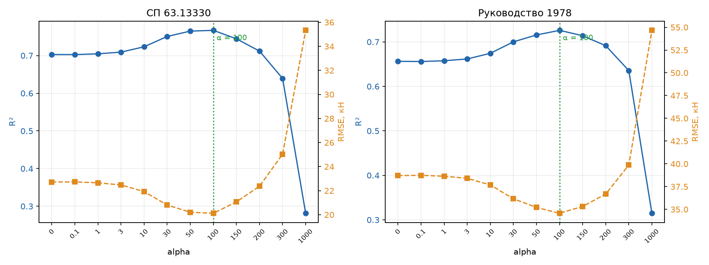
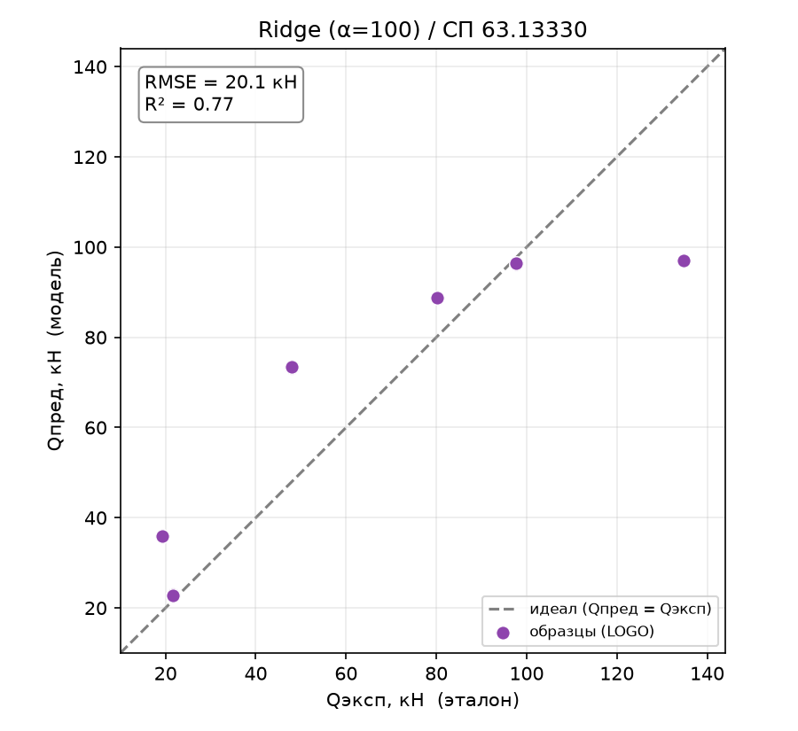
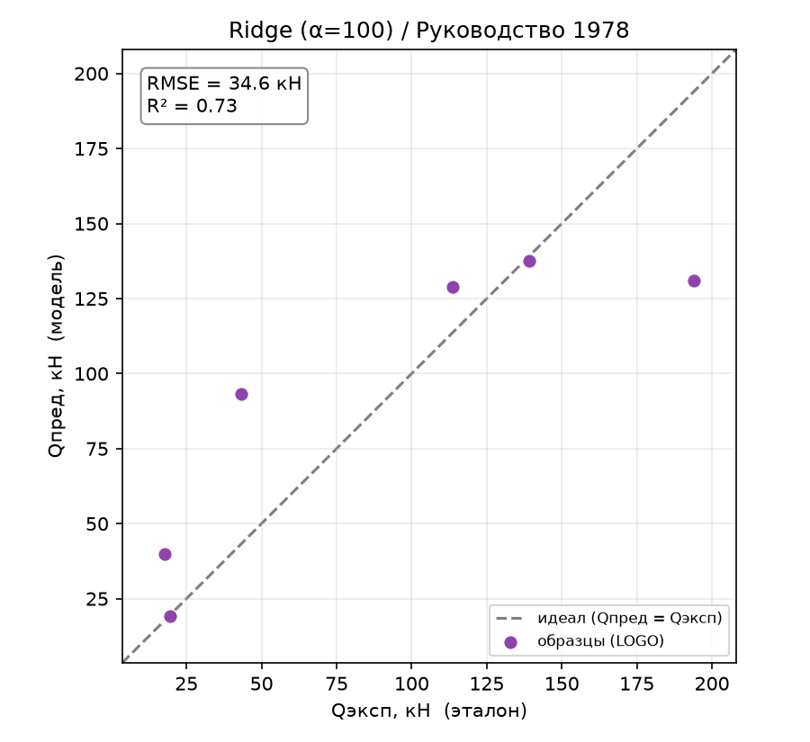
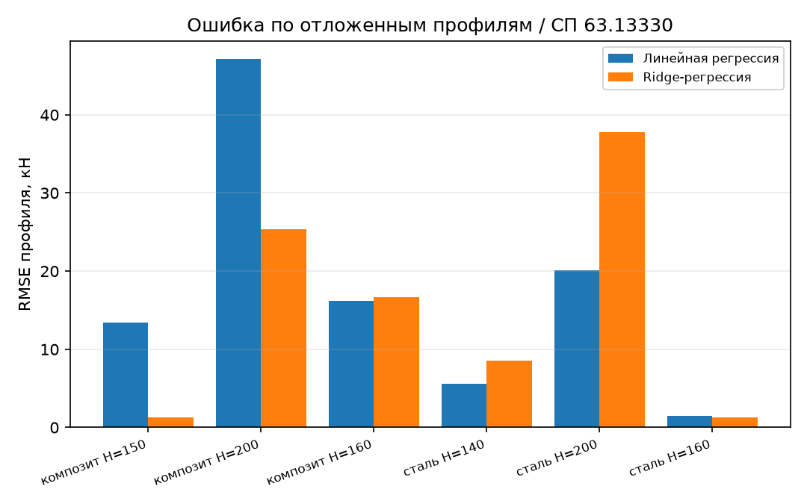
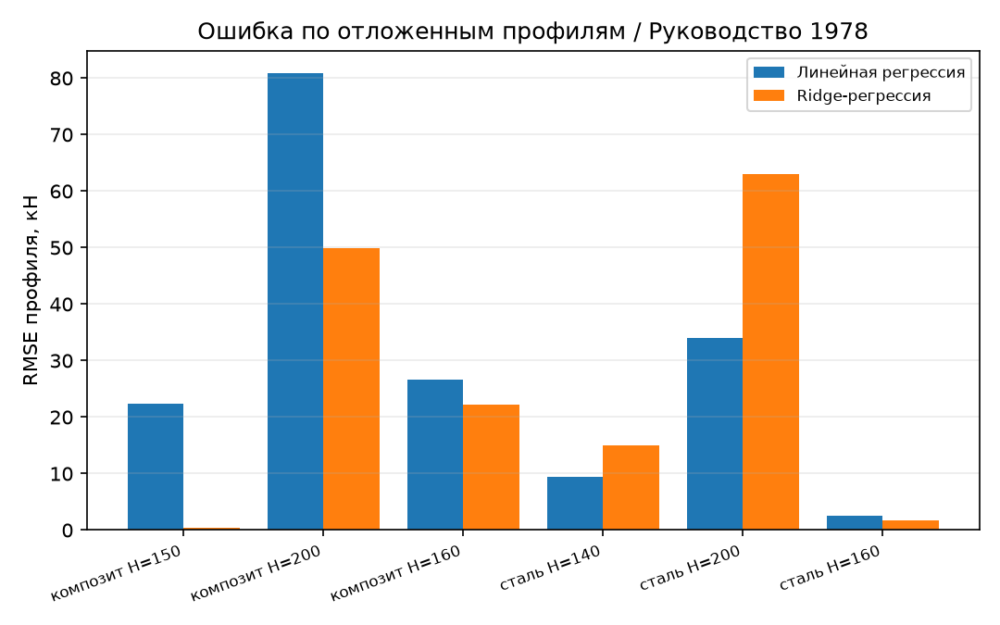

# Ridge-регрессия

## 1. Метод Ridge-регрессии

Ridge – это линейная регрессия с добавленным штрафом на величину коэффициентов
(L2-регуляризация). Модель остаётся линейной, но при обучении ей запрещают
слишком сильно увеличивать коэффициенты, что делает её устойчивее на малой выборке и при
коррелированных признаках.

В работе Ridge – прямой ответ на слабые места базовой линии: линейная регрессия
переобучалась (6 признаков на 6 профилей), страдала от мультиколлинеарности
(`is_steel`≡`R`≡`E`) и на цели РУК78 выдавала физически невозможные отрицательные
предсказания. Ridge адресует ровно эти проблемы.

## 2. Как работает

### 2.1. Модель

Коэффициенты подбираются минимизацией суммы квадратов ошибок плюс штраф за
их величину:

$$\min_{\beta} \sum_k \big(Q^{(k)}_\text{эксп} - Q^{(k)}_\text{пред}\big)^2 + \alpha \sum_{i=1}^{6} \beta_i^2$$

Второе слагаемое стягивает коэффициенты к нулю. Признаки предварительно
стандартизуются (`StandardScaler`) – без этого штраф несправедливо давил бы на
признаки с большим масштабом. Реализация – конвейер `StandardScaler → Ridge` в
[core/models/baseline/ridge.py](../core/models/baseline/ridge.py).

### 2.2. Коэффициент регуляризации alpha

$\alpha$ управляет силой штрафа. При $\alpha = 0$ Ridge вырождается в обычный МНК
(базовую линию). С ростом $\alpha$ коэффициенты сжимаются: падает разброс,
но растёт смещение (bias). Оптимум – там, где выигрыш от устойчивости ещё не перекрыт
ростом смещения. Подбор $\alpha$ – центральный вопрос метода (раздел 3).

### 2.3. Схема оценки

Та же, что для базовой линии: Leave-One-Group-Out по 6 профилям, метрики – по 18
реальным образцам, синтетические участвуют только в обучении.

## 3. Подбор alpha

Значение $\alpha$ подбиралось утилитой [tools/find_alpha.py](../tools/find_alpha.py),
которая прогоняет Ridge с сеткой $\alpha$ по той же схеме LOGO и печатает
$R^2$/RMSE по каждой цели. Ключевые точки сетки (синтез 15):

| alpha | СП63 $R^2$ | СП63 RMSE | РУК78 $R^2$ | РУК78 RMSE |
|:-----:|:----------:|:---------:|:-----------:|:----------:|
| 0 (=linear) | 0.703 | 22.72 | 0.656 | 38.71 |
| 10 | 0.723 | 21.92 | 0.674 | 37.68 |
| 50 | 0.765 | 20.21 | 0.716 | 35.22 |
| **100** | **0.767** | **20.12** | **0.726** | **34.57** |
| 150 | 0.744 | 21.07 | 0.714 | 35.32 |
| 300 | 0.639 | 25.03 | 0.636 | 39.87 |
| 1000 | 0.281 | 35.33 | 0.315 | 54.67 |

*Рисунок 1 – Подбор alpha: R² (синяя ось) и RMSE (оранжевая ось) в зависимости от alpha*

Обе цели дают чёткий максимум $R^2$ на $\alpha = 100$: плато до ~10, подъём к 100,
затем резкий развал (перерегуляризация зажимает коэффициенты в ноль). Поэтому в
модели зашито $\alpha = 100$ – одно значение на обе цели.

## 4. Результаты

### 4.1. Ridge (α=100) против базовой линии

| Метрика | модель | СП 63.13330 | Руководство 1978 |
|---------|:------:|:-----------:|:----------------:|
| $Q_\text{эксп}/Q_\text{пред}$ | linear | 1.13 | −0.56 |
| | **ridge** | **0.91** | **0.89** |
| CV | linear | 0.63 | −5.34 |
| | **ridge** | **0.30** | **0.40** |
| within15 | linear | 33 % | 33 % |
| | **ridge** | **50 %** | **50 %** |
| RMSE, кН | linear | 22.7 | 38.7 |
| | **ridge** | **20.1** | **34.6** |
| RMSE_worst, кН | linear | 47.1 | 80.8 |
| | **ridge** | **37.8** | **63.0** |
| pct_negative | linear | 0 % | 16.7 % |
| | **ridge** | **0 %** | **0 %** |
| $R^2$ (LOGO) | linear | 0.703 | 0.656 |
| | **ridge** | **0.767** | **0.726** |
| overfit | linear | 0.288 | 0.333 |
| | **ridge** | **0.199** | **0.239** |

### 4.2. Что показывает метод

Ridge превосходит базовую линию на обеих целях по всем ключевым метрикам:
$R^2$ выше, RMSE ниже, разброс `CV` примерно вдвое меньше, доля попаданий в ±15 %
выросла с трети до половины, переобучение снизилось.

Главный результат – на **Руководстве 1978**: линейная регрессия давала 16.7 %
физически невозможных отрицательных предсказаний, из-за чего метрика
$Q_\text{эксп}/Q_\text{пред}$ уходила в минус (−0.56). **Ridge полностью убрал
отрицательные предсказания** (0 %), а отношение стало осмысленным (0.89 ≈ 1).
Регуляризация подтянула экстраполяцию на малых композитных профилях обратно выше
нуля – то, чего базовая линия не могла. То есть Ridge не просто точнее, а делает
цель РУК78 принципиально пригодной для линейной модели.

На СП63 отношение сместилось с 1.13 (занижение) к 0.91 (лёгкое завышение) – по
модулю ближе к идеалу, разброс заметно уже.

### 4.3. Графики

Диаграммы «эксперимент – предсказание» (обозначения – как в отчёте по линейной
регрессии: пунктир – идеал, точки – образцы в LOGO, рамка – RMSE).

*Рисунок 2 – Ridge (α=100), эксперимент–предсказание, СП 63.13330*

*Рисунок 3 – Ridge (α=100), эксперимент–предсказание, Руководство 1978*

На РУК78 у Ridge все точки лежат выше нуля (линия $Q = 0$ даже не появляется в
области графика) – в отличие от базовой линии, где один образец проваливался в
отрицательную зону.

Сравнение ошибки по профилям, базовая линия против Ridge:

*Рисунок 4 – RMSE по профилям, линейная против Ridge, СП 63.13330*

*Рисунок 5 – RMSE по профилям, линейная против Ridge, Руководство 1978*

Видно, что Ridge резко улучшает проблемные композитные профили (особенно
крайний H=200), но ухудшает стальной H=200. Это прямое следствие регуляризации
(раздел 5.2).

## 5. Поведение метода

### 5.1. Коэффициенты: перераспределение весов

Стандартизованные коэффициенты, базовая линия против Ridge ($\alpha = 100$):

| Признак | linear (СП63) | ridge (СП63) | linear (РУК78) | ridge (РУК78) |
|---------|:-------------:|:------------:|:--------------:|:-------------:|
| `H` – высота | +20.1 | +2.6 | +30.4 | +3.3 |
| `is_steel` | +12.3 | +4.3 | +19.0 | +7.0 |
| `R` | +12.3 | +4.3 | +19.0 | +7.0 |
| `E` | +12.3 | +4.3 | +19.0 | +7.0 |
| `s` – толщина | −3.3 | −0.7 | −11.9 | −2.1 |
| `a/h₀` | ≈ 0 | ≈ 0 | ≈ 0 | ≈ 0 |

Три наблюдения:

1. **Все коэффициенты сжались** – ожидаемое действие штрафа. Сильнее всего сжалась
   доминировавшая высота `H` (у неё был самый крупный коэффициент, а штраф давит на
   большие сильнее всего).
2. **Сместился главный фактор.** У базовой линии доминировала `H`; у Ridge на первый
   план вышел материал (`is_steel`/`R`/`E` суммарно), а `H` стала вторичной. Физически
   это разумно: наибольший разброс $Q_\text{дв}$ в данных – между сталью и композитом,
   и Ridge опирается прежде всего на это различие.
3. **Мультиколлинеарность и `a/h₀` – без изменений в структуре:** тройка
   `is_steel`/`R`/`E` по-прежнему делит вес поровну (несёт одну информацию), а `a/h₀`
   остаётся иррелевантным. Ridge их не «лечит», а лишь равномерно сжимает.

### 5.2. Разбор по профилям: компромисс смещения и разброса

Пофолдовый RMSE показывает не только выигрыш, но и его цену:

- **Композитные профили – резко лучше.** Крайний композит H=200: RMSE упал с 47 до
  25 кН (СП63) и с 81 до 50 кН (РУК78); малый композит H=150 на РУК78 – практически
  идеально.
- **Стальной H=200 – хуже** (РУК78: 34 → 63 кН). Причина та же, что и улучшение:
  Ridge сжал коэффициент `H`, а стальной H=200 – это профиль с самым большим
  $Q_\text{дв}$ (до 194 кН). Сжатие `H` систематически занижает предсказание для
  самого высокого профиля.

Это классический компромисс bias/variance: регуляризация уменьшает общую ошибку и
убирает отрицательные выбросы, но ценой смещения на экстремальном по высоте профиле.

### 5.3. Переобучение

Ridge снижает переобучение на обеих целях: разрыв между обучением и LOGO сузился
(overfit 0.29 → 0.20 для СП63 и 0.33 → 0.24 для РУК78; $R^2_\text{train}$ упал с
~0.99 до ~0.97). Модель перестала почти идеально запоминать обучающую выборку и
стала более устойчивой на отложенном профиле – ровно то, ради чего вводилась
регуляризация.

## 6. Выводы

- **Ridge превосходит базовую линию на обеих целях** – выше $R^2$, ниже RMSE,
  вдвое меньше разброс, меньше переобучение. Планка, заданная линейной регрессией,
  пройдена.
- **Ключевой результат на РУК78:** Ridge убрал 16.7 % физически невозможных
  отрицательных предсказаний (0 % против базовой линии), сделав цель пригодной для
  линейной по своей природе модели.
- **Цена – смещение на экстремальном стальном профиле** (H=200), где сжатие
  коэффициента `H` систематически занижает предсказание. Это осознанный компромисс,
  а не сбой.
- **Ограничения структуры данных Ridge не устраняет:** мультиколлинеарность
  `is_steel`/`R`/`E` и иррелевантность `a/h₀` остаются – их адресуют методы отбора
  признаков (Lasso, ElasticNet) и нелинейные подходы.

Воспроизведение. Прогон: `python entrypoint/single/ridge_regression.py` (обе цели,
синтез по умолчанию, $\alpha = 100$). Подбор alpha: `python tools/find_alpha.py --plot`.
