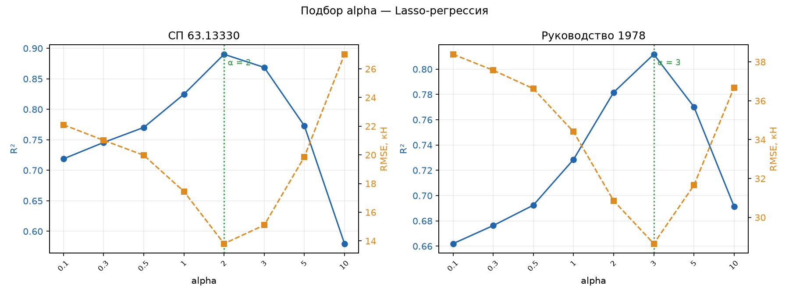
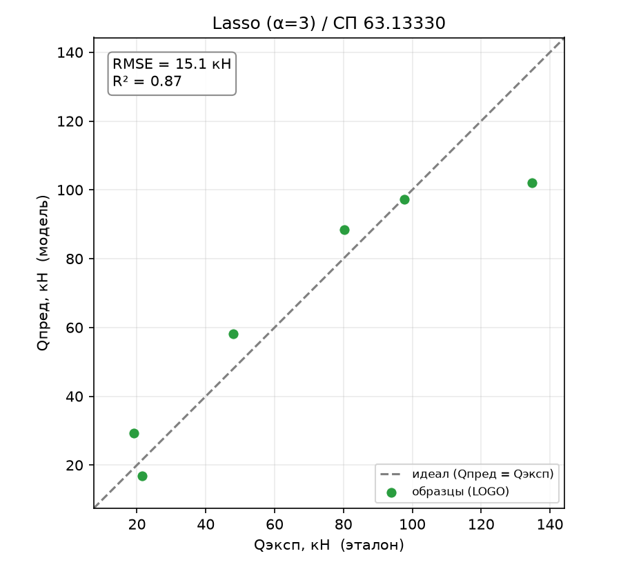
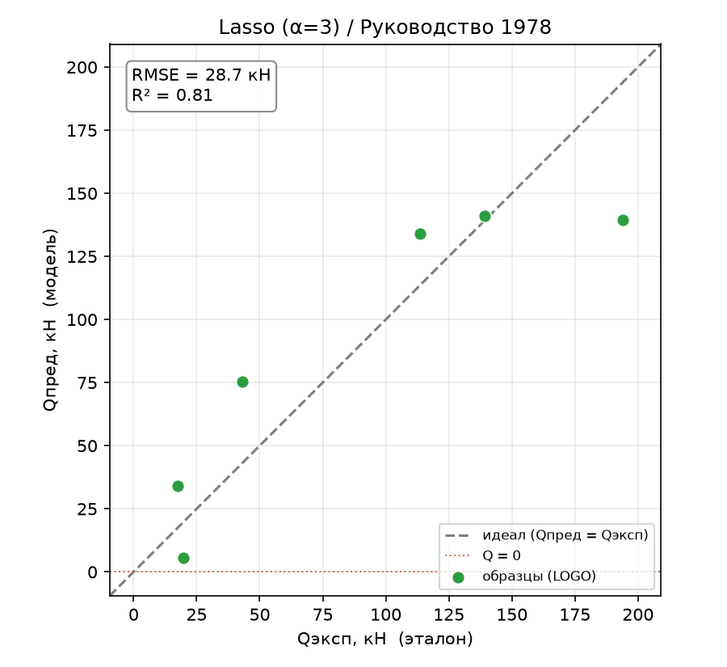
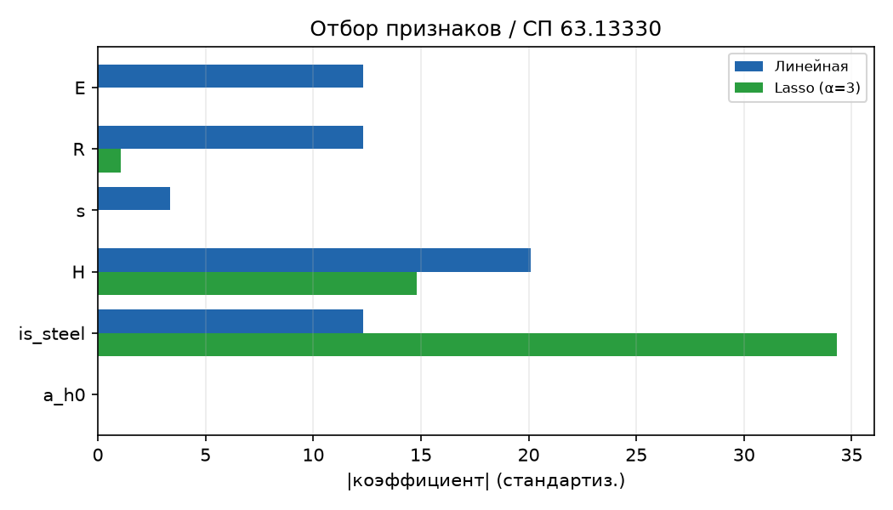
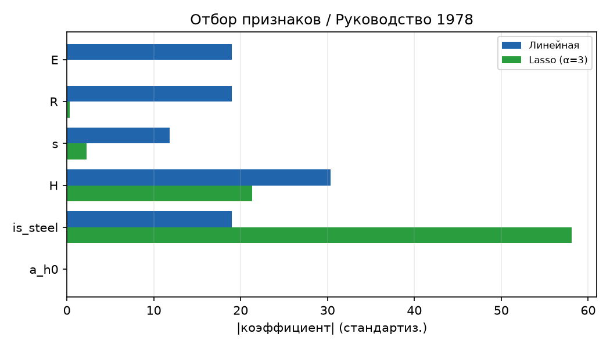
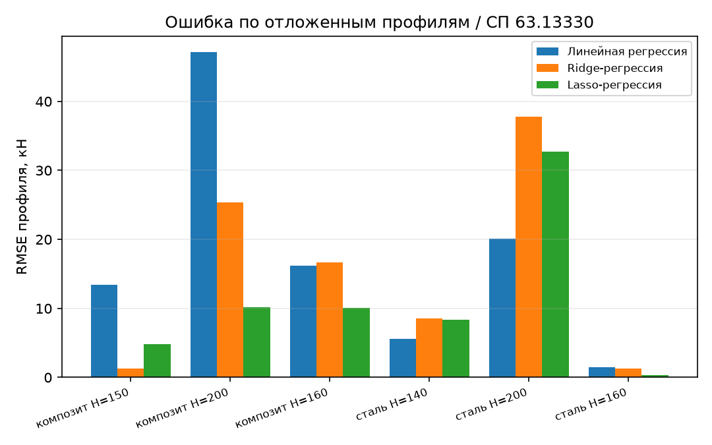
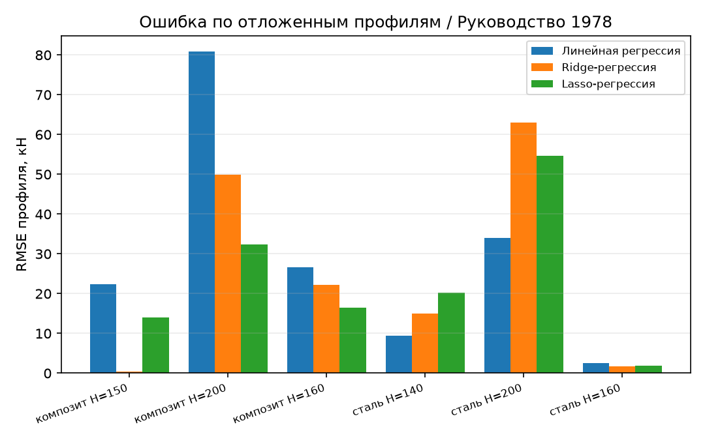

# Lasso-регрессия

## 1. Метод Lasso-регрессии

Lasso – линейная регрессия со штрафом на **сумму модулей** коэффициентов
(L1-регуляризация). Как и Ridge, она сдерживает величину коэффициентов, но за счёт
модуля вместо квадрата обладает особым свойством: часть коэффициентов она обнуляет
**полностью**, то есть выполняет автоматический **отбор признаков**.

В работе Lasso напрямую отвечает на диагноз базовой линии: мультиколлинеарность
`is_steel`≡`R`≡`E` и иррелевантность `a/h₀`. Ridge эти признаки лишь сжимал; Lasso
способен их выбросить и оставить только значимые.

## 2. Как работает

### 2.1. Модель

$$\min_{\beta} \sum_k \big(Q^{(k)}_\text{эксп} - Q^{(k)}_\text{пред}\big)^2 + \alpha \sum_{i=1}^{6} \lvert \beta_i \rvert$$

Штраф по модулю (L1) имеет «угловую» геометрию, из-за которой оптимум часто
приходится на точку, где часть $\beta_i$ строго равна нулю. Признаки предварительно
стандартизуются (`StandardScaler`). Реализация – конвейер `StandardScaler → Lasso`
в [core/models/baseline/lasso.py](../core/models/baseline/lasso.py).

### 2.2. Коэффициент регуляризации alpha

$\alpha$ управляет силой штрафа. При малых $\alpha$ Lasso близок к обычному МНК; с
ростом $\alpha$ коэффициенты не только сжимаются, но и **по одному обнуляются** –
чем больше $\alpha$, тем меньше признаков остаётся в модели. Оптимум ищется по той
же схеме, что для Ridge.

### 2.3. Схема оценки

Та же: Leave-One-Group-Out по 6 профилям, метрики – по 18 реальным образцам,
синтетические участвуют только в обучении.

## 3. Подбор alpha

$\alpha$ подбиралась той же утилитой [tools/find_alpha.py](../tools/find_alpha.py)
(`--model lasso`); для Lasso она дополнительно печатает число оставшихся ненулевыми
признаков. Ключевые точки (синтез 15):

| alpha | СП63 $R^2$ | РУК78 $R^2$ | признаков (СП63) |
|:-----:|:----------:|:-----------:|:----------------:|
| 0.1 | 0.719 | 0.662 | 5 |
| 0.5 | 0.770 | 0.692 | 4 |
| 1 | 0.825 | 0.729 | 3 |
| 2 | 0.890 | 0.782 | 3 |
| **3** | **0.869** | **0.812** | **3** |
| 5 | 0.773 | 0.770 | 3 |
| 10 | 0.580 | 0.691 | 3 |

*Рисунок 1 – Подбор alpha для Lasso: R² (синяя ось) и RMSE (оранжевая ось)*

Пики целей слегка разошлись: СП63 максимален при $\alpha = 2$ ($R^2 = 0.890$),
РУК78 – при $\alpha = 3$ ($R^2 = 0.812$). В модель зашито **$\alpha = 3$** как
компромисс: это оптимум для РУК78, а для СП63 значение near-optimal (0.869 против
пика 0.890). Как и для Ridge, действует оговорка: $\alpha$ выбрана по тому же LOGO,
что идёт в метрики (слегка оптимистично); строгую цифру дал бы вложенный подбор.

## 4. Результаты

### 4.1. Три базовых метода

| Метрика | linear | ridge | **lasso** |
|---------|:------:|:-----:|:---------:|
| **СП 63.13330** | | | |
| RMSE, кН | 22.7 | 20.1 | **15.1** |
| $R^2$ (LOGO) | 0.703 | 0.767 | **0.869** |
| $Q_\text{эксп}/Q_\text{пред}$ | 1.13 | 0.91 | **1.00** |
| CV | 0.63 | 0.30 | **0.24** |
| overfit | 0.288 | 0.199 | **0.109** |
| pct_negative | 0 % | 0 % | 0 % |
| **Руководство 1978** | | | |
| RMSE, кН | 38.7 | 34.6 | **28.7** |
| $R^2$ (LOGO) | 0.656 | 0.726 | **0.812** |
| $Q_\text{эксп}/Q_\text{пред}$ | −0.56 | **0.89** | 1.31 |
| CV | −5.34 | **0.40** | 0.80 |
| overfit | 0.333 | 0.239 | **0.166** |
| pct_negative | 16.7 % | 0 % | 0 % |

### 4.2. Что показывает метод

По метрикам (RMSE, $R^2$) **Lasso – лучший из трёх базовых методов**
на обеих целях, и с самым низким переобучением. На СП63 он также идеально
откалиброван: $Q_\text{эксп}/Q_\text{пред} = 1.00$, то есть в среднем без
систематического смещения.

### 4.3. Графики

*Рисунок 2 – Lasso (α=3), эксперимент–предсказание, СП 63.13330*

*Рисунок 3 – Lasso (α=3), эксперимент–предсказание, Руководство 1978*

На СП63 облако точек заметно плотнее к линии идеала, чем у линейной и гребневой
(RMSE 15.1 кН). Отрицательных предсказаний нет ни на одной цели.

## 5. Поведение метода

### 5.1. Отбор признаков

Главное свойство Lasso. Стандартизованные коэффициенты при $\alpha = 3$ (обучение на
18 реальных образцах):

| Признак | linear | **lasso** |
|---------|:------:|:---------:|
| `is_steel` | 12.3 | **34.3** |
| `H` | 20.1 | **14.8** |
| `R` | 12.3 | 1.1 |
| `s` | −3.3 | **0** |
| `E` | 12.3 | **0** |
| `a/h₀` | ≈ 0 | **0** |

*Рисунок 4 – Отбор признаков (|коэффициенты|), линейная против Lasso, СП 63.13330*

*Рисунок 5 – Отбор признаков (|коэффициенты|), линейная против Lasso, Руководство 1978*

Lasso автоматически воспроизвёл диагноз, полученный вручную в предыдущих отчётах:

1. **`a/h₀` занулён** – иррелевантный признак выброшен.
2. **Мультиколлинеарная тройка свёрнута к материалу.** Из `is_steel`/`R`/`E` Lasso
   оставил `is_steel` (собрав в него почти весь вес: 34.3 против 12.3 у линейной),
   `E` занулил полностью, `R` оставил незначимым (1.1). Три коррелированных признака
   схлопнулись фактически в один.
3. **Ядро модели – `is_steel` + `H`.** На СП63 остаётся 3 признака, на РУК78 – 4
   (там дополнительно удерживается `s`). Модель стала проще и интерпретируемее без
   потери, а с ростом качества.

### 5.2. Разбор по профилям

Сравнение всех трёх методов по отложенным профилям:

*Рисунок 6 – RMSE по профилям: линейная, Ridge, Lasso, СП 63.13330*

*Рисунок 7 – RMSE по профилям: линейная, Ridge, Lasso, Руководство 1978*

Прослеживается общий прогресс linear → ridge → lasso: композитные профили
улучшаются от метода к методу (крайний композит H=200 на РУК78: 81 → 50 → 32 кН).
Сохраняется знакомый компромисс: на стальном H=200 регуляризованные модели уступают
линейной – сжатие/отбор признаков занижает предсказание для самого высокого профиля.
Но в целом худший профиль у Lasso ниже, чем у Ridge и линейной (RMSE_worst 32.7
против 37.8 и 47.1 на СП63).

### 5.3. Переобучение

У Lasso самый маленький разрыв обучение/LOGO из трёх методов (overfit 0.109 на СП63
и 0.166 на РУК78 против 0.29 и 0.33 у линейной). Отбор признаков напрямую снижает
сложность модели, поэтому она меньше переобучается – при том что точность на
отложенном профиле, наоборот, выросла.

## 6. Выводы

- **Lasso – лучшая из трёх базовых линий** по RMSE и $R^2$ на обеих целях, с самым
  низким переобучением. Планка для сложных методов поднята заметно выше.
- **Автоматический отбор признаков подтвердил ручной диагноз:** Lasso занулил `E`
  (избыточный из-за мультиколлинеарности) и `a/h₀` (иррелевантный), собрав сигнал
  материала в `is_steel`. Ядро зависимости – `is_steel` и `H`.
- **Компромисс сохраняется:** как и Ridge, Lasso занижает экстремальный стальной
  профиль H=200 (цена сжатия `H`); на РУК78 он лучше по RMSE, но по инженерной
  калибровке ($Q_\text{эксп}/Q_\text{пред}$) уступает Ridge.
- **Итог по базовым линиям:** три метода дали согласованную картину – зависимость
  определяется материалом и высотой, `a/h₀` не влияет, данных мало (6 профилей),
  а лучшее качество линейного класса – $R^2 \approx 0.87$ (СП63). Это ориентир для
  следующих, нелинейных методов.

Воспроизведение. Прогон: `python entrypoint/single/lasso_regression.py` (обе цели,
синтез по умолчанию, $\alpha = 3$). Подбор alpha: `python tools/find_alpha.py --model lasso --plot`.
