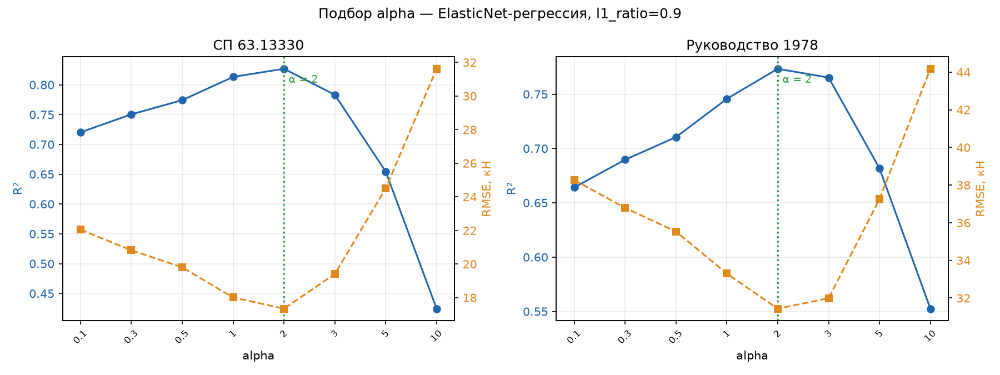
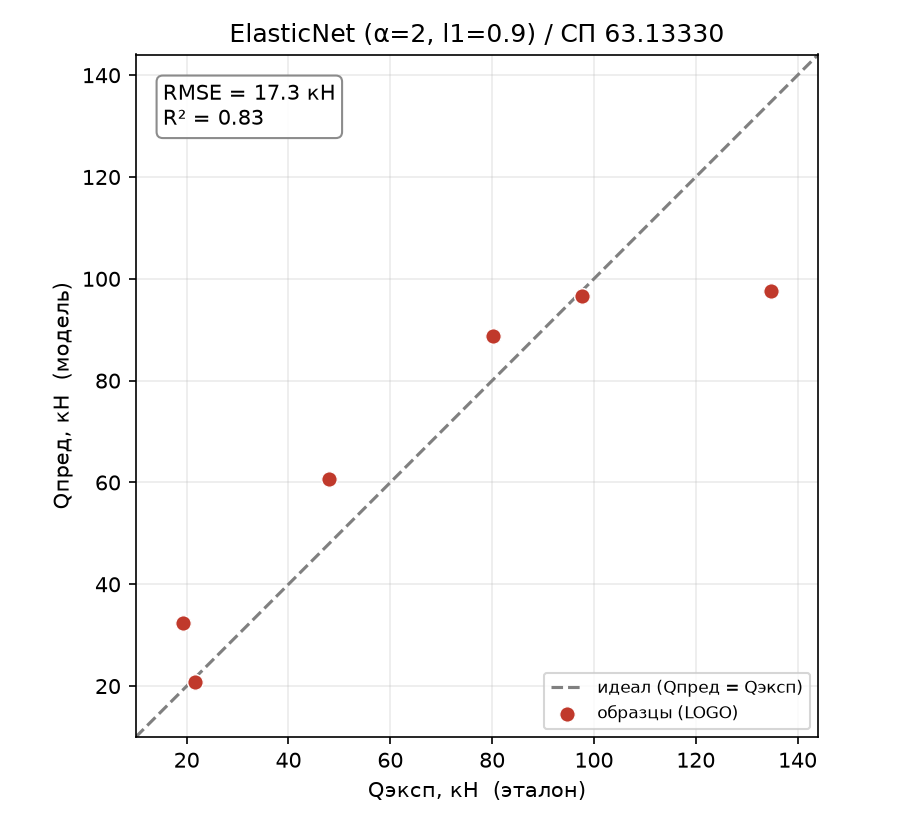
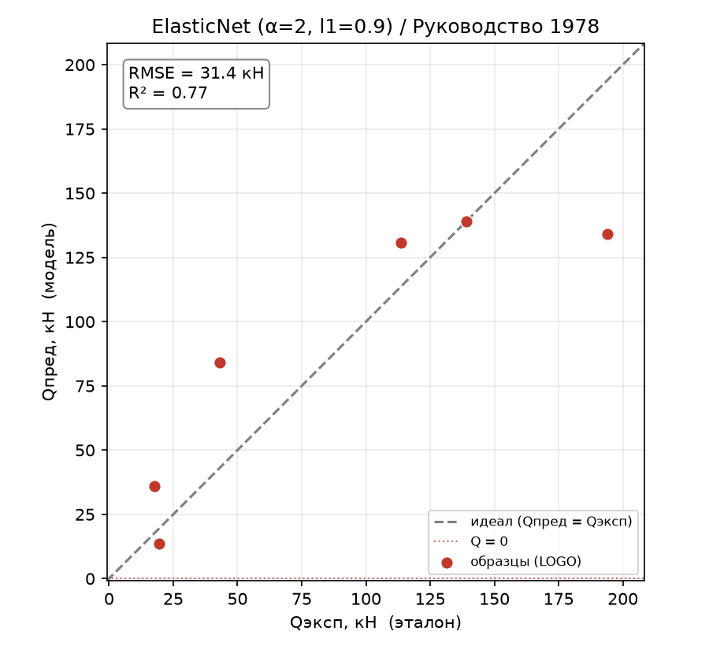
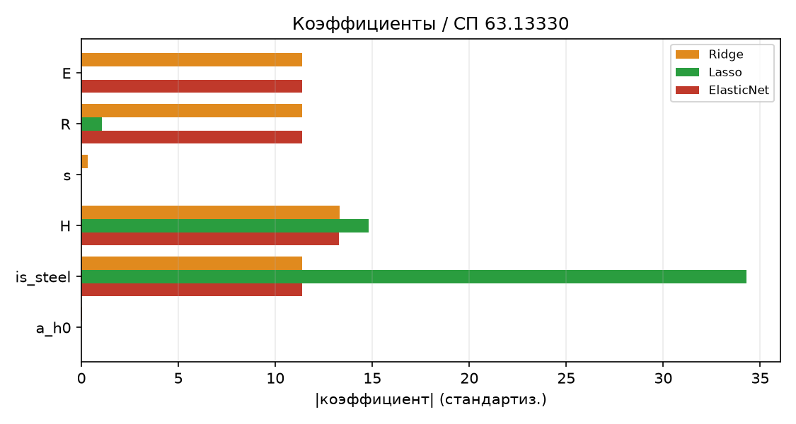
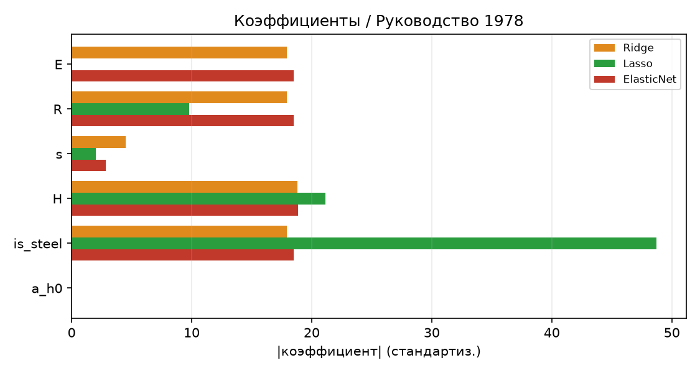
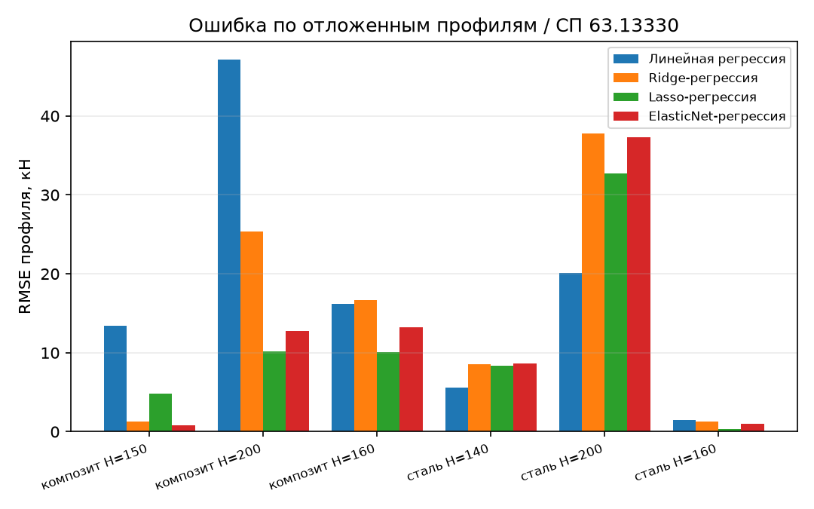
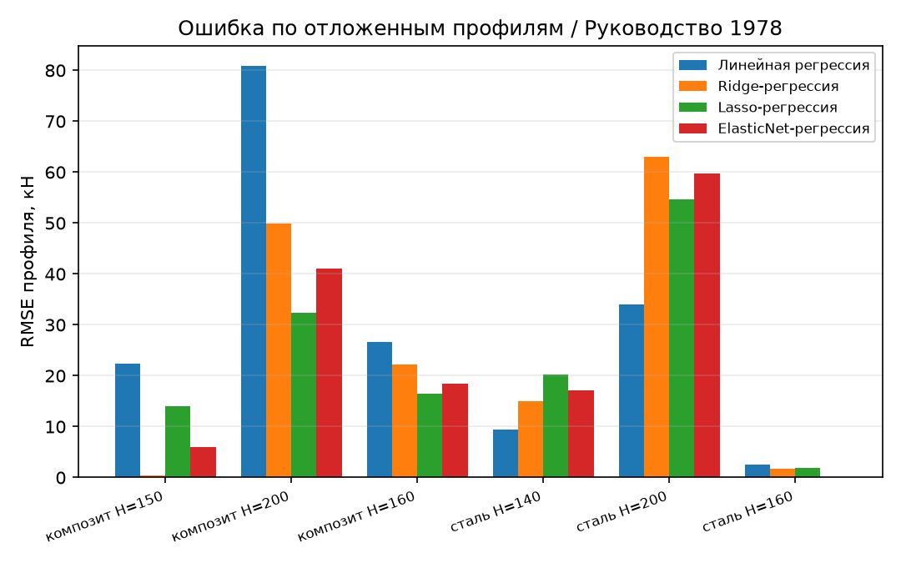

# ElasticNet-регрессия

Отчёт по четвёртому методу из ТЗ – ElasticNet, комбинации L1- и L2-регуляризации.
Структура и метрики те же, что в предыдущих отчётах; акцент – на том, что даёт
смешанный штраф по сравнению с чистыми Ridge и Lasso. Определения метрик и схема
оценки описаны в [report_01_linear_regression.md](report_01_linear_regression.md).

## 1. Метод ElasticNet-регрессии

ElasticNet – линейная регрессия с **двумя** штрафами одновременно: L1 (как у Lasso,
обнуляет признаки) и L2 (как у Ridge, сжимает и удерживает коррелированные признаки
вместе). Баланс между ними задаётся параметром `l1_ratio`. Метод занимает
промежуточное положение и призван совместить сильные стороны обоих: разреженность
Lasso и устойчивость Ridge к мультиколлинеарности.

В работе ElasticNet проверяет гипотезу: не даст ли смесь L1/L2 лучший компромисс,
чем крайние Ridge и Lasso, — и заодно демонстрирует **эффект группировки**
коррелированных признаков.

## 2. Как работает

### 2.1. Модель

К сумме квадратов ошибок добавляется смешанный штраф:

$$\min_{\beta} \sum_k \big(Q^{(k)}_\text{эксп} - Q^{(k)}_\text{пред}\big)^2 + \alpha \Big( \rho \sum_i \lvert \beta_i \rvert + \tfrac{1-\rho}{2} \sum_i \beta_i^2 \Big)$$

где $\rho$ – это `l1_ratio`. При $\rho = 1$ ElasticNet вырождается в Lasso, при
$\rho = 0$ – в Ridge. Признаки стандартизуются (`StandardScaler`). Реализация –
конвейер `StandardScaler → ElasticNet` в
[core/models/baseline/elastic_net.py](../core/models/baseline/elastic_net.py).

### 2.2. Гиперпараметры

Их два: `alpha` (общая сила штрафа) и `l1_ratio` (доля L1 в смеси). Оба подбираются
по той же схеме LOGO. В модель зашито `l1_ratio = 0.9` и `alpha = 2` (обоснование –
раздел 3).

### 2.3. Схема оценки

Та же: Leave-One-Group-Out по 6 профилям, метрики – по 18 реальным образцам,
синтетические участвуют только в обучении.

## 3. Подбор alpha и l1_ratio

**Сначала `l1_ratio`.** При балансе 0.5 (поровну L1/L2) ElasticNet держится на
уровне Ridge; сдвиг к L1 подтягивает его к Lasso:

| l1_ratio | СП63 $R^2$ | РУК78 $R^2$ | положение |
|:--------:|:----------:|:-----------:|-----------|
| 0.5 | 0.780 | 0.730 | ≈ Ridge |
| **0.9** | **0.827** | **0.773** | между Ridge и Lasso |
| 1.0 (=Lasso) | 0.869 | 0.812 | Lasso |

Взято `l1_ratio = 0.9` – это осмысленный «средний» режим: заметно лучше Ridge, с
сохранением эффекта группировки (см. раздел 5.1), но не выродившийся в чистый Lasso.

**Затем `alpha`** при фиксированном `l1_ratio = 0.9` (утилита
[tools/find_alpha.py](../tools/find_alpha.py) `--model elasticnet --l1-ratio 0.9`):

| alpha | СП63 $R^2$ | РУК78 $R^2$ | признаков (СП63) |
|:-----:|:----------:|:-----------:|:----------------:|
| 0.1 | 0.720 | 0.664 | 5 |
| 0.5 | 0.774 | 0.710 | 5 |
| 1 | 0.813 | 0.746 | 4 |
| **2** | **0.827** | **0.773** | **4** |
| 3 | 0.783 | 0.765 | 4 |
| 5 | 0.654 | 0.682 | 4 |

*Рисунок 1 – Подбор alpha для ElasticNet (l1_ratio=0.9): R² и RMSE по LOGO*

Обе цели максимальны при `alpha = 2` – одно значение. Оговорка та же, что для
Ridge/Lasso: подбор по LOGO слегка оптимистичен, строгую цифру дал бы вложенный
подбор.

## 4. Результаты

### 4.1. Четыре базовых метода

| Метрика | linear | ridge | lasso | **elasticnet** |
|---------|:------:|:-----:|:-----:|:--------------:|
| **СП 63.13330** | | | | |
| RMSE, кН | 22.7 | 20.1 | **15.1** | 17.3 |
| $R^2$ (LOGO) | 0.703 | 0.767 | **0.869** | 0.827 |
| $Q_\text{эксп}/Q_\text{пред}$ | 1.13 | 0.91 | 1.00 | 0.95 |
| overfit | 0.288 | 0.199 | **0.109** | 0.139 |
| pct_negative | 0 % | 0 % | 0 % | 0 % |
| **Руководство 1978** | | | | |
| RMSE, кН | 38.7 | 34.6 | **28.7** | 31.4 |
| $R^2$ (LOGO) | 0.656 | 0.726 | **0.812** | 0.773 |
| $Q_\text{эксп}/Q_\text{пред}$ | −0.56 | 0.89 | 1.31 | **0.96** |
| overfit | 0.333 | 0.239 | **0.166** | 0.195 |
| pct_negative | 16.7 % | 0 % | 0 % | 0 % |

### 4.2. Что показывает метод

ElasticNet устойчиво занимает **промежуток между Ridge и Lasso** по $R^2$ и RMSE на
обеих целях – как и ожидается от смеси. По чистой точности он уступает Lasso: на
этих данных задача выигрывает от агрессивного отбора, а L2-компонента его чуть
разбавляет.

Но по одной метрике ElasticNet **лучший на РУК78** – это калибровка
$Q_\text{эксп}/Q_\text{пред} = 0.96$ (почти идеал) против 1.31 у Lasso (заметное
занижение) и 0.89 у Ridge. То есть смесь даёт наименьшее систематическое смещение
там, где Lasso «перегнул». Отрицательных предсказаний нет ни на одной цели.

### 4.3. Графики

*Рисунок 2 – ElasticNet (α=2, l1=0.9), эксперимент–предсказание, СП 63.13330*

*Рисунок 3 – ElasticNet (α=2, l1=0.9), эксперимент–предсказание, Руководство 1978*

## 5. Поведение метода

### 5.1. Эффект группировки

Главная особенность ElasticNet. Стандартизованные коэффициенты трёх
регуляризованных методов:

*Рисунок 4 – Стандартизованные |коэффициенты|: Ridge, Lasso, ElasticNet, СП 63.13330*

*Рисунок 5 – Стандартизованные |коэффициенты|: Ridge, Lasso, ElasticNet, Руководство 1978*

Видно три разных стратегии на коррелированной тройке `is_steel`/`R`/`E`:

- **Ridge** размазывает вес поровну по всем трём (~11.4 каждый), но не убирает
  ничего лишнего;
- **Lasso** схлопывает тройку в один `is_steel` (34.3), произвольно выбросив `R`
  и `E`;
- **ElasticNet** удерживает тройку **вместе** (~11.4 каждый, как Ridge), но при
  этом зануляет иррелевантные `s` и `a/h₀` (как Lasso).

Это и есть **эффект группировки**: L2-компонента заставляет коррелированные признаки
получать близкие коэффициенты и отбираться группой, а не «по одному произвольному»,
как у Lasso. Практический плюс – более устойчивый и физически честный отбор:
ElasticNet не делает вид, что `R` и `E` не важны, а признаёт всю группу материала
значимой.

### 5.2. Разбор по профилям

Сравнение всех четырёх методов по отложенным профилям:

*Рисунок 6 – RMSE по профилям: линейная, Ridge, Lasso, ElasticNet, СП 63.13330*

*Рисунок 7 – RMSE по профилям: линейная, Ridge, Lasso, ElasticNet, Руководство 1978*

Картина знакомая: регуляризованные методы (включая ElasticNet) сильно улучшают
композитные профили, но занижают экстремальный стальной H=200. ElasticNet по
профилям идёт близко к Lasso, чуть уступая ему.

### 5.3. Переобучение

Разрыв обучение/LOGO у ElasticNet (overfit 0.139 на СП63 и 0.195 на РУК78) лежит
между Lasso (0.109/0.166) и Ridge (0.199/0.239) – ровно как и всё остальное.
Смешанный штраф даёт промежуточную сложность модели.

## 6. Выводы

- **ElasticNet – закономерная «середина»** между Ridge и Lasso по точности,
  переобучению и сложности; параметр `l1_ratio` позволяет плавно двигаться между
  ними.
- **Эффект группировки – его отличительная черта:** ElasticNet удерживает
  коррелированную тройку `is_steel`/`R`/`E` вместе и одновременно выбрасывает
  иррелевантные `s`, `a/h₀`. Это более устойчивый отбор, чем произвольный выбор
  одного признака у Lasso.
- **Лучшая калибровка на РУК78** ($Q_\text{эксп}/Q_\text{пред} = 0.96$) – там, где
  Lasso занижает, а Ridge завышает, смесь оказывается ближе всего к единице.
- **Но по чистому $R^2$/RMSE на этих данных Lasso всё же впереди:** задача любит
  разреженность, и наилучший линейный результат остаётся за Lasso ($R^2 \approx 0.87$).
  ElasticNet ценен как более устойчивая и интерпретируемая альтернатива, а не как
  рекордсмен точности.

Воспроизведение. Прогон: `python entrypoint/single/elastic_net_regression.py`
(обе цели, синтез по умолчанию, $\alpha = 2$, $l1\_ratio = 0.9$). Подбор:
`python tools/find_alpha.py --model elasticnet --l1-ratio 0.9 --plot`.
