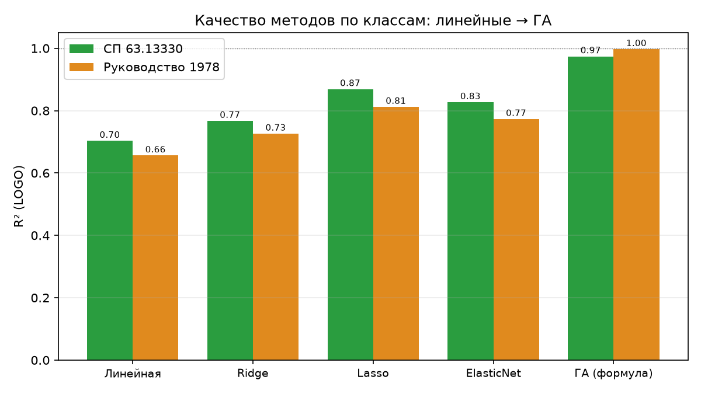
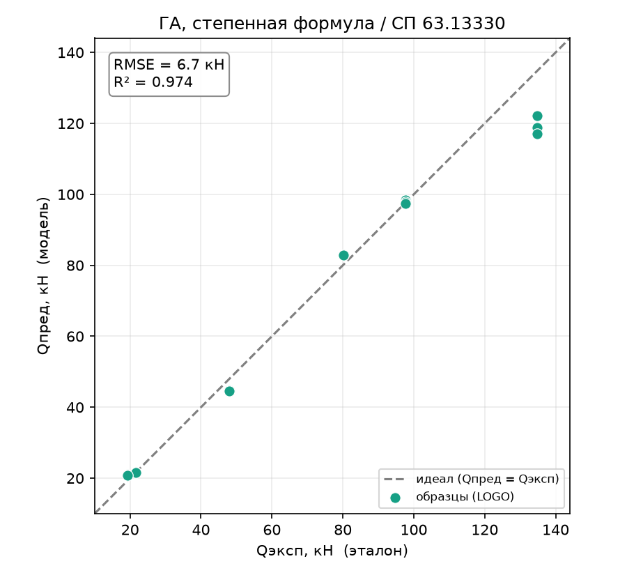
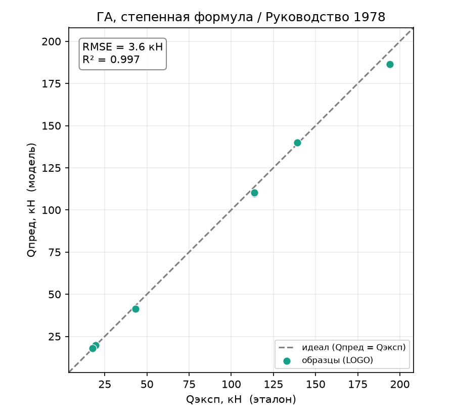

# Генетический алгоритм: подбор степенной формулы

Отчёт по первому биоинспирированному методу и первому методу вывода **явной
формулы**. В отличие от линейных методов, которые лишь оценивают коэффициенты
фиксированной линейной модели, здесь ищется параметрическая **степенная** формула, а
её коэффициенты подбирает генетический алгоритм (ГА). Это прямая современная замена
ручного подбора степенной формулы из методики диссертации. Определения метрик и
схема оценки — в [report_01_linear_regression.md](report_01_linear_regression.md).

## 1. Метод

Ищется формула вида

$$Q_\text{дв} = a \cdot \prod_i x_i^{\,p_i}$$

— произведение признаков в степенях. Коэффициент $a$ и показатели $p_i$ подбираются
не аналитически, а **генетическим алгоритмом**: популяция «особей» (наборов
параметров) эволюционирует под давлением отбора к меньшей ошибке. По ТЗ это ядро
новизны — автоматизированная замена ручного подбора степенной зависимости.

Архитектурно метод разделён на **форму** (степенная) и **оптимизатор** (ГА): они
независимы, поэтому позже к той же форме легко подключить другие оптимизаторы (DE,
PSO, CMA-ES) для их сравнения — как требует ТЗ.

## 2. Как работает

### 2.1. Форма и линеаризация

Степенная форма логарифмируется и становится линейной по параметрам:

$$\ln Q = \ln a + \sum_i p_i \ln x_i,$$

поэтому целевая функция — среднеквадратичная ошибка в лог-пространстве. Логарифм
требует $x_i > 0$, поэтому используются только строго положительные признаки. Бинарный
`is_steel` (нули у композита) **выпадает** — но информация о материале сохраняется
через `R` и `E`, которые у стали и композита резко различаются.

### 2.2. Оптимизатор

Вещественный ГА: инициализация популяции в границах параметров, затем поколения из
**турнирной селекции**, **элитизма** (лучшие переходят без изменений), **BLX-α
кроссовера** и **гауссовой мутации** с затухающей амплитудой (широкий поиск в начале,
уточнение в конце). Гиперпараметры — размер популяции и число поколений (раздел 3).

### 2.3. Схема оценки

Та же Leave-One-Group-Out по 6 профилям, метрики — по 18 реальным образцам. ГА
стохастичен, поэтому зависит от зерна ГПСЧ (для прогона зафиксировано `SEED = 1337`).

## 3. Подбор гиперпараметров

Число поколений и размер популяции подбирались утилитой
[tools/tune_optimizer.py](../tools/tune_optimizer.py) (`--optimizer ga`). Решающий фактор — **число поколений**: ГА
должен успеть сойтись. При фиксированном `pop = 150`:

| поколений | СП63 $R^2$ | РУК78 $R^2$ |
|:---------:|:----------:|:-----------:|
| 100 | 0.965 | 0.171 |
| 300 | 0.821 | 0.569 |
| 600 | 0.959 | 0.941 |
| 1000 | 0.947 | 0.886 |
| **2000** | **0.974** | **0.997** |

В модель зашито `pop = 150, generations = 2000`.

**Важная оговорка (честно).** При одном зерне кривая **немонотонна** (например, СП63:
100 → 0.965, 300 → 0.821) — это не сходимость в классическом смысле, а разброс из-за
стохастики: при разных зёрнах ГА попадает в разные бассейны. Поэтому `pop = 150`
предпочтён `pop = 80` (крупная популяция устойчивее), а число поколений взято с
запасом. Как и для линейных методов, подбор по LOGO слегка оптимистичен.

**Проверка устойчивости.** Усреднение по 3 зёрнам при `pop = 150, generations = 2000`
даёт $R^2 = 0.954$ (СП63) и $0.996$ (РУК78) против одиночных 0.974 / 0.997. То есть
результат **устойчив**: даже усреднённый, он далеко превосходит лучший линейный метод
(0.87 / 0.81) — рекорд не является везением одного зерна.

## 4. Результаты

### 4.1. Все методы вместе

| Метрика | linear | ridge | lasso | elasticnet | **ГА** |
|---------|:------:|:-----:|:-----:|:----------:|:------:|
| **СП 63.13330** | | | | | |
| RMSE, кН | 22.7 | 20.1 | 15.1 | 17.3 | **6.7** |
| $R^2$ (LOGO) | 0.703 | 0.767 | 0.869 | 0.827 | **0.974** |
| $Q_\text{эксп}/Q_\text{пред}$ | 1.13 | 0.91 | 1.00 | 0.95 | **1.02** |
| within15 | 33 % | 50 % | 33 % | 50 % | **94 %** |
| overfit | 0.288 | 0.199 | 0.109 | 0.139 | **0.025** |
| **Руководство 1978** | | | | | |
| RMSE, кН | 38.7 | 34.6 | 28.7 | 31.4 | **3.6** |
| $R^2$ (LOGO) | 0.656 | 0.726 | 0.812 | 0.773 | **0.997** |
| $Q_\text{эксп}/Q_\text{пред}$ | −0.56 | 0.89 | 1.31 | 0.96 | **1.02** |
| within15 | 33 % | 50 % | 17 % | 33 % | **100 %** |
| overfit | 0.333 | 0.239 | 0.166 | 0.195 | **0.003** |

*Рисунок 1 – Качество методов: линейный класс → ГА со степенной формулой*

### 4.2. Что показывает метод

**ГА-формула — безоговорочно лучший метод** на обеих целях, с огромным отрывом:
RMSE в 2–8 раз ниже лучшего линейного, $R^2 \approx 0.97$–$0.997$, попадание в ±15 %
почти стопроцентное, отношение $Q_\text{эксп}/Q_\text{пред} \approx 1.0$.

Особенно показателен **overfit ≈ 0** (0.025 и 0.003 против 0.11–0.33 у остальных):
модель почти не переобучается. Причина принципиальная — **степенная форма это
«правильная» структура** для данной задачи: целевые величины сами являются выходами
инженерных формул, близких к степенным, поэтому малопараметрическая степенная модель
воспроизводит их почти точно и без потери на отложенном профиле. Там, где линейные
методы боролись с нелинейностью, символьная форма её просто содержит.

### 4.3. Графики

*Рисунок 2 – ГА (степенная формула), эксперимент–предсказание, СП 63.13330*

*Рисунок 3 – ГА (степенная формула), эксперимент–предсказание, Руководство 1978*

Точки практически лежат на линии идеала — качественно иная картина по сравнению с
линейными методами.

## 5. Поведение метода

### 5.1. Восстановленные формулы и их неоднозначность

Полученные степенные формулы (обучение на полной выборке):

- **СП63:** $Q_\text{дв} = 2.1{\cdot}10^{-9} \cdot H^{0.92} \cdot s^{1.04} \cdot R^{-0.11} \cdot E^{1.54}$ (показатель при `a/h₀` ≈ 0)
- **РУК78:** $Q_\text{дв} = 3.1{\cdot}10^{-9} \cdot H^{1.09} \cdot s^{0.92} \cdot R^{0.21} \cdot E^{1.34}$

Два наблюдения:

1. **`a/h₀` снова получает нулевой показатель** — независимое, уже четвёртое
   подтверждение, что пролёт среза не влияет на $Q_\text{дв}$.
2. **Показатели при `R` и `E` не идентифицируемы.** Из-за мультиколлинеарности
   (`R` и `E` жёстко связаны с материалом) их степени взаимозаменяемы: другой прогон
   ГА даёт, например, `R^{1.39}·E^{-1.06}` с почти тем же качеством. То есть **предсказания
   устойчивы, а конкретные показатели при `R`/`E` — нет**; читать их как физические
   коэффициенты нельзя. Устойчивы показатели при `H` (≈ 1) и `s` (≈ 1).

### 5.2. Разбор по профилям

Пофолдовый RMSE ГА (кН): худший профиль — по-прежнему стальной H=200 (15.6 на СП63,
7.9 на РУК78), но это **в разы ниже**, чем у линейных методов (у Lasso там 32.7 / 54.7).
Компромисс «регуляризация занижает экстремальный профиль», мучивший линейный класс,
у степенной формулы практически снят: она хорошо описывает и крайние профили.

### 5.3. Переобучение

$R^2$ на обучении и на LOGO почти совпадают (overfit 0.025 и 0.003). Малое число
параметров степенной формы (5–6 показателей) и её физическая адекватность дают
модель, которая обобщается на отложенный профиль почти без потерь — лучший результат
из всех методов.

## 6. Выводы

- **ГА со степенной формулой — лучший метод из рассмотренных** ($R^2$ до 0.997,
  RMSE до 3.6 кН, overfit ≈ 0). Он выполняет главную задачу ТЗ — **автоматический
  вывод явной инженерной формулы**, и делает это точнее ручного линейного класса.
- **Почему так хорошо:** цель — сама по себе формула, близкая к степенной, поэтому
  малопараметрическая символьная форма её воспроизводит; отсюда и near-zero overfit.
- **Ограничения (честно):**
  - метод **стохастический и вычислительно дорогой** (2000 поколений × популяция ×
    фолды); нужен достаточный бюджет и проверка устойчивости по зёрнам;
  - **формула не единственна:** показатели при коллинеарных `R`/`E` не
    идентифицируемы — интерпретировать можно лишь устойчивые `H`, `s` и общий вид;
  - `is_steel` в степенную форму не входит (логарифм), материал заходит через `R`/`E`.
- **Направление дальше по ТЗ:** к той же степенной форме подключить и сравнить другие
  биоинспирированные оптимизаторы (дифференциальная эволюция, PSO, CMA-ES) —
  архитектура к этому готова.

Воспроизведение. Прогон: `python entrypoint/single/genetic_algorithm.py` (обе цели,
$pop = 150$, $generations = 2000$, `SEED = 1337`). Подбор гиперпараметров:
`python tools/tune_optimizer.py --optimizer ga --grid pop_size=150 generations=2000 --repeats 3`.
