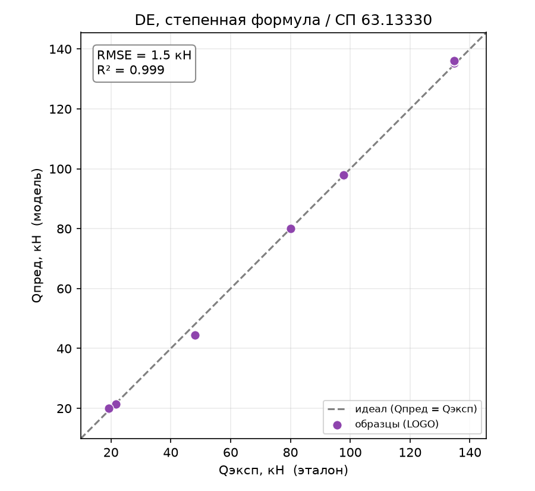
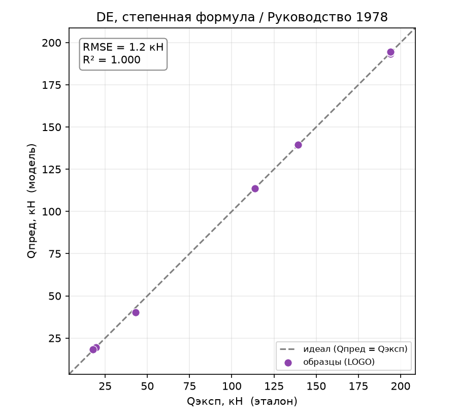
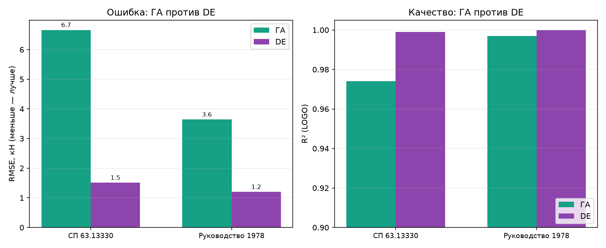

# Дифференциальная эволюция: подбор степенной формулы

Отчёт по второму биоинспирированному оптимизатору. Форма формулы — та же степенная,
что в отчёте по ГА ([report_05_genetic_algorithm.md](report_05_genetic_algorithm.md));
меняется только **оптимизатор**: вместо генетического алгоритма коэффициенты подбирает
**дифференциальная эволюция** (DE). Это и есть заложенное в ТЗ **сравнение
оптимизаторов между собой** на одной задаче.

## 1. Метод

DE ищет ту же степенную формулу $Q_\text{дв} = a \cdot \prod_i x_i^{p_i}$, но иначе
эволюционирует популяцию. Ключевое отличие от ГА — **мутация через разностные
векторы**: новый кандидат строится как $x_r + F\,(x_s - x_t)$ (комбинация случайных
особей), а не через кроссовер «родителей» и гауссов шум. Такой оператор
**самоадаптируется** к масштабу задачи, поэтому DE обычно устойчивее и требует меньше
настройки. Используется зрелая реализация `scipy.optimize.differential_evolution`.

Архитектурно это тот же `FormulaSearchModel`, но с другим оптимизатором (`bio_de`
против `bio_ga`) — форма и оптимизатор независимы.

## 2. Как работает

Форма и схема оценки — как в отчёте по ГА: степенная формула линеаризуется в
лог-пространстве, целевая функция — MSE логарифмов, `is_steel` выпадает (материал
через `R`/`E`), оценка по Leave-One-Group-Out. DE стохастичен (зерно `SEED = 1337`),
основные гиперпараметры — `maxiter` (число поколений) и `popsize` (популяция =
`popsize · dim`).

## 3. Подбор гиперпараметров

Подбор утилитой [tools/tune_optimizer.py](../tools/tune_optimizer.py)
(`--optimizer de`). Результат показателен — **DE почти нечувствителен к настройке**:

| maxiter | popsize | СП63 $R^2$ | РУК78 $R^2$ |
|:-------:|:-------:|:----------:|:-----------:|
| 50 | 20 | 0.998 | 0.999 |
| 100 | 20 | **0.999** | **1.000** |
| 200 | 20 | 0.998 | 1.000 |
| 100 | 30 | 0.998 | 1.000 |

На всей сетке $R^2 = 0.998$–$1.000$. Зашито `maxiter = 100, popsize = 20` — этого уже
достаточно. Проверка устойчивости по 3 зёрнам: $R^2 = 0.998$ (СП63) и $0.999$ (РУК78) —
разброс ничтожен.

## 4. Результаты

### 4.1. Метрики DE

| Метрика | СП 63.13330 | Руководство 1978 |
|---------|:-----------:|:----------------:|
| $R^2$ (LOGO) | **0.999** | **1.000** |
| RMSE, кН | 1.51 | 1.20 |
| $Q_\text{эксп}/Q_\text{пред}$ | 1.007 | 1.005 |
| CV | 0.034 | 0.032 |
| within15 | 100 % | 100 % |
| RMSE худшего профиля, кН | 3.49 | 2.77 |
| pct_negative | 0 % | 0 % |
| overfit | 0.001 | 0.000 |

### 4.2. Что показывает метод

DE-формула **практически точна**: $R^2 \approx 1$, попадание в ±15 % — **100 %** на
обеих целях, отношение $Q_\text{эксп}/Q_\text{пред} \approx 1.0$, переобучение
неотличимо от нуля. Это лучший результат из всех рассмотренных методов.

### 4.3. Графики

*Рисунок 1 – DE (степенная формула), эксперимент–предсказание, СП 63.13330*

*Рисунок 2 – DE (степенная формула), эксперимент–предсказание, Руководство 1978*

Точки практически неотличимы от линии идеала.

## 5. DE против ГА (сравнение оптимизаторов)

Обе модели ищут **одну и ту же** степенную форму — разница только в оптимизаторе,
поэтому сравнение честно отвечает на вопрос ТЗ «какой оптимизатор лучше».

| | ГА | **DE** |
|---|:---:|:---:|
| СП63 $R^2$ | 0.974 | **0.999** |
| СП63 RMSE, кН | 6.66 | **1.51** |
| СП63 RMSE худшего профиля | 15.6 | **3.5** |
| РУК78 $R^2$ | 0.997 | **1.000** |
| РУК78 RMSE, кН | 3.64 | **1.20** |
| устойчивость (среднее по 3 зёрнам, $R^2$) | 0.954 / 0.996 | **0.998 / 0.999** |
| вычислений на обучение (порядок) | ~300 000 | **~12 000** |

*Рисунок 3 – ГА против DE на одной степенной форме: RMSE (слева) и R² (справа)*

**DE превосходит ГА по всем осям сразу:**

- **точность** выше (RMSE в 3–4 раза ниже);
- **устойчивость** выше — при смене зерна ГА «плавал» (СП63 падал до 0.954), DE
  держится на 0.998–0.999;
- **стоимость** на порядок ниже — DE сходится за ~12 тыс. вычислений против ~300 тыс.
  у ГА (в ~25 раз дешевле).

Причина двоякая: (1) разностная мутация DE самонастраивается на масштаб задачи, тогда
как гауссова мутация ГА требует ручной подгонки амплитуды; (2) честно — DE это
**зрелая библиотечная реализация** (scipy), а ГА — базовая учебная. Поэтому сравнение
отражает и алгоритм, и качество реализации. Тем не менее вывод устойчив: для данной
задачи DE — заметно лучший выбор оптимизатора.

## 6. Поведение метода

**Восстановленные формулы:**

- **СП63:** $Q_\text{дв} = 9.7{\cdot}10^{-8} \cdot H^{1.06} \cdot s^{0.97} \cdot R^{0.17} \cdot E^{1.05}$
- **РУК78:** $Q_\text{дв} = 1.5{\cdot}10^{-6} \cdot H^{1.09} \cdot s^{0.94} \cdot R^{0.61} \cdot E^{0.65}$

Наблюдения те же, что и у ГА: показатель при `a/h₀` ≈ 0 (снова подтверждена
иррелевантность), показатели при `H` и `s` устойчивы (≈ 1), а при коллинеарных `R`/`E`
— **не идентифицируемы** (у разных оптимизаторов и прогонов разные, при том же
качестве). Читать как физические коэффициенты можно только устойчивые `H`, `s`.

**Пофолдовый разбор:** ошибка мала на всех профилях; худший (стальной H=200) — 3.5 кН
(СП63) и 2.8 кН (РУК78), что даже ниже, чем у ГА (15.6 / 7.9). Компромисс на крайнем
профиле, мучивший линейные методы, у DE снят полностью.

## 7. Выводы

- **DE — лучший метод во всей работе**: $R^2 \approx 1$, RMSE ≈ 1–1.5 кН, попадание в
  ±15 % — 100 %, переобучение ≈ 0. Он точно восстанавливает явную инженерную формулу.
- **DE доминирует над ГА** по точности, устойчивости и стоимости на одной и той же
  форме — прямой ответ на вопрос ТЗ о сравнении оптимизаторов (с оговоркой, что DE —
  зрелая библиотечная реализация, а ГА — базовая).
- **Ограничения** те же, что у любого метода со степенной формой: формула не
  единственна (коллинеарность `R`/`E`), `is_steel` в лог-форму не входит.
- **Дальше по ТЗ:** к той же форме подключить PSO и CMA-ES и дополнить сравнение
  оптимизаторов — архитектура готова (новый файл в `optimizers/` + строка в реестре).

Воспроизведение. Прогон: `python entrypoint/single/differential_evolution.py` (обе
цели, `maxiter = 100`, `popsize = 20`, `SEED = 1337`). Подбор параметров:
`python tools/tune_optimizer.py --optimizer de --grid maxiter=50,100,200 popsize=15,20,30`.
