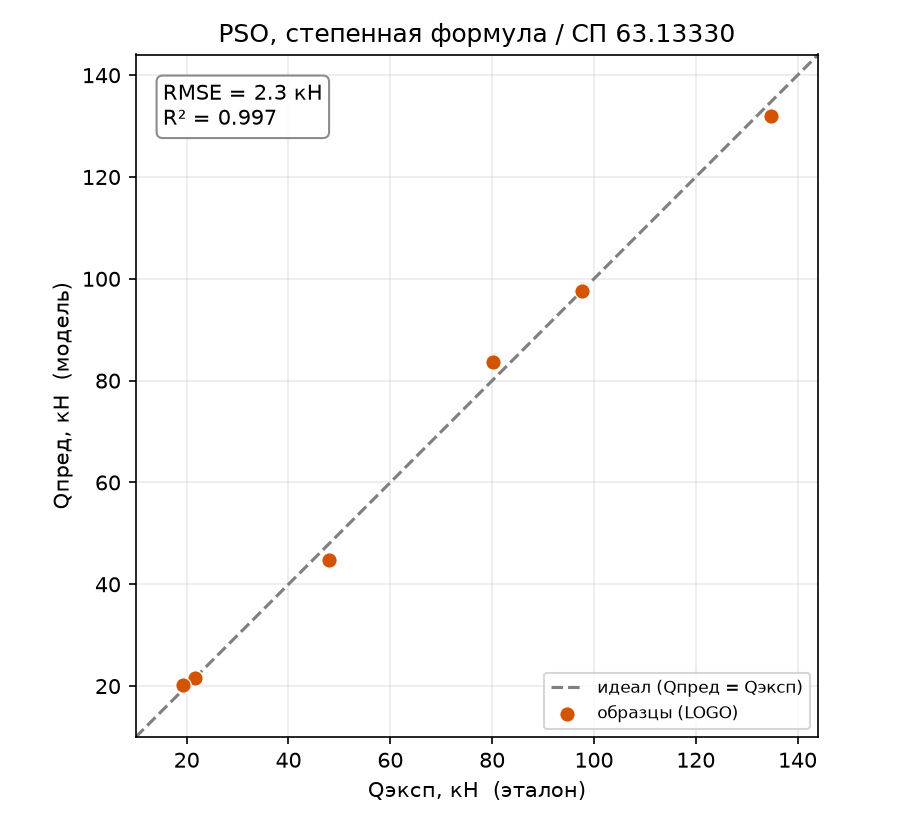
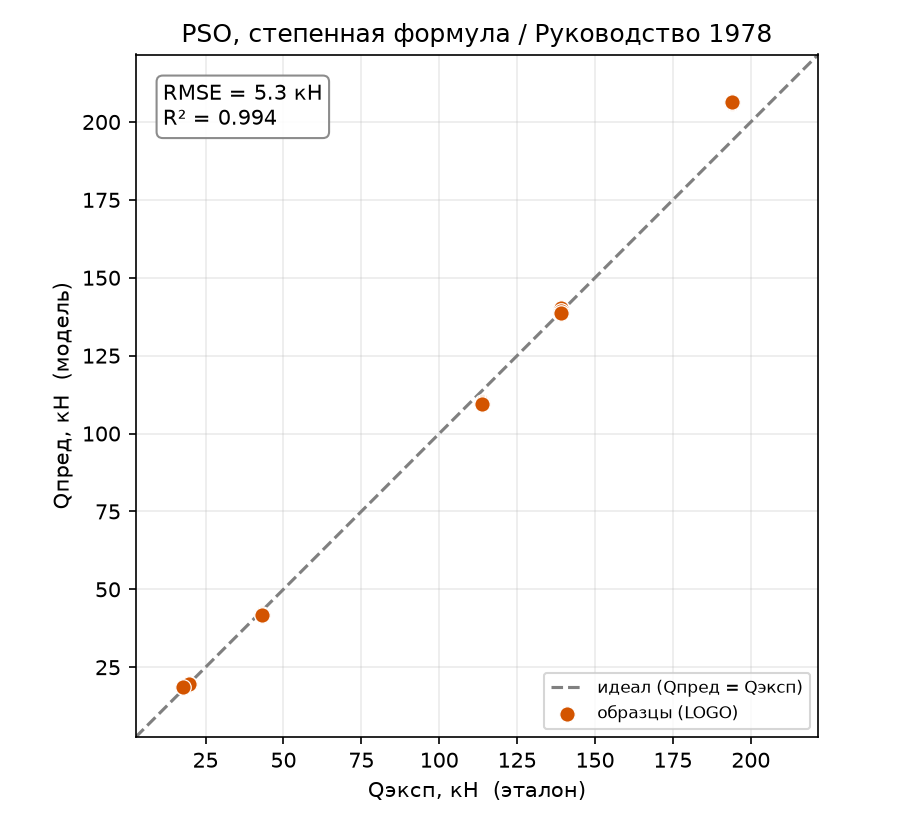

# Метод роя частиц (PSO): подбор степенной формулы

Отчёт по третьему биоинспирированному оптимизатору. Форма формулы — та же степенная
($Q_\text{дв} = a \cdot \prod_i x_i^{p_i}$), меняется оптимизатор: коэффициенты
подбирает **метод роя частиц** (PSO). Форму и общую методику см. в отчёте по ГА
([report_05_genetic_algorithm.md](report_05_genetic_algorithm.md)); сравнение
оптимизаторов между собой продолжает линию отчёта по DE
([report_06_differential_evolution.md](report_06_differential_evolution.md)).

## 1. Метод

PSO моделирует **рой частиц**, летающих в пространстве параметров. Каждая частица
имеет положение (набор коэффициентов) и скорость; она тянется одновременно к своему
лучшему найденному положению (**когнитивная** составляющая) и к лучшему положению
всего роя (**социальная**). Так рой коллективно стягивается к минимуму ошибки. В
отличие от ГА, здесь нет кроссовера и мутации — поиск ведётся через инерционное
движение частиц. Реализация ручная.

Архитектурно это тот же `FormulaSearchModel` с другим оптимизатором (`bio_pso`).

## 2. Как работает

Форма и схема оценки — как в отчёте по ГА (лог-линеаризация степенной формулы,
`is_steel` выпадает, оценка по Leave-One-Group-Out). Оптимизатор PSO обновляет
скорость каждой частицы как

$$v \leftarrow w\,v + c_1 r_1 (p_\text{best} - x) + c_2 r_2 (g_\text{best} - x),$$

где $w$ — инерция (линейно убывает 0.9 → 0.4: сначала широкий поиск, потом
уточнение), $c_1, c_2$ — веса тяги к личному и глобальному лучшему. Скорость
ограничена долей диапазона, иначе рой «разлетается». Основные гиперпараметры —
`n_particles` и `iters`.

## 3. Подбор гиперпараметров

Подбор утилитой [tools/tune_optimizer.py](../tools/tune_optimizer.py)
(`--optimizer pso`). Как и ГА, PSO **чувствителен к бюджету** — при малом рое и
коротком прогоне срывается:

| n_particles | iters | СП63 $R^2$ | РУК78 $R^2$ |
|:-----------:|:-----:|:----------:|:-----------:|
| 40 | 300 | **0.634** | 0.948 |
| 40 | 600 | 0.995 | 0.998 |
| 80 | 300 | 0.997 | 0.951 |
| **80** | **600** | 0.997 | 0.994 |

Взято `n_particles = 80, iters = 600` как устойчивый компромисс для обеих целей.
Проверка по 3 зёрнам: $R^2 = 0.995$ (СП63) и $0.993$ (РУК78) — надёжно.

## 4. Результаты

| Метрика | СП 63.13330 | Руководство 1978 |
|---------|:-----------:|:----------------:|
| $R^2$ (LOGO) | **0.997** | **0.994** |
| RMSE, кН | 2.35 | 5.31 |
| $Q_\text{эксп}/Q_\text{пред}$ | 0.999 | 0.993 |
| CV | 0.041 | 0.037 |
| within15 | 100 % | 100 % |
| RMSE худшего профиля, кН | 3.68 | 12.31 |
| pct_negative | 0 % | 0 % |
| overfit | 0.003 | 0.006 |

PSO-формула точна: $R^2 \approx 0.995$, попадание в ±15 % — **100 %** на обеих целях,
отношение $Q_\text{эксп}/Q_\text{пред} \approx 1.0$, переобучение ≈ 0.

*Рисунок 1 – PSO (степенная формула), эксперимент–предсказание, СП 63.13330*

*Рисунок 2 – PSO (степенная формула), эксперимент–предсказание, Руководство 1978*

## 5. Место в сравнении оптимизаторов (ГА / PSO / DE)

Три биоинспирированных оптимизатора ищут **одну и ту же** степенную форму — сравнение
честно ранжирует именно оптимизаторы.

| | ГА | **PSO** | DE |
|---|:---:|:---:|:---:|
| СП63 $R^2$ | 0.974 | 0.997 | **0.999** |
| СП63 RMSE, кН | 6.66 | 2.35 | **1.51** |
| РУК78 $R^2$ | 0.997 | 0.994 | **1.000** |
| РУК78 RMSE, кН | 3.64 | 5.31 | **1.20** |
| устойчивость (3 зерна, $R^2$) | 0.954 / 0.996 | 0.995 / 0.993 | **0.998 / 0.999** |
| вычислений на обучение | ~300 000 | ~48 000 | **~12 000** |

*Рисунок 3 – ГА, PSO и DE на одной степенной форме: качество (слева) и стоимость (справа)*

**PSO — уверенный второй.** Он заметно лучше ГА: точнее (RMSE ниже), устойчивее по
зёрнам и в ~6 раз дешевле (48 тыс. вычислений против 300 тыс.). Но **DE остаётся
впереди** — и точнее PSO, и ещё вчетверо дешевле. Итоговый порядок для этой задачи:
**DE > PSO > ГА**.

Как и ГА (и в отличие от DE), PSO чувствителен к бюджету — разностная мутация DE
самонастраивается, а рою нужен достаточный размер и число итераций, иначе он
преждевременно сходится.

## 6. Поведение метода

**Восстановленные формулы:**

- **СП63:** $Q_\text{дв} = 0.019 \cdot H^{1.05} \cdot s^{0.98} \cdot R^{0.94} \cdot E^{-0.29}$
- **РУК78:** $Q_\text{дв} = 7.7{\cdot}10^{-5} \cdot H^{1.11} \cdot s^{0.94} \cdot R^{0.87} \cdot E^{0.21}$

Наблюдения те же, что у ГА и DE: показатель при `a/h₀` ≈ 0 (иррелевантность снова
подтверждена), `H` и `s` устойчивы (≈ 1), а показатели при коллинеарных `R`/`E`
у каждого оптимизатора свои — **не идентифицируемы**. Устойчива только общая форма.

**Пофолдовый разбор:** ошибка мала на всех профилях; слабое место PSO — стальной
H=200 на РУК78 (RMSE 12.3 кН), где он уступает и DE (2.8), и ГА (7.9). На СП63 худший
профиль всего 3.7 кН. В целом PSO надёжно описывает и крайние профили.

## 7. Выводы

- **PSO успешно восстановил степенную формулу** ($R^2 \approx 0.995$, попадание в
  ±15 % — 100 %, overfit ≈ 0) — ещё один биоинспирированный метод, справившийся с
  задачей вывода явной формулы.
- **В сравнении оптимизаторов PSO — второй** (DE > PSO > ГА): лучше и дешевле ГА, но
  уступает DE и по точности, и по стоимости, и по устойчивости.
- **Ограничения** те же, что у всех методов со степенной формой: формула не
  единственна (коллинеарность `R`/`E`), `is_steel` в лог-форму не входит; плюс, как
  у ГА, чувствительность к вычислительному бюджету.
- **Дальше по ТЗ:** остаётся CMA-ES — тогда сравнение четырёх оптимизаторов будет
  полным. Архитектура готова (новый файл в `optimizers/` + строка в реестре).

Воспроизведение. Прогон: `python entrypoint/single/pso.py` (обе цели,
`n_particles = 80`, `iters = 600`, `SEED = 1337`). Подбор параметров:
`python tools/tune_optimizer.py --optimizer pso --grid n_particles=40,80 iters=300,600`.
