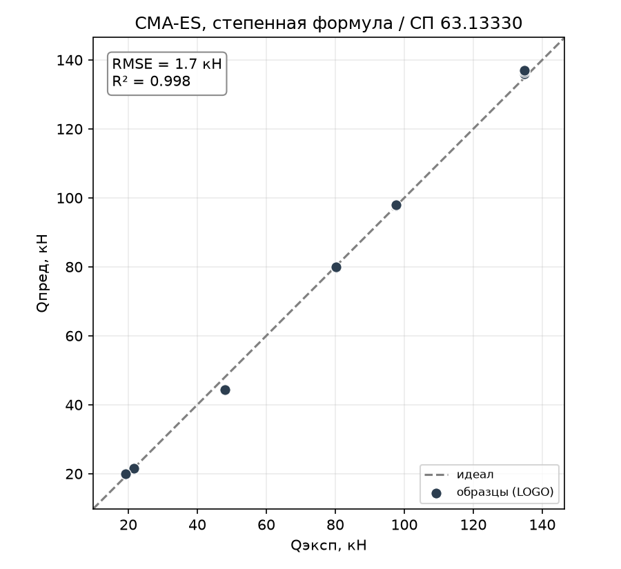
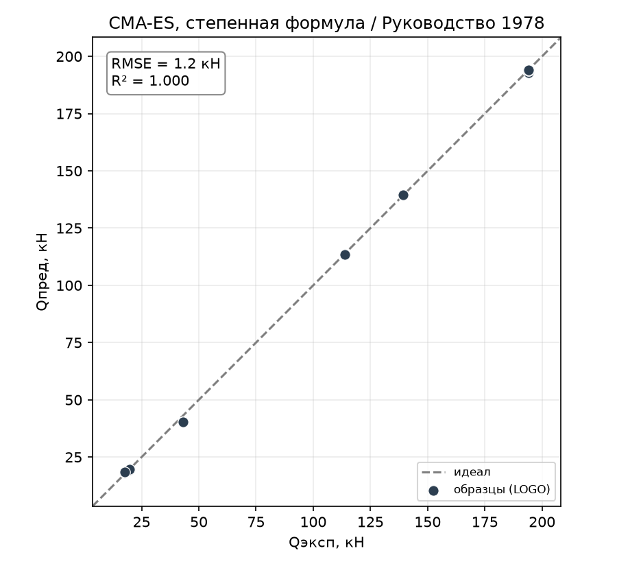
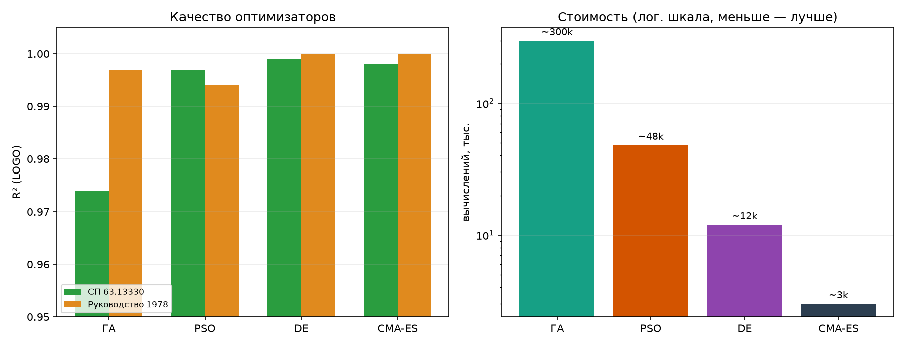
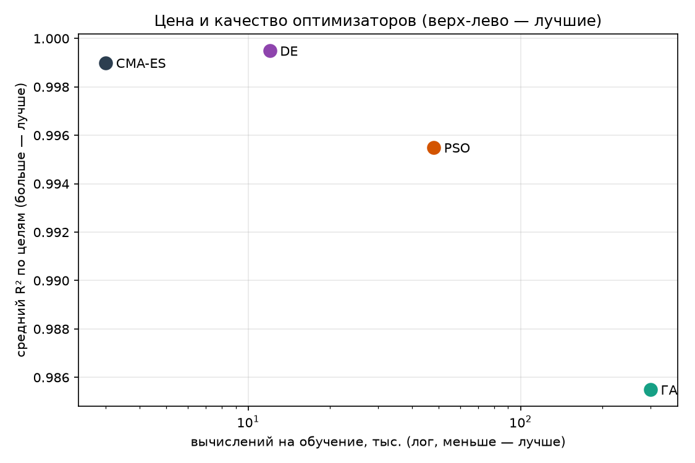

# Сравнение биоинспирированных оптимизаторов

Сводный отчёт по четырём биоинспирированным оптимизаторам — генетическому алгоритму
(ГА), рою частиц (PSO), дифференциальной эволюции (DE) и CMA-ES. Все они ищут **одну
и ту же** степенную формулу $Q_\text{дв} = a \cdot \prod_i x_i^{p_i}$ на одних данных
и по одной схеме оценки — меняется только оптимизатор. Это прямой ответ на пункт ТЗ
**«сравнение оптимизаторов между собой»**. Отдельные отчёты: ГА
([report_05](report_05_genetic_algorithm.md)), DE
([report_06](report_06_differential_evolution.md)), PSO
([report_07](report_07_pso.md)); CMA-ES описан здесь.

## 1. Постановка

Сравнение честно, потому что зафиксировано всё, кроме оптимизатора: степенная форма,
логарифмическая целевая функция, 18 образцов, Leave-One-Group-Out по 6 профилям,
`SEED = 1337`. Отличаются только алгоритмы поиска коэффициентов:

- **ГА** — популяция «особей», турнирная селекция + кроссовер + мутация. Ручная реализация.
- **PSO** — рой частиц, тяга к личному и глобальному лучшему. Ручная реализация.
- **DE** — эволюция через разностные векторы. Реализация `scipy`.
- **CMA-ES** — адаптация ковариационной матрицы. Реализация библиотеки `cma`.

## 2. CMA-ES

CMA-ES (Covariance Matrix Adaptation Evolution Strategy) — самый «умный» из четырёх:
он адаптирует не только величину шага, но и **форму** области поиска (ковариационную
матрицу), подстраиваясь под геометрию задачи. Поэтому почти не требует настройки —
единственная ручка `maxiter`, и к ней результат нечувствителен. Импорт библиотеки
`cma` сделан ленивым: `bio_cmaes` регистрируется даже без неё, а сама библиотека
нужна только при запуске.

| Метрика | СП 63.13330 | Руководство 1978 |
|---------|:-----------:|:----------------:|
| $R^2$ (LOGO) | 0.998 | 1.000 |
| RMSE, кН | 1.69 | 1.19 |
| $Q_\text{эксп}/Q_\text{пред}$ | 1.007 | 1.006 |
| within15 | 100 % | 100 % |
| overfit | 0.001 | 0.000 |

Восстановленные формулы:

- **СП63:** $Q_\text{дв} = 1.1{\cdot}10^{-8} \cdot H^{1.07} \cdot s^{0.97} \cdot R^{0.03} \cdot E^{1.29}$
- **РУК78:** $Q_\text{дв} = 3.5{\cdot}10^{-9} \cdot H^{1.11} \cdot s^{0.92} \cdot R^{0.23} \cdot E^{1.31}$

*Рисунок 1 – CMA-ES, эксперимент–предсказание, СП 63.13330*

*Рисунок 2 – CMA-ES, эксперимент–предсказание, Руководство 1978*

CMA-ES практически идеален — на уровне DE, но с наименьшей стоимостью.

## 3. Сводное сравнение

| Метрика | ГА | PSO | DE | CMA-ES |
|---------|:---:|:---:|:---:|:---:|
| **СП63** $R^2$ | 0.974 | 0.997 | **0.999** | 0.998 |
| СП63 RMSE, кН | 6.66 | 2.35 | **1.51** | 1.69 |
| СП63 RMSE худшего проф. | 15.6 | 3.68 | 3.49 | 3.63 |
| **РУК78** $R^2$ | 0.997 | 0.994 | **1.000** | **1.000** |
| РУК78 RMSE, кН | 3.64 | 5.31 | 1.20 | **1.19** |
| within15 (обе цели) | 94–100 % | 100 % | 100 % | 100 % |
| overfit (макс.) | 0.025 | 0.006 | 0.001 | 0.001 |
| устойчивость (3 зерна, $R^2$) | 0.954 / 0.996 | 0.995 / 0.993 | 0.998 / 0.999 | 0.998 / 0.999 |
| вычислений на обучение | ~300 000 | ~48 000 | ~12 000 | **~3 000** |

*Рисунок 3 – Четыре оптимизатора: R² (слева) и стоимость в лог-шкале (справа)*

*Рисунок 4 – Цена/качество: чем левее и выше, тем лучше (DE и CMA-ES доминируют)*

**Ранжирование:**

1. **DE и CMA-ES — со-лидеры.** Оба практически точны ($R^2 \approx 1$), стабильны по
   зёрнам и дёшевы. CMA-ES — **самый экономный** (~3 тыс. вычислений), DE — чуть
   точнее по RMSE. Для практики любой из двух — лучший выбор.
2. **PSO — крепкий второй эшелон.** Точность высокая (100 % в ±15 %), но дороже
   лидеров и чувствителен к бюджету; слабое место — стальной H=200 на РУК78.
3. **ГА — слабейший.** Дороже всех на порядок (~300 тыс.), нестабилен по зёрнам,
   на СП63 заметно уступает. Честная оговорка: ГА и PSO — **ручные** реализации, а
   DE и CMA-ES — **зрелые библиотечные**, так что разрыв отражает и алгоритм, и
   качество кода.

## 4. Что объединяет все четыре

Несмотря на разброс по стоимости, **все четыре оптимизатора восстановили формулу
хорошо** ($R^2$ от 0.97 до 1.0). Отсюда главный вывод сравнения:

- **Определяющим оказывается не оптимизатор, а форма.** Степенная форма — правильная
  структура для этой задачи (целевые величины сами являются степенными формулами),
  поэтому к почти точному решению приходят все. Оптимизатор влияет лишь на **цену и
  устойчивость** сходимости, а не на потолок качества.
- **Все согласованно подтверждают физику:** показатель при `a/h₀` ≈ 0 (иррелевантность
  пролёта среза), устойчивые показатели при `H` и `s` (≈ 1). А вот показатели при
  коллинеарных `R`/`E` у каждого оптимизатора свои — **не идентифицируемы**;
  интерпретировать можно только устойчивую часть формулы.

## 5. Выводы

- **Лучшие оптимизаторы для задачи — DE и CMA-ES:** near-perfect восстановление
  формулы, устойчивость и низкая стоимость. CMA-ES — самый дешёвый, DE — чуть точнее.
- **Иерархия:** DE ≈ CMA-ES > PSO > ГА — как по точности, так и по стоимости и
  устойчивости.
- **Ключевой методический вывод:** на этой задаче **важнее правильно выбрать форму
  формулы, чем оптимизатор** — с верной (степенной) формой к потолку приходят все, а
  выбор оптимизатора определяет лишь эффективность.
- **Оговорка честности:** ручные ГА/PSO против библиотечных DE/CMA-ES — сравнение
  отражает не только алгоритмы, но и зрелость реализации.

Воспроизведение. Прогон любого оптимизатора — `bio_ga` / `bio_pso` / `bio_de` /
`bio_cmaes` (через интерактив, `group` или обёртки в `entrypoint/single/`). Подбор
параметров любого — `python tools/tune_optimizer.py --optimizer <имя> --grid …`.
