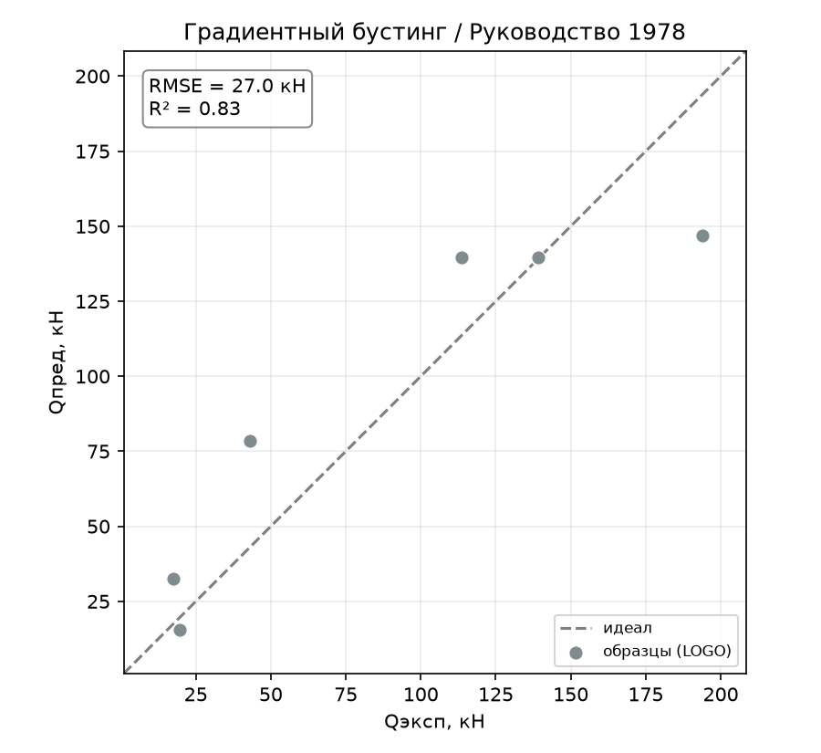
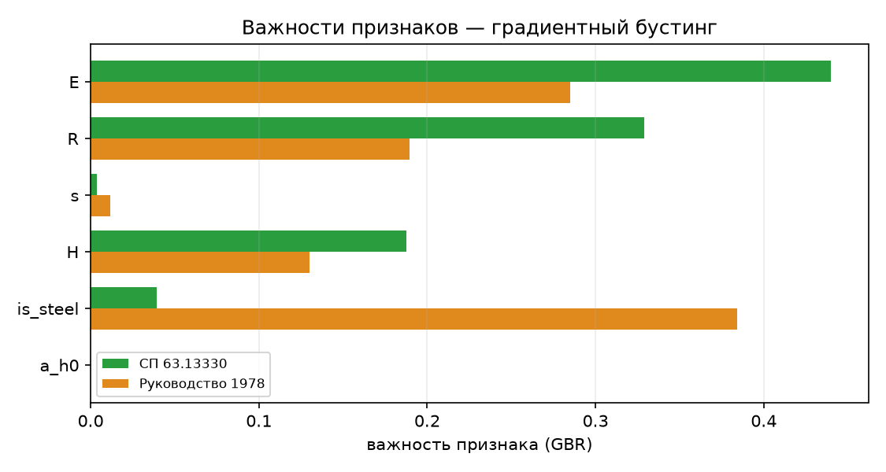

# Градиентный бустинг: первый метод «чёрного ящика»

Отчёт по первому предсказательному методу-«чёрному ящику» (раздел 4.2 ТЗ) —
градиентному бустингу над деревьями (GBR). В отличие от линейных и символьных
методов, он не выдаёт явной формулы, а строит ансамбль деревьев. По ТЗ такой метод
ожидаемо слаб на малой выборке, и результат информативен именно этим. Определения
метрик и схема оценки — в [report_01_linear_regression.md](report_01_linear_regression.md).

## 1. Метод

Градиентный бустинг последовательно добавляет деревья, каждое из которых
исправляет ошибки предыдущих. Это гибкая нелинейная модель без явной формулы —
«чёрный ящик». Её роль в работе — проверить, даёт ли выигрыш гибкий ансамбль на
данных из 6 профилей, или переобучение съедает все преимущества.

## 2. Как работает

Деревья добавляются по одному; `learning_rate` задаёт вклад каждого, `max_depth` —
их глубину, `n_estimators` — количество. Признаки не масштабируются (деревьям
безразличен масштаб). Оценка — та же Leave-One-Group-Out по 6 профилям. Явной
формулы нет, поэтому вместо коэффициентов метод характеризуется **важностями
признаков** (раздел 5.2).

## 3. Подбор гиперпараметров

С параметрами по умолчанию (`max_depth=3`) GBR сильно переобучался (СП63 $R^2 =
0.736$, overfit 0.264). Подбор утилитой [tools/tune_model.py](../tools/tune_model.py)
показал чёткое направление:

| n_estimators | max_depth | learning_rate | СП63 $R^2$ | overfit |
|:---:|:---:|:---:|:---:|:---:|
| 200 | 3 (дефолт) | 0.05 | 0.736 | 0.264 |
| 200 | 2 | 0.05 | 0.766 | 0.234 |
| 200 | 1 | 0.05 | 0.834 | 0.162 |
| 400 | 1 | 0.1 | **0.864** | **0.136** |

Ключ — **`max_depth=1` («пни»)**: деревья-обрубки не заучивают отдельные профили,
и модель превращается по сути в аддитивную. Больше деревьев (400) и чуть больший
шаг (0.1) добавляют точности без взрыва переобучения. В модель зашито
`n_estimators=400, max_depth=1, learning_rate=0.1` — оптимум для обеих целей.

## 4. Результаты

Сравнение настроенного GBR с лучшим линейным (Lasso) и лучшим методом в целом (DE):

| Метрика | **GBR** | Lasso | DE |
|---------|:---:|:---:|:---:|
| **СП63** $R^2$ | 0.864 | 0.869 | 0.999 |
| СП63 RMSE, кН | 15.4 | 15.1 | 1.5 |
| СП63 within15 | 17 % | 33 % | 100 % |
| СП63 overfit | 0.136 | 0.109 | 0.001 |
| **РУК78** $R^2$ | 0.833 | 0.812 | 1.000 |
| РУК78 RMSE, кН | 27.0 | 28.7 | 1.2 |
| РУК78 overfit | 0.167 | 0.166 | 0.000 |

*Рисунок 1 – Градиентный бустинг, эксперимент–предсказание, СП 63.13330*

*Рисунок 2 – Градиентный бустинг, эксперимент–предсказание, Руководство 1978*

По $R^2$/RMSE настроенный GBR **вышел на уровень Lasso** (на РУК78 даже чуть выше),
но не превзошёл линейный класс — и остался далеко позади биоинспирированных методов.

## 5. Поведение метода

### 5.1. Переобучение — главная черта

Даже у настроенного GBR **$R^2$ на обучении = 1.000** на обеих целях: ансамбль
идеально запоминает обучающую выборку, а на отложенном профиле проседает до
0.83–0.86 (overfit 0.14–0.17 — выше, чем у Lasso). Показательна и метрика
`within15` = **17 %** (против 33 % у Lasso и 100 % у DE): по относительной точности
предсказания GBR грубоваты. Дерево плохо интерполирует между разреженными профилями —
отсюда высокая ошибка на многих из них.

### 5.2. Важности признаков

Хотя формулы нет, GBR сообщает, на какие признаки он опирался:

*Рисунок 3 – Важности признаков GBR по обеим целям*

| Признак | СП63 | РУК78 |
|---------|:----:|:-----:|
| `E` | 0.44 | 0.29 |
| `R` | 0.33 | 0.19 |
| `is_steel` | 0.04 | 0.38 |
| `H` | 0.19 | 0.13 |
| `s` | 0.00 | 0.01 |
| `a/h₀` | **0.00** | **0.00** |

Совершенно другой класс модели **независимо подтвердил ту же физику**, что линейные
и символьные методы:

- **`a/h₀` имеет нулевую важность** — очередное (уже независимое от способа)
  подтверждение, что пролёт среза не влияет на $Q_\text{дв}$;
- вес несут **материал** (`E`/`R`/`is_steel` — коллинеарная тройка, дерево делит её
  между собой по-разному на разных целях) и **высота `H`**; `s` практически не важен.

### 5.3. Разбор по профилям

Худший профиль — стальной H=200 (RMSE 24.8 кН на СП63, 47.1 на РУК78), но, в отличие
от линейных методов, GBR ошибается заметно **на многих профилях сразу** (композит
H=160, сталь H=140): дерево не восстанавливает гладкую зависимость между профилями,
а даёт ступенчатую аппроксимацию.

## 6. Выводы

- **Настроенный GBR догнал линейный класс, но не превзошёл его** ($R^2 \approx 0.85$,
  на уровне Lasso) — и остался далеко позади биоинспирированных методов ($R^2 \approx 1$).
- **Ансамбль деревьев на 6 профилях неоправдан** — ровно как предсказывает ТЗ: даже с
  сильной регуляризацией («пни») он переобучается ($R^2_\text{train} = 1$) и грубоват
  по относительной точности (within15 = 17 %). Гибкость чёрного ящика не окупается,
  когда данных мало, а истинная зависимость проста.
- **Ценный побочный результат** — важности признаков независимо подтвердили диагноз:
  `a/h₀` иррелевантен, определяют материал и высота.
- **Практический вывод:** на данной задаче простая регуляризованная линейная модель
  предпочтительнее бустинга — проще, интерпретируемее и не хуже по качеству.

Воспроизведение. Прогон: `python entrypoint/single/gbr.py` (обе цели,
`n_estimators=400, max_depth=1, learning_rate=0.1`). Подбор:
`python tools/tune_model.py --model gbr --grid max_depth=1,2,3 n_estimators=200,400 learning_rate=0.05,0.1`.
