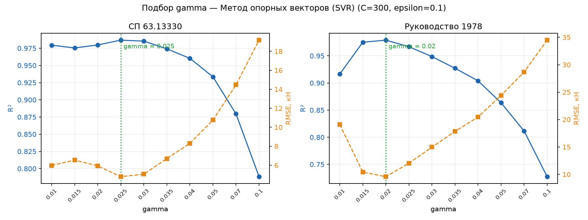
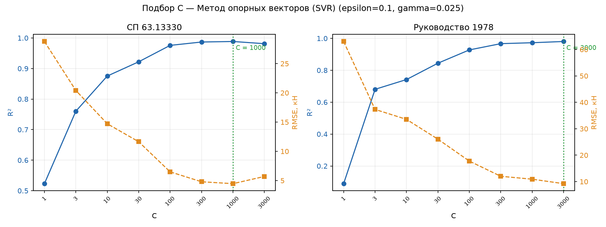
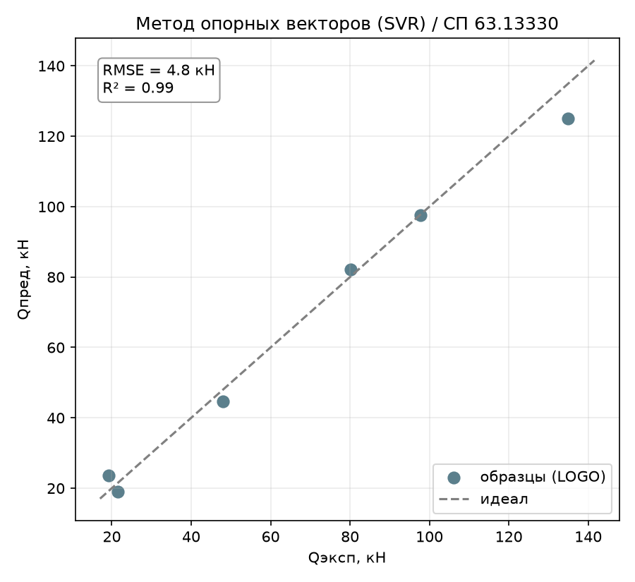
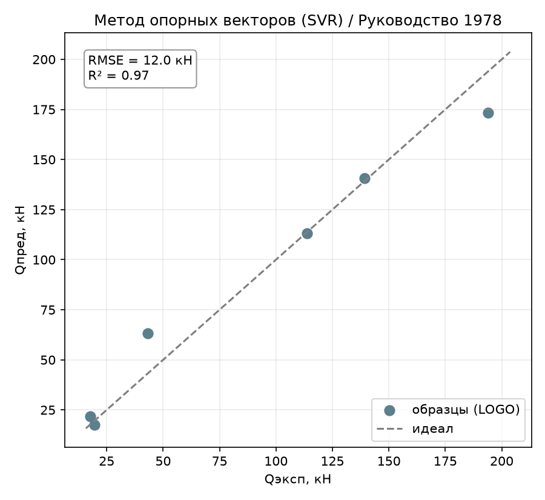
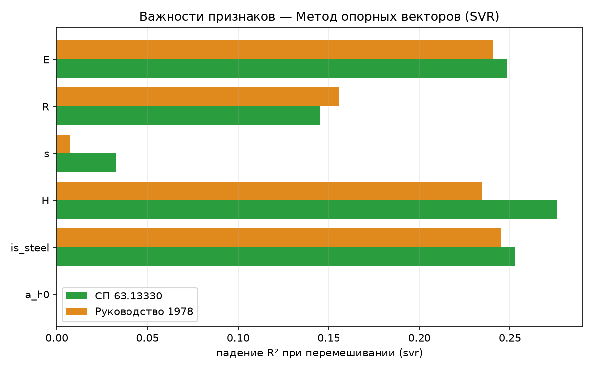

# Метод опорных векторов (SVR): второй метод «чёрного ящика»

Отчёт по второму предсказательному методу-«чёрному ящику» (раздел 4.2 ТЗ) —
методу опорных векторов с RBF-ядром (SVR). В отличие от градиентного бустинга
(report_09), SVR — не ансамбль деревьев, а ядерный метод: он ищет гладкую
функцию в пространстве повышенной размерности, куда данные неявно проецирует
RBF-ядро. Определения метрик и схема оценки — в
[report_01_linear_regression.md](report_01_linear_regression.md).

## 1. Метод

SVR строит регрессию, минимизируя число образцов, выходящих за пределы
$\varepsilon$-трубки вокруг предсказания, плюс регуляризационный штраф на
сложность функции. С RBF-ядром модель фактически становится взвешенной суммой
гауссиан вокруг опорных векторов — гладкая, нелинейная, без явной формулы.

## 2. Как работает

- **`C`** — штраф за выход за пределы трубки: чем больше `C`, тем сильнее
  модель старается пройти близко к каждой точке (меньше регуляризации).
- **`epsilon`** — ширина трубки нечувствительности: ошибки внутри неё не
  штрафуются вообще.
- **`gamma`** — обратный «радиус влияния» опорной точки в RBF-ядре: большой
  `gamma` — узкие, локальные гауссианы (риск переобучения на 6 профилях),
  маленький — широкие, гладкие, почти линейные.

В отличие от деревьев (GBR), ядерным методам **не всё равно** масштаб
признаков — `H` (сотни мм) и `a/h₀` (единицы) без нормировки задавили бы друг
друга в RBF-ядре. Поэтому модель обёрнута в pipeline
`StandardScaler → SVR` ([svr.py](../core/models/classic_ml/svr.py)).
Оценка — та же схема Leave-One-Group-Out по 6 профилям.

## 3. Подбор гиперпараметров

Подбор — утилитой [tools/tune_svr.py](../tools/tune_svr.py) (перебор одного
параметра при фиксированных остальных, график R²/RMSE от значения) и
[tools/tune_model.py](../tools/tune_model.py) (перекрёстная сетка с overfit).

**`gamma` — главный рычаг.** С дефолтным `gamma="scale"` (≈0.028 по формуле
sklearn) SVR давал R² 0.71/0.66 — не лучше нетюненого GBR. Прямой перебор
показал резкий пик:

*Рисунок 1 – Подбор gamma при C=300, epsilon=0.1 (обе цели)*

Оптимум близко совпал на обеих целях: `gamma=0.025` (СП63) и `gamma=0.02`
(РУК78) — выбрано **`gamma=0.025`** как компромисс.

**`C` — насыщается, а не подбирается на пик.** При фиксированном `gamma=0.025`
рост `C` монотонно улучшает LOGO-R², но с явным затуханием после ~300:

*Рисунок 2 – Подбор C при epsilon=0.1, gamma=0.025 (обе цели)*

| C | gamma | СП63 R² | СП63 overfit | РУК78 R² | РУК78 overfit |
|:---:|:---:|:---:|:---:|:---:|:---:|
| 100 | 0.025 | 0.976 | 0.024 | 0.928 | 0.072 |
| 200 | 0.025 | 0.985 | 0.015 | 0.960 | 0.040 |
| **300** | **0.025** | **0.987** | **0.013** | **0.967** | **0.033** |
| 500 | 0.025 | 0.988 | 0.012 | 0.973 | 0.027 |
| 1000 | 0.025 | 0.988 | — | 0.973 | — |
| 3000 | 0.025 | 0.981 | — | 0.981 | — |

Уход к `C=1000` и выше даёт прибавку R² на третьем знаке ценой роста порядка
величины параметра — риск подгонки под шум синтеза без реального смысла.
Остановились на **`C=300`**. `epsilon` в диапазоне 0.01–2 почти не влияет на
результат (R² плавает в пределах 0.01) — оставлен дефолт `epsilon=0.1`.

Итоговые параметры, зашитые в модель
([svr.py](../core/models/classic_ml/svr.py)): `C=300, epsilon=0.1, gamma=0.025`.

## 4. Результаты

Сравнение SVR с лучшим линейным (Lasso), первым «чёрным ящиком» (GBR) и
лучшим методом в целом (DE):

| Метрика | **SVR** | Lasso | GBR | DE |
|---------|:---:|:---:|:---:|:---:|
| **СП63** $R^2$ | 0.987 | 0.869 | 0.864 | 0.999 |
| СП63 RMSE, кН | 4.79 | 15.10 | 15.35 | 1.51 |
| СП63 within15 | 72 % | 33 % | 17 % | 100 % |
| СП63 overfit | 0.013 | 0.109 | 0.136 | 0.001 |
| **РУК78** $R^2$ | 0.967 | 0.812 | 0.833 | 1.000 |
| РУК78 RMSE, кН | 12.01 | 28.65 | 27.01 | 1.19 |
| РУК78 overfit | 0.033 | 0.166 | 0.167 | 0.000 |

*Рисунок 3 – SVR, эксперимент–предсказание (по профилям), СП 63.13330*

*Рисунок 4 – SVR, эксперимент–предсказание (по профилям), Руководство 1978*

В отличие от GBR, тюненый SVR **уверенно обошёл линейный класс** на обеих
целях — единственный «чёрный ящик» в работе, который это сделал. До
биоинспирированной DE (которая подбирает коэффициенты заведомо верной
степенной формы) он всё же не дотягивает: DE использует физически осмысленную
структуру формулы, а SVR ищет гладкую функцию вслепую.

## 5. Поведение метода

### 5.1. Overfit — заметно ниже, чем у GBR

`overfit = 0.013` (СП63) и `0.033` (РУК78) — против `0.136`/`0.167` у GBR.
Узкий RBF-пик (`gamma=0.025`) с умеренным `C=300` даёт модель, которая
воспроизводит на обучении почти всё ($R^2_\text{train}=1.000$), но при этом
хорошо переносится на отложенный профиль — небольшой разрыв говорит, что
найденная гладкая поверхность действительно близка к истинной зависимости, а
не просто запоминает 6 профилей. `within15 = 72 %` (СП63) / `67 %` (РУК78) —
на порядок точнее GBR (17 %) и вдвое точнее Lasso (33 %).

### 5.2. Важности признаков

У SVR, как и у GBR, нет явной формулы, но важности можно оценить permutation
importance — падение $R^2$ при перемешивании одного признака
([tools/importances.py](../tools/importances.py)):

*Рисунок 5 – Permutation importance SVR по обеим целям*

| Признак | СП63 | РУК78 |
|---------|:----:|:-----:|
| `H` | 0.276 | 0.235 |
| `is_steel` | 0.253 | 0.245 |
| `E` | 0.248 | 0.240 |
| `R` | 0.145 | 0.156 |
| `s` | 0.033 | 0.007 |
| `a/h₀` | **0.000** | **0.000** |

Третий независимый метод (после линейных и GBR) подтверждает ту же картину:
**`a/h₀` не влияет на $Q_\text{дв}$**, определяют высота `H` и материал
(`is_steel`/`E`/`R`).

### 5.3. Разбор по профилям

Худший профиль — тот же, что и у GBR: **сталь H=200** (RMSE 9.8 кН на СП63,
20.8 кН на РУК78) — на порядок хуже остальных пяти профилей (0.1–4.4 кН). Это
краевой случай выборки (самый высокий стальной двутавр), где RBF-ядру не на
что опереться — ближайшие обучающие точки при LOGO физически дальше всего.
Остальные профили SVR предсказывает с точностью 1–4 кН, заметно ровнее GBR,
который «спотыкался» сразу на нескольких профилях (раздел 5.3 report_09).

## 6. Выводы

- **SVR — первый «чёрный ящик» в работе, обошедший линейный класс**: $R^2$
  0.99/0.97 против 0.87/0.81 у Lasso, при вдвое-втрое меньшем RMSE.
- **Ключ — тюнинг `gamma`**, а не `C`: дефолтный `gamma="scale"` давал
  результат на уровне нетюненого GBR; узкая RBF-гауссиана (`gamma=0.025`)
  вытащила модель на новый уровень точности.
- **Overfit контролируем** (0.01–0.03) — в отличие от GBR, где регуляризация
  «пнями» была вынужденной мерой против переобучения, здесь `C=300` даёт
  точность без выраженного разрыва обучение/LOGO.
- **Независимое третье подтверждение физики**: `a/h₀` иррелевантен, вклад
  двутавра определяют высота и материал — вывод теперь подтверждён линейными,
  древесными (GBR) и ядерными (SVR) методами одновременно.
- **Практический вывод:** на этой задаче ядерный метод с тщательно
  подобранным `gamma` — сильный кандидат в чёрных ящиках, хотя и уступает
  биоинспирированному подбору степенной формулы (DE), которому заранее
  известна верная структура зависимости.

Воспроизведение. Прогон: `python entrypoint/single/svr.py` (обе цели,
`C=300, epsilon=0.1, gamma=0.025`). Подбор:
`python tools/tune_svr.py --param gamma --C 300`,
`python tools/tune_svr.py --param C --gamma 0.025`,
`python tools/tune_model.py --model svr --grid C=100,200,300,500 gamma=0.025,0.03,0.035`.
Важности: `python tools/importances.py --model svr --plot`.
