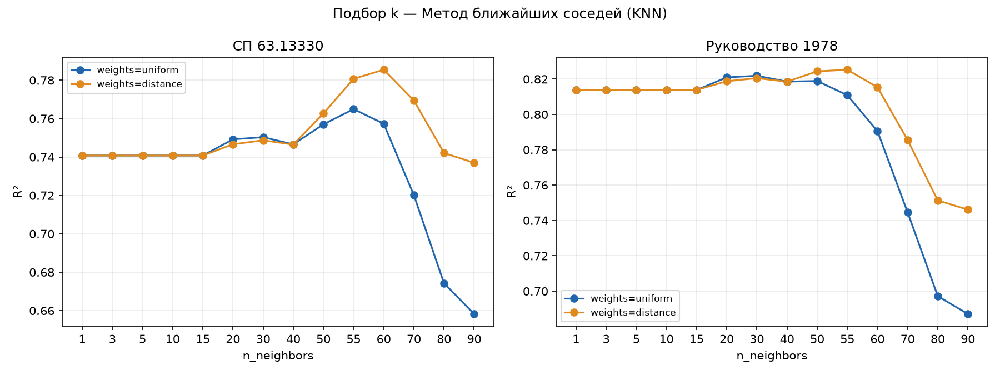
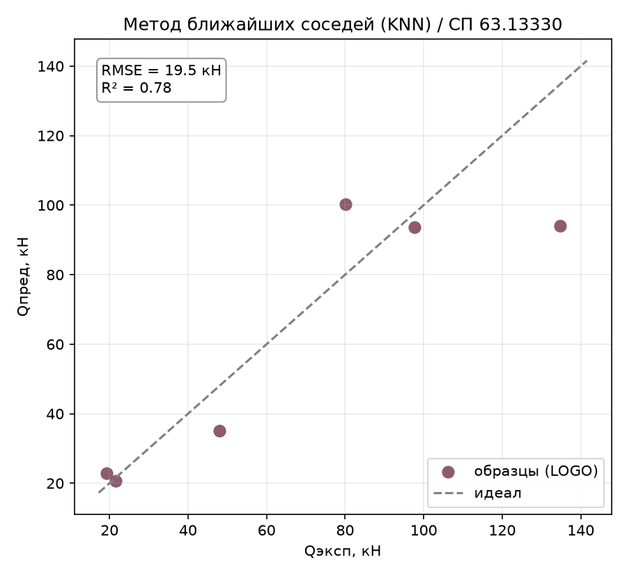
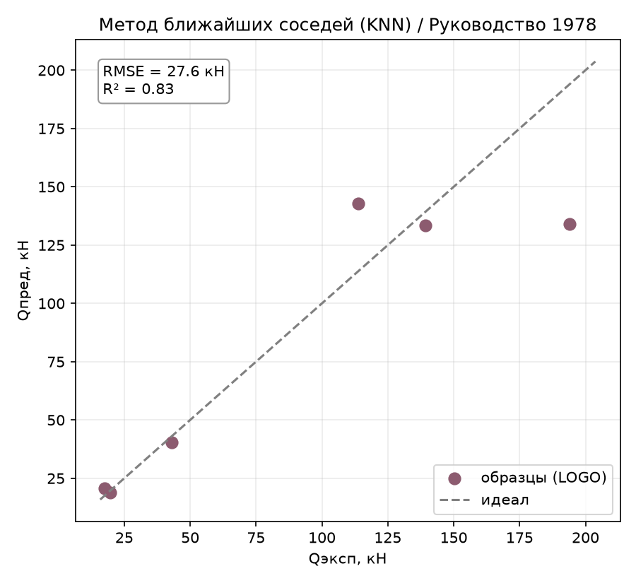
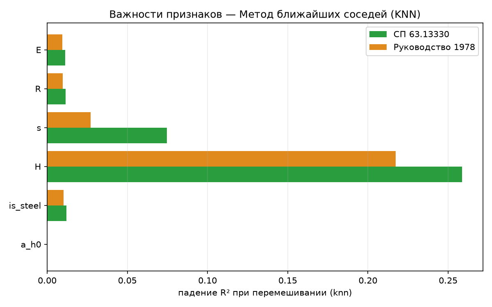

# Метод ближайших соседей (KNN): третий метод «чёрного ящика»

Отчёт по третьему предсказательному методу-«чёрному ящику» (раздел 4.2 ТЗ) —
методу k ближайших соседей (KNN). В отличие от GBR (report_09) и SVR
(report_10), KNN не строит модель вовсе — предсказание это взвешенное среднее
целевых значений `k` ближайших по признакам обучающих точек. Определения
метрик и схема оценки — в [report_01_linear_regression.md](report_01_linear_regression.md).

## 1. Метод

KNN — «ленивое обучение»: на этапе `fit` он просто запоминает обучающую
выборку, а всё вычисление происходит при `predict` — поиск `k` ближайших
соседей нового образца по евклидову расстоянию в пространстве признаков и
усреднение их $Q_\text{дв}$. Как и SVR, метод чувствителен к масштабу
признаков, поэтому обёрнут в pipeline `StandardScaler → KNeighborsRegressor`
([knn.py](../core/models/classic_ml/knn.py)).

## 2. Как работает

- **`n_neighbors` (k)** — сколько ближайших точек усредняется. Малый `k` —
  предсказание держится за буквально ближайшие синтезированные образцы (шум
  синтеза передаётся в предсказание один в один); большой `k` — предсказание
  сползает к среднему по всей обучающей выборке.
- **`weights`** — `uniform` (все `k` соседей вносят равный вклад) или
  `distance` (более близкие соседи весят больше — мягче реагирует на выбор
  `k`).

Оценка — та же схема Leave-One-Group-Out по 6 профилям.

## 3. Подбор гиперпараметров

Подбор — утилитой [tools/tune_knn.py](../tools/tune_knn.py) (двумерный
перебор `n_neighbors × weights`, LOGO-R² по каждой комбинации).

*Рисунок 1 – R² от n_neighbors при weights=uniform/distance (обе цели)*

Три характерных участка на графике:

1. **k = 1…15 — плато.** R² не меняется вообще (0.741 / 0.814) — из-за
   синтеза данных (раздел 3.2 ТЗ) ближайшие точки любого образца при малом
   `k` почти всегда принадлежат одному и тому же ближайшему профилю: `k`
   соседей набираются внутри него, не выходя за его пределы, — предсказание
   не меняется, пока `k` не превысит число точек одного профиля.
2. **k ≈ 50–60 — пик.** Когда `k` дорастает до объёма нескольких профилей,
   в усреднение начинают попадать точки соседних профилей — сглаживание
   компенсирует шум синтеза и точность растёт.
3. **k > 70 — спад.** При ещё большем `k` в среднее подмешиваются далёкие,
   непохожие профили — предсказание тянется к глобальному среднему.

Оптимумы близки, но не совпадают: `k=60` (СП63, R²=0.785) и `k=55` (РУК78,
R²=0.825), в обоих случаях `weights=distance` заметно устойчивее
`uniform` на правом склоне пика. Выбран компромисс — **`k=55,
weights=distance`** (СП63 при этом R²=0.781, на 0.004 ниже своего пика).

Итоговые параметры, зашитые в модель
([knn.py](../core/models/classic_ml/knn.py)): `n_neighbors=55, weights=distance`.

## 4. Результаты

Сравнение KNN с лучшим линейным (Lasso), остальными чёрными ящиками (GBR,
SVR) и лучшим методом в целом (DE):

| Метрика | **KNN** | Lasso | GBR | SVR | DE |
|---------|:---:|:---:|:---:|:---:|:---:|
| **СП63** $R^2$ | 0.781 | 0.869 | 0.864 | 0.987 | 0.999 |
| СП63 RMSE, кН | 19.52 | 15.10 | 15.35 | 4.79 | 1.51 |
| СП63 within15 | 33 % | 33 % | 17 % | 72 % | 100 % |
| СП63 overfit | 0.219 | 0.109 | 0.136 | 0.013 | 0.001 |
| **РУК78** $R^2$ | 0.825 | 0.812 | 0.833 | 0.967 | 1.000 |
| РУК78 RMSE, кН | 27.60 | 28.65 | 27.01 | 12.01 | 1.19 |
| РУК78 overfit | 0.175 | 0.166 | 0.167 | 0.033 | 0.000 |

*Рисунок 2 – KNN, эксперимент–предсказание (по профилям), СП 63.13330*

*Рисунок 3 – KNN, эксперимент–предсказание (по профилям), Руководство 1978*

KNN — **самый слабый чёрный ящик в работе**: даже после подбора он не
превзошёл ни Lasso (на СП63), ни GBR (на обеих целях), и далеко позади SVR.
На рассеянии хорошо видно типичное для KNN «поджатие к среднему»: самый
крупный профиль (135 кН эксп.) предсказан лишь в ~94 кН — усреднение по
десяткам соседей физически не может выйти за диапазон обучающих значений,
а тем более экстраполировать выше него.

## 5. Поведение метода

### 5.1. Overfit — худший среди чёрных ящиков

`overfit = 0.219` (СП63) и `0.175` (РУК78) — выше даже нетюненого GBR. Причина
не в переусложнении (как у деревьев), а в природе метода: на обучающих данных
`weights=distance` даёт почти точное совпадение (сама точка — свой ближайший
сосед с нулевым расстоянием → доминирующий вес), поэтому
$R^2_\text{train}\approx1$ гарантирован structurally, а разрыв с LOGO-R²
целиком отражает, насколько плохо ближайшие соседи одного профиля
предсказывают другой, ранее не виденный.

### 5.2. Важности признаков

Permutation importance ([tools/importances.py](../tools/importances.py)):

*Рисунок 4 – Permutation importance KNN по обеим целям*

| Признак | СП63 | РУК78 |
|---------|:----:|:-----:|
| `H` | 0.259 | 0.217 |
| `s` | 0.075 | 0.027 |
| `is_steel` | 0.012 | 0.010 |
| `R` | 0.012 | 0.010 |
| `E` | 0.011 | 0.010 |
| `a/h₀` | **0.000** | **0.000** |

Четвёртое независимое подтверждение (после линейных, GBR, SVR):
**`a/h₀` не влияет на $Q_\text{дв}$.** Но в остальном картина у KNN другая —
здесь доминирует практически только `H`, а вклад материала (`is_steel`/`E`/`R`)
почти не виден. Объяснение — не физика, а метрика расстояния: после
`StandardScaler` профили в основном разносятся по `H` (самый разбросанный по
диапазону признак), поэтому геометрически «ближайший сосед» почти всегда
подбирается по высоте, а материал внутри такого соседства — уже вторичный,
слабо используемый сигнал. Это ограничение самого KNN, а не новое наблюдение
о задаче.

### 5.3. Разбор по профилям

Худший профиль — тот же, что у GBR и SVR: **сталь H=200** (RMSE 40.8 кН на
СП63, 60.2 кН на РУК78 — заметно хуже, чем у остальных чёрных ящиков). Второй
худший — **сталь H=140** (20.1/29.2 кН). Оба стальных профиля предсказаны
плохо, а все три композитных — точно (0.6–13 кН). Причина в дисбалансе
выборки: профилей стали всего 3 из 6, и при LOGO на месте отложенного
стального профиля у KNN остаётся лишь **два** стальных соседа против **трёх**
композитных — усреднение по ближайшим соседям тянет предсказание в сторону
более многочисленного композитного класса.

## 6. Выводы

- **KNN — самый слабый предсказательный чёрный ящик** из трёх испытанных:
  $R^2$ 0.78/0.83, хуже даже нетюненого линейного класса на одной из целей.
- **Плато при малом k** — прямое следствие схемы синтеза данных (раздел 3.2
  ТЗ): пока `k` меньше числа точек одного профиля, KNN физически не видит
  соседние профили.
- **Overfit самый высокий среди чёрных ящиков** (0.18–0.22) — структурное
  свойство метода с `weights=distance`, а не признак переусложнения модели.
- **Дисбаланс классов бьёт по стальным профилям** — из-за меньшего числа
  стальных образцов (3 против 3 композитных, но при LOGO остаётся 2 против 3)
  KNN систематически хуже предсказывает именно сталь.
- **Четвёртое независимое подтверждение физики**: `a/h₀` иррелевантен во всех
  испытанных семействах методов (линейные, деревья, ядерные, метрические).
- **Практический вывод:** для этой задачи «ленивое» усреднение по соседям —
  наименее удачный из чёрных ящиков; результат ожидаемо слаб (как и
  предсказывает ТЗ для класса «предсказательные модели» на выборке из
  6 профилей) и информативен именно этим — контраст с SVR показывает, что
  проблема не в самой идее «чёрного ящика», а в том, что KNN не строит
  никакой структуры, кроме локального усреднения.

Воспроизведение. Прогон: `python entrypoint/single/knn.py` (обе цели,
`n_neighbors=55, weights=distance`). Подбор:
`python tools/tune_knn.py --k 1,3,5,10,15,20,30,40,50,55,60,70,80,90 --weights uniform,distance --plot`.
Важности: `python tools/importances.py --model knn --plot`.
