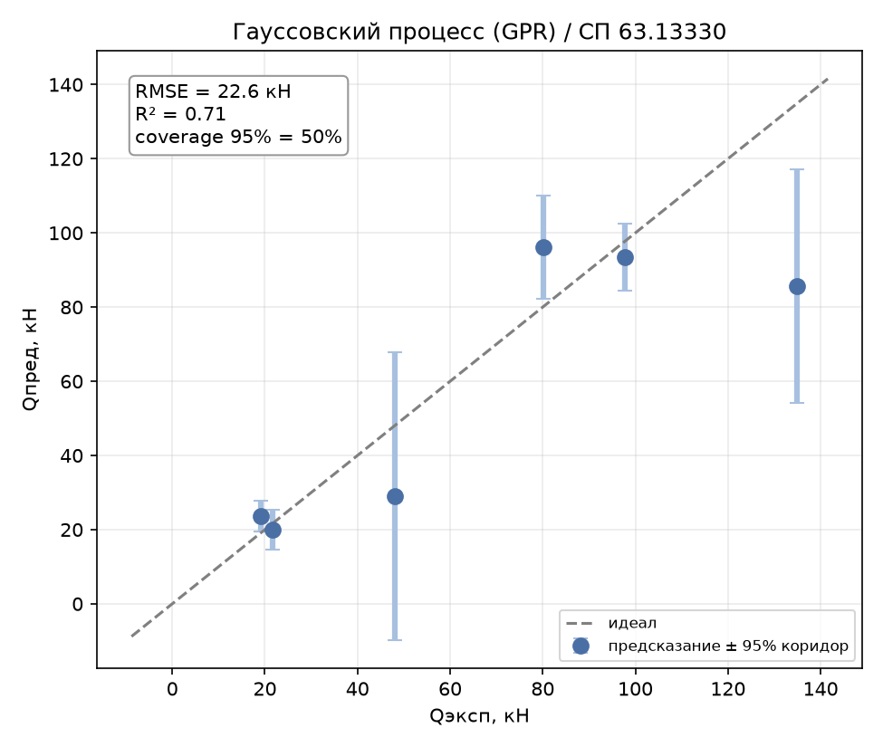
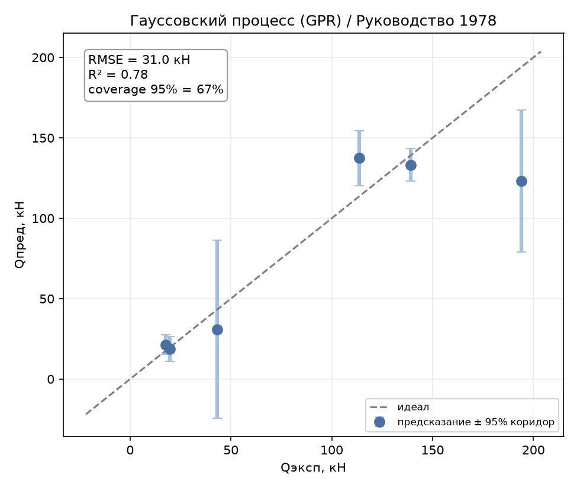
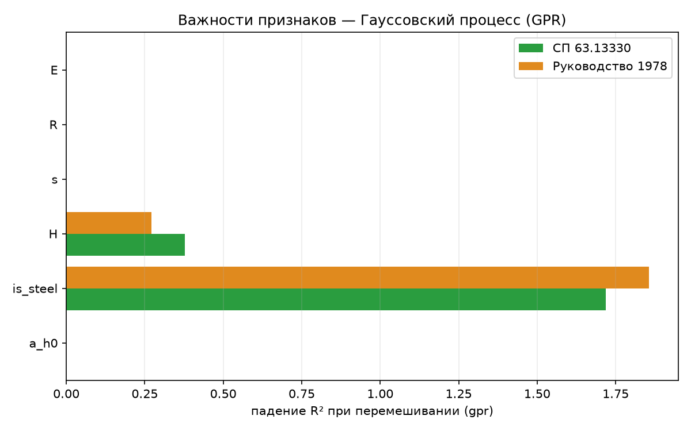

# Гауссовский процесс (GPR): четвёртый метод «чёрного ящика»

Отчёт по четвёртому и последнему предсказательному методу-«чёрному ящику»
(раздел 4.2 ТЗ) — регрессии на гауссовских процессах (GPR). В отличие от
GBR/SVR/KNN (report_09–11), GPR — единственный метод в работе, который вместе
с точечным предсказанием даёт **доверительный коридор**: по формулировке ТЗ,
это «современный и подходящий для малых данных подход» именно за счёт оценки
неопределённости, а не за счёт точности как таковой. Определения метрик и
схема оценки — в [report_01_linear_regression.md](report_01_linear_regression.md).

## 1. Метод

GPR не подбирает параметры одной функции, а задаёт **априорное распределение
над функциями** через ядро (ковариацию между точками) и после наблюдения
данных выводит апостериорное распределение — для каждой новой точки это не
число, а гауссиана со своим средним (предсказание) и дисперсией
(неопределённость). Гиперпараметры ядра (масштабы длины, амплитуда, уровень
шума) не перебираются вручную, а находятся автоматически максимизацией
маргинального правдоподобия при `fit()` — в этом смысле GPR «самонастраивается»
там, где GBR/SVR/KNN требуют явного grid search.

## 2. Как работает

- **Ядро** задаёт форму допустимых функций. Испытаны: RBF (бесконечно гладкая),
  Matern (менее гладкая, более гибкая — параметр `nu`), RationalQuadratic
  (смесь RBF разных масштабов).
- **ARD** (Automatic Relevance Determination) — у каждого признака свой масштаб
  длины вместо одного общего; масштаб, «убежавший» к верхней границе, де-факто
  означает, что признак не влияет на функцию.
- **`WhiteKernel`** — отдельно учитывает шум наблюдений (важно с учётом
  синтеза данных, раздел 3.2 ТЗ).

Как и SVR/KNN, GPR чувствителен к масштабу признаков — pipeline
`StandardScaler → GaussianProcessRegressor`
([gpr.py](../core/models/classic_ml/gpr.py)). Оценка — та же схема
Leave-One-Group-Out по 6 профилям.

## 3. Подбор гиперпараметров

В отличие от предыдущих методов, здесь «подбор» — это выбор **структуры
ядра**, а не численного параметра (числовые гиперпараметры ядра сам GPR находит
через маргинальное правдоподобие). Перебор — через
[tools/tune_model.py](../tools/tune_model.py) с грид-параметром `kernel_type`
([gpr.py](../core/models/classic_ml/gpr.py) реализует фабрику ядер: `rbf`,
`rbf_ard`, `matern1.5[_ard]`, `matern2.5[_ard]`, `rq`).

| kernel_type | СП63 R² | СП63 overfit | РУК78 R² | РУК78 overfit |
|---|:---:|:---:|:---:|:---:|
| rbf | 0.326 | 0.674 | 0.326 | 0.674 |
| rbf_ard | 0.212 | 0.788 | 0.267 | 0.733 |
| matern1.5 | 0.697 | 0.303 | 0.688 | 0.312 |
| **matern1.5_ard** | **0.706** | **0.294** | **0.779** | **0.221** |
| matern2.5 | 0.530 | 0.470 | 0.503 | 0.497 |
| matern2.5_ard | 0.516 | 0.484 | 0.595 | 0.405 |
| rq | 0.680 | 0.320 | 0.636 | 0.364 |

Два чётких вывода из таблицы:

1. **RBF полностью проваливается** (R²≈0.33, overfit≈0.67), причём `rbf_ard`
   даже хуже изотропного — со всего 5 обучающими профилями на LOGO-шаге ARD
   даёт слишком много свободы (6 масштабов длины + амплитуда + шум) и
   переобучается на маргинальном правдоподобии: несколько масштабов длины
   упираются в верхнюю границу поиска (см. предупреждения sklearn
   `ConvergenceWarning` при обучении) — модель фактически вырождается.
2. **Menее гладкое ядро (Matern, `nu=1.5`) намного устойчивее** RBF — резкий
   контраст с SVR, где гладкое RBF-ядро оказалось лучшим выбором (report_10).
   Здесь `matern1.5_ard` выигрывает у изотропного `matern1.5` на обеих целях —
   единственный случай, где ARD помогает, а не вредит.

Перебор `n_restarts_optimizer` (5/10/20) на лучшей конфигурации не изменил
результат вовсе — оптимизация уже сходится к одному и тому же максимуму
правдоподобия. Итоговые параметры, зашитые в модель
([gpr.py](../core/models/classic_ml/gpr.py)): `kernel_type="matern1.5_ard"`.

## 4. Результаты

Сравнение GPR со всеми испытанными методами:

| Метрика | **GPR** | Lasso | GBR | SVR | KNN | DE |
|---------|:---:|:---:|:---:|:---:|:---:|:---:|
| **СП63** $R^2$ | 0.706 | 0.869 | 0.864 | 0.987 | 0.781 | 0.999 |
| СП63 RMSE, кН | 22.61 | 15.10 | 15.35 | 4.79 | 19.52 | 1.51 |
| СП63 within15 | 33 % | 33 % | 17 % | 72 % | 33 % | 100 % |
| СП63 overfit | 0.294 | 0.109 | 0.136 | 0.013 | 0.219 | 0.001 |
| **РУК78** $R^2$ | 0.779 | 0.812 | 0.833 | 0.967 | 0.825 | 1.000 |
| РУК78 RMSE, кН | 31.02 | 28.65 | 27.01 | 12.01 | 27.60 | 1.19 |
| РУК78 overfit | 0.221 | 0.166 | 0.167 | 0.033 | 0.175 | 0.000 |

GPR по чистой точности — **слабейший из четырёх чёрных ящиков** (ниже даже
KNN на обеих целях) и не превосходит линейный класс. Как и предсказывает ТЗ,
ожидаемо слабый результат здесь информативен: точность GPR на 6 профилях
упирается в тот же потолок, что и у остальных «чёрных ящиков» без встроенной
физической структуры, а его реальная ценность — не в точке предсказания, а в
её доверительном коридоре (раздел 5.2).

*Рисунок 1 – GPR, эксперимент–предсказание ± 95% доверительный коридор (по профилям), СП 63.13330*

*Рисунок 2 – GPR, эксперимент–предсказание ± 95% доверительный коридор (по профилям), Руководство 1978*

## 5. Поведение метода

### 5.1. Overfit — вслед за KNN

`overfit = 0.294` (СП63) и `0.221` (РУК78) — хуже, чем у GBR/KNN, лучше только
изначально проваленных изотропных ядер. Причина та же, что у KNN: на
обучающих точках GPR с малым уровнем шума предсказывает почти точно
($R^2_\text{train}=1.000$), а на действительно новом профиле — заметно хуже.

### 5.2. Калибровка доверительного коридора — главный результат раздела

Ключевой вопрос для GPR — не «насколько точно предсказание», а **«насколько
можно доверять указанной неопределённости»**. Проверка: для каждого реального
образца при LOGO взята его ошибка $|y_\text{эксп}-y_\text{пред}|$ и сравнена с
предсказанным $\sigma$; посчитана доля образцов, укладывающихся в ±1σ и ±2σ.
Для калиброванного гауссовского предсказания ожидается ~68% и ~95%
соответственно.

| Цель | Coverage ±1σ (ожид. 68%) | Coverage ±2σ (ожид. 95%) |
|---|:---:|:---:|
| СП63 | 50.0% | 50.0% |
| РУК78 | 33.3% | 66.7% |

**Коридор недокалиброван — заужен.** Фактическое покрытие заметно ниже
номинального на обеих целях, особенно на СП63, где даже широкий 95%-коридор
накрывает лишь половину отложенных профилей. На Рисунке 1 видно, почему:
у профиля с $Q_\text{эксп}\approx48$ (сталь H=140, выброс на общем фоне)
коридор — самый широкий из всех, но истинное значение всё равно вне его; а у
$Q_\text{эксп}\approx135$ (композит H=200) коридор, наоборот, узкий и тоже
промахивается. Модель угадывает *где* ей неуверенно (широкие интервалы у
атипичных профилей), но не угадывает *насколько* — недооценивает
эпистемическую неопределённость экстраполяции на новый профиль, потому что
`WhiteKernel` в первую очередь учится объяснять шум синтеза внутри профиля, а
не разброс между профилями. **Практический вывод: доверительным интервалам
GPR в этой задаче на сырых значениях доверять нельзя** — их стоило бы
дополнительно расширять (например, калибровкой по остаткам LOGO) прежде чем
использовать для инженерных допусков.

### 5.3. Важности признаков

Permutation importance ([tools/importances.py](../tools/importances.py)):

*Рисунок 3 – Permutation importance GPR по обеим целям*

| Признак | СП63 | РУК78 |
|---------|:----:|:-----:|
| `is_steel` | 1.718 | 1.856 |
| `H` | 0.379 | 0.272 |
| `E` | 0.000 | 0.000 |
| `R` | 0.000 | 0.000 |
| `s` | 0.000 | 0.000 |
| `a/h₀` | **0.000** | **0.000** |

Пятое независимое подтверждение: **`a/h₀` не влияет на $Q_\text{дв}$.** Но
здесь важности резче, чем у остальных методов — GPR фактически использует
только `is_steel` и `H`, а `E`/`R`/`s` при обученных длинах ARD-ядра упёрлись
в верхнюю границу поиска (масштаб длины ≈1e5 — де-факто «выключены», то же
самое видно и напрямую по `kernel_.length_scale` после `fit()`). При всего
5 обучающих профилях маргинальному правдоподобию оказалось достаточно
материала (`is_steel`) и высоты, чтобы объяснить данные — это агрессивный,
но, возможно, случайный отбор признаков, а не обязательно более верная модель
физики, чем у SVR/GBR, где вклад `E`/`R` распределён более равномерно.

### 5.4. Разбор по профилям

Худший профиль — тот же, что у всех прочих чёрных ящиков: **сталь H=200**
(RMSE 49.1 кН на СП63, 70.8 кН на РУК78 — здесь GPR ошибается на нём даже
сильнее, чем KNN и GBR). Пятое подряд совпадение худшего профиля по всем
методам подтверждает: это не артефакт конкретного алгоритма, а действительно
самый нетипичный образец выборки — крайняя точка диапазона `H` в стальной
группе.

## 6. Выводы

- **GPR — самый слабый по точности чёрный ящик** ($R^2$ 0.71/0.78, хуже KNN),
  не подтвердил ожидание ТЗ «современный и подходящий для малых данных подход»
  в части точности предсказания.
- **Ключевой выбор — не численный гиперпараметр, а форма ядра**: гладкое RBF
  полностью проваливается (переобучение маргинального правдоподобия при
  5 профилях), менее гладкий Matern устойчив — противоположность выводу для
  SVR, где именно гладкое RBF победило.
- **ARD помог только с Matern**, а с RBF, наоборот, усугубил переобучение —
  число степеней свободы ядра нужно соотносить с реальным числом независимых
  профилей, а не количеством образцов (которых после синтеза формально много).
- **Доверительный коридор недокалиброван** (фактическое покрытие 33–67% против
  номинальных 68–95%) — главный практический вывод раздела: даже там, где
  метод специально предназначен для количественной оценки неопределённости,
  на 6 профилях этой оценке доверять напрямую нельзя без дополнительной
  калибровки.
- **Пятое независимое подтверждение физики**: `a/h₀` иррелевантен во всех
  испытанных семействах методов (линейные, деревья, ядерные, метрические,
  гауссовские процессы).
- **Практический вывод:** из четырёх «чёрных ящиков» GPR — наименее удачный
  выбор для точечного предсказания на этой задаче (SVR и даже GBR точнее), но
  единственный, кто в принципе умеет сказать «я не уверен» — и именно
  тестирование этого умения (раздел 5.2), а не точность, стало содержательным
  результатом раздела, как и предполагает ТЗ для экспериментального сравнения
  подходов.

## 7. Итоговый свод по чёрным ящикам (раздел 4.2 ТЗ)

GPR — последний из четырёх методов раздела 4.2 ТЗ («предсказательные модели»,
report_09–12). Здесь — общий свод по всем четырём вместе с базовой линией
(Lasso) и лучшим методом работы в целом (DE, раздел 4.3 ТЗ) для масштаба.

| Метод | Ключевой гиперпараметр | СП63 R² | РУК78 R² | overfit (СП63/РУК78) |
|---|---|:---:|:---:|:---:|
| Lasso (базовая линия) | `alpha` (регуляризация) | 0.869 | 0.812 | 0.109 / 0.166 |
| GBR | `max_depth=1` («пни») | 0.864 | 0.833 | 0.136 / 0.167 |
| **SVR** | `gamma=0.025` (ширина RBF-ядра) | **0.987** | **0.967** | **0.013 / 0.033** |
| KNN | `n_neighbors=55, weights=distance` | 0.781 | 0.825 | 0.219 / 0.175 |
| GPR | `kernel_type=matern1.5_ard` | 0.706 | 0.779 | 0.294 / 0.221 |
| DE (для масштаба, раздел 4.3) | — (степенная формула) | 0.999 | 1.000 | 0.001 / 0.000 |

**Ранжирование по точности:** SVR ≫ GBR ≈ Lasso > KNN > GPR. Единственный
чёрный ящик, обошедший линейный класс — SVR; остальные три (GBR, KNN, GPR)
либо на уровне Lasso, либо хуже него. Ранжирование по overfit повторяет
ранжирование по точности почти зеркально: чем меньше разрыв обучение/LOGO, тем
выше итоговый $R^2$ — ожидаемая связь, но полезно видеть её явно на одной
выборке методов.

**Что объединяет все четыре метода:**

- **`a/h₀` не влияет на $Q_\text{дв}$** — подтверждено независимо всеми
  четырьмя чёрными ящиками (permutation importance в report_09–12) и уже
  до этого — отбором признаков в Lasso. Шесть разных механизмов оценки
  значимости признаков (L1-отбор, важности деревьев, чувствительность к
  перестановке для ядерного/метрического/гауссовского методов) сходятся в
  одном выводе — это самый устойчивый результат работы на сегодняшний день.
- **Худший профиль всегда один и тот же — сталь H=200**: GBR (15.4→24.8),
  SVR (4.8→10.6), KNN (19.5→40.8), GPR (22.6→49.1) кН RMSE на СП63 и худший
  по фолду соответственно. Это крайняя точка диапазона `H` в стальной
  подвыборке — структурная сложность датасета, а не слабость конкретного
  алгоритма.

**Почему именно SVR выиграл, а KNN и GPR — нет.** Все три метода — «ядерные»
или метрические в широком смысле (решение строится через сходство между
точками), и все три чувствительны к масштабу признаков. Разница — в том, как
каждый использует малую выборку:

- SVR оптимизирует **глобальную** гладкую функцию с регуляризацией (`C`),
  явно балансирующей точность и сложность через выпуклую задачу — устойчивый
  оптимум даже при 5 обучающих профилях.
- KNN и GPR оба, по сути, **локальная память**: KNN буквально усредняет
  ближайшие точки, GPR апостериорно взвешивает точки через ковариацию — оба
  метода сильнее страдают, когда обучающих *профилей* (не точек!) всего пять:
  KNN должен искусственно раздувать `k`, чтобы не залипать на одном профиле
  (раздел 3, report_11), а GPR-ядро либо переобучается на маргинальном
  правдоподобии (RBF), либо агрессивно «выключает» половину признаков
  (Matern ARD, раздел 5.3).

**Практический вывод по всему разделу 4.2:** ни один чёрный ящик не подошёл
так близко к качеству биоинспирированного подбора степенной формулы (DE,
$R^2\approx1$), как ожидает философия ТЗ — гибкие модели без физической
структуры формулы проигрывают методу, который эту структуру знает заранее.
Среди самих чёрных ящиков SVR — единственный практически применимый кандидат;
GBR держится на уровне линейной базовой линии, а KNN и GPR подтверждают
ожидание ТЗ о слабости «предсказательных моделей» на выборке из 6 профилей —
с той оговоркой, что GPR при этом остаётся единственным методом, способным
явно сообщить о своей неуверенности (раздел 5.2), пусть эта оценка здесь и
требует калибровки.

Воспроизведение. Прогон: `python entrypoint/single/gpr.py` (обе цели,
`kernel_type=matern1.5_ard, n_restarts_optimizer=5`). Подбор ядра:
`python tools/tune_model.py --model gpr --grid kernel_type=rbf,rbf_ard,matern1.5,matern1.5_ard,matern2.5,matern2.5_ard,rq`.
Важности: `python tools/importances.py --model gpr --plot`.
