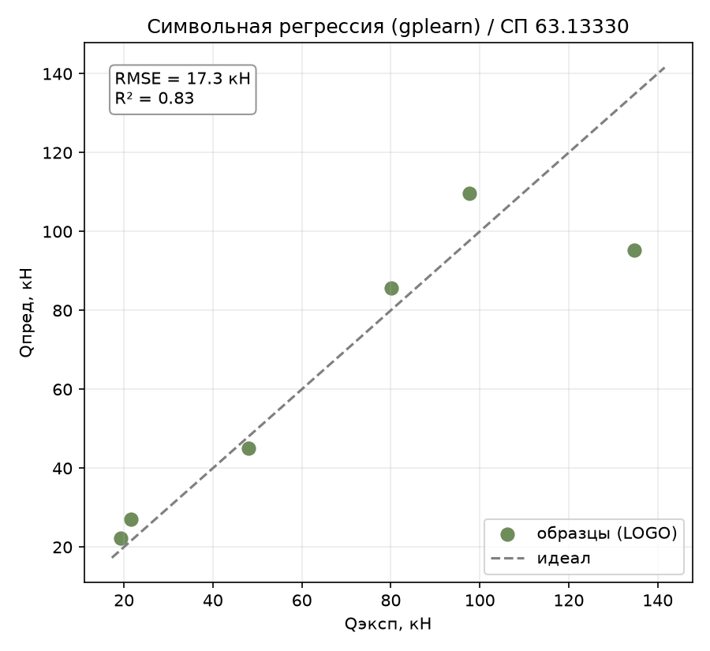
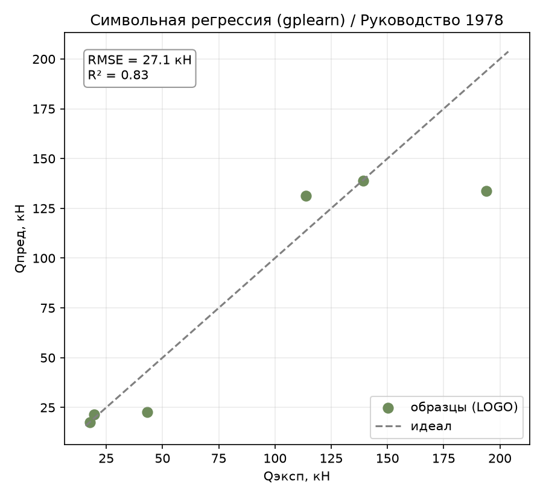
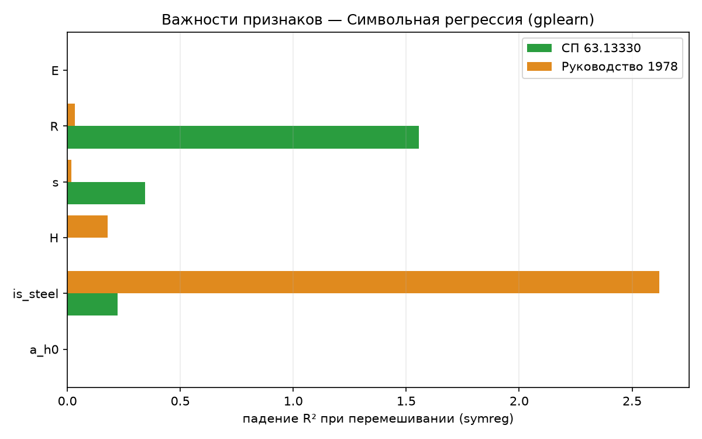

# Символьная регрессия (gplearn): автоматический вывод формулы

Отчёт по первому методу раздела 4.3 ТЗ «Вывод явной формулы» — генетическому
программированию (gplearn, `SymbolicRegressor`). В отличие от
биоинспирированного подбора коэффициентов (report_05–08), где заранее задана
**форма** зависимости (степенная), символьная регрессия ищет одновременно и
структуру формулы, и её коэффициенты — прямая современная замена ручного
подбора, о которой говорит ТЗ (раздел 1). Определения метрик и схема оценки —
в [report_01_linear_regression.md](report_01_linear_regression.md).

## 1. Метод

Генетическое программирование эволюционирует популяцию деревьев выражений:
каждое дерево — кандидат-формула из заданного набора операций
(`+ - * / sqrt ln`), фитнес — ошибка предсказания со штрафом за размер дерева
(`parsimony_coefficient`, чтобы не разрастались бесконечно). За несколько
поколений скрещивания и мутации популяция сходится к формуле с приемлемым
компромиссом «точность/простота». В отличие от бионспирированных методов,
здесь ничего не задано заранее — ни степенная форма, ни то, какие признаки
вообще войдут в формулу.

## 2. Как работает

- **`population_size` / `generations`** — размер популяции формул и число
  поколений эволюции (аналог бюджета вычислений у GA/PSO/DE).
- **`parsimony_coefficient`** — штраф за длину дерева выражения; без него
  генетический поиск склонен к «раздутию» (bloat) — see раздел 3.
- **`function_set`** — набор допустимых операций. Здесь `add, sub, mul, div,
  sqrt, log` (без возведения в степень — поэтому итоговая формула не похожа
  на степенную из report_06–08).

Модель обёрнута в [symbolic_regression.py](../core/models/sym_regression/symbolic_regression.py)
(`SymbolicRegressionModel`) по тому же интерфейсу `BaseModel`, что и остальные
методы, плюс `.formula()` — как у биоинспирированных моделей (раздел 4.3 ТЗ).
Печатное представление `gplearn` (`str(sr._program)`), например
`add(mul(H, s), sqrt(E))`, переводится в привычную инфиксную запись функцией
`humanize_expression()`, а затем — в LaTeX через
[core/formula/latexify.py](../core/formula/latexify.py) (тот же конвертер, что
уже используется для Lasso и биоинспирированных формул — раздел 5.2 проверяет,
что он не ломается на глубоко вложенных выражениях).

## 3. Можно ли применять LOGO к символьной регрессии — да, и вот почему

Пользователь прямо спросил, корректно ли гонять Leave-One-Group-Out для этого
метода. Коротко — да, ровно так же, как для GA/PSO/DE/CMA-ES (report_05–08):
`SymbolicRegressor.fit(X, y)` — это полный переобучение «с нуля» (новая
случайная популяция, эволюция заново) на переданных данных, поэтому
`leave_one_group_out(lambda: SymbolicRegressionModel(...), X, y, groups, ...)`
на каждом фолде честно обучает новую формулу на 5 профилях и проверяет её на
6-м, ни разу не видев его. Никакой утечки нет — методологически это тот же
протокол, что и у всех остальных методов работы.

**Но есть нюанс, специфичный именно для генетического программирования**:
результат заметно более стохастичен, чем у биоинспирированного подбора
коэффициентов. Там форма формулы зафиксирована (степенная), и оптимизатор
ищет всего 5–6 чисел в ограниченном, хорошо обусловленном пространстве. Здесь
же ищется сама структура выражения — пространство поиска несравнимо больше и
хуже обусловлено, а тренировочных профилей — только 5 в каждом фолде. Поэтому
доверять одному прогону на одном `seed` нельзя — нужна явная проверка
стабильности по разным `seed` (сделана в разделе 4).

## 4. Подбор гиперпараметров и проверка стабильности

### 4.1. `parsimony_coefficient` — контроль раздутия

С `population_size=2000, generations=25, parsimony_coefficient=0.01` (черновая
настройка) формула на полном датасете выродилась в выражение из **53 узлов**
и глубиной 14 — нечитаемая мешанина вложенных `sqrt`/`ln` с искусственной
конструкцией вида `H - is_steel` (вычитание бинарного флага из высоты в мм —
явный признак переобучения/бессмысленной структуры, а не физики). Классическая
проблема генетического программирования — **bloat**.

Перебор `parsimony_coefficient` (одиночный `seed`, LOGO, СП63):

| parsimony_coefficient | R² | RMSE | overfit |
|:---:|:---:|:---:|:---:|
| 0.01 | 0.725 | 21.85 | 0.270 |
| 0.03 | 0.869 | 15.09 | 0.128 |
| 0.05 | 0.819 | 17.75 | 0.076 |
| 0.08 | 0.828 | 17.27 | 0.060 |
| 0.12 | 0.739 | 21.30 | 0.160 |

Результат **немонотонный** — не типичная кривая bias/variance, а шум:
признак того, что на одном `seed` эти цифры не значат почти ничего. Отсюда —
обязательная проверка по нескольким `seed` (раздел 4.2), а не выбор по
одному прогону, как можно было бы сделать по инерции для детерминированных
методов (report_09–12).

### 4.2. Стабильность по seed — только так подбор имеет смысл

LOGO-R² на 4 seed'ах для трёх кандидатов `parsimony_coefficient` (СП63):

| parsimony_coefficient | R² по seed'ам | mean | std |
|---|---|:---:|:---:|
| 0.03 | 0.869, 0.855, 0.827, 0.777 | 0.832 | 0.035 |
| 0.05 | 0.819, 0.835, 0.824, 0.757 | 0.809 | 0.030 |
| **0.08** | 0.828, 0.855, 0.906, 0.884 | **0.868** | **0.029** |

`parsimony_coefficient=0.08` — лучшее среднее при сопоставимом разбросе.
Проверка на второй цели (РУК78, 3 seed'а): `[0.832, 0.912, 0.842]`,
mean=0.862, std=0.036 — та же картина, выбор подтверждён на обеих целях.
Итоговые параметры, зашитые в модель
([symbolic_regression.py](../core/models/sym_regression/symbolic_regression.py)):
`population_size=1000, generations=20, parsimony_coefficient=0.08`.

**Важная оговорка: стабилен R², но не сама формула.** Формулы на полном
датасете (СП63) на четырёх разных `seed` при одинаковых гиперпараметрах:

| seed | Формула |
|---|---|
| 1337 | `(((s + M) + M) · √R) − (√(((s + M) + M) · √R) + (a/h₀))` |
| 1338 | `s · ((√(√(√(((0.89 − E) + (0.89 − E)) · (R/(M·−0.473)))) + (H/(M·−0.473)))) − ((M·−0.473)·s)) − ((M·−0.473)·s))` |
| 1339 | `((H/M) − (s/−0.133)) / √ln((R − ln((H/M) − (s/−0.133))) − s − (H/M))` |
| 1340 | `√((H + √√E) · ((ln(√s · 0.611)/M)/(M/H) + (s − 0.594) − 0.594))` |

Четыре seed'а — **четыре совершенно разных выражения** с разным набором
задействованных признаков (одно использует `R`, другое `E`, третье вообще без
`R` и `E`). Точность предсказания при этом близка (раздел 4.2). Это ключевое
методологическое ограничение генетического программирования на такой
крошечной выборке: **предсказание воспроизводимо, а конкретная символьная
структура — нет**. Смысл символьной регрессии по ТЗ — получить интерпретируемую
инженерную формулу; если сама формула не устойчива к перезапуску со случайным
зерном, доверять её конкретному виду как «открытой физике» нельзя — в отличие
от степенной формулы DE/CMA-ES (report_06, 08), которая воспроизводится
стабильно, потому что её форма зафиксирована заранее.

## 5. Результаты

Сравнение символьной регрессии со всеми испытанными методами:

| Метрика | Lasso | GBR | **symreg** | SVR | KNN | GPR | DE |
|---|:---:|:---:|:---:|:---:|:---:|:---:|:---:|
| **СП63** $R^2$ | 0.869 | 0.864 | **0.828** | 0.987 | 0.781 | 0.706 | 0.999 |
| СП63 RMSE, кН | 15.10 | 15.35 | 17.27 | 4.79 | 19.52 | 22.61 | 1.51 |
| СП63 within15 | 33 % | 17 % | 67 % | 72 % | 33 % | 33 % | 100 % |
| СП63 overfit | 0.109 | 0.136 | 0.060 | 0.013 | 0.219 | 0.294 | 0.001 |
| **РУК78** $R^2$ | 0.812 | 0.833 | **0.832** | 0.967 | 0.825 | 0.779 | 1.000 |
| РУК78 RMSE, кН | 28.65 | 27.01 | 27.05 | 12.01 | 27.60 | 31.02 | 1.19 |
| РУК78 overfit | 0.166 | 0.167 | 0.158 | 0.175 | 0.221 | 0.294 | 0.000 |

Символьная регрессия занимает **середину рейтинга**: чуть слабее Lasso/GBR по
$R^2$, но с заметно более низким overfit на СП63 (0.060 — второй результат в
работе после SVR) и лучшим `within15` (67 %) среди всех методов, кроме SVR и
DE. Она однозначно обходит KNN и GPR по обеим целям.

*Рисунок 1 – Символьная регрессия, эксперимент–предсказание (по профилям), СП 63.13330*

*Рисунок 2 – Символьная регрессия, эксперимент–предсказание (по профилям), Руководство 1978*

Итоговые формулы (`seed=1337`, зафиксированный по умолчанию), отрендеренные
через `latexify` без ошибок и без падения в моноширинный fallback:

- **СП63**: $Q_\text{дв} = (((s + M) + M) \cdot \sqrt{R}) - (\sqrt{(((s + M) + M) \cdot \sqrt{R})} + (a/h_0))$
- **РУК78**: $Q_\text{дв} = (s + ((\sqrt{(H \cdot ((s - (a/h_0)) + (((s - (a/h_0)) + (H/M))/M)))} + (a/h_0)) - \sqrt{R})) - \sqrt{R}$

## 6. Поведение метода

### 6.1. Overfit — на удивление низкий

`overfit = 0.060` (СП63) — второй лучший результат в работе (после SVR),
заметно ниже Lasso и GBR. На РУК78 (`0.158`) — на уровне Lasso/GBR. Это может
показаться противоречащим разделу 4.2 (нестабильность формулы), но
объясняется просто: parsimony-штраф ограничивает сложность дерева, поэтому
даже переобучаясь под конкретные 5 профилей, формула не может выучить их
идеально ($R^2_\text{train}=0.889$ на СП63 — заметно ниже 1.0, в отличие от
всех «чёрных ящиков» report_09–12) — принудительная простота работает как
регуляризация.

### 6.2. Формула правдоподобна лишь отчасти — критический разбор

Две проблемы в самой структуре найденной (при `seed=1337`) формулы:

1. **`a/h₀` присутствует в обеих формулах, но permutation importance
   (раздел 6.3) показывает его вклад практически равным нулю** (`0.0004` /
   `0.0000`). Признак использован генетическим поиском, но функционально не
   работает — артефакт эволюции, а не найденная зависимость. Единственный
   надёжный способ это заметить — не разбор формулы на глаз, а permutation
   importance.
2. **Формула РУК78 делит на `is_steel`** (`H/M`, `M`=0/1) — для композитных
   образцов (`M=0`) это буквально деление на ноль. `gplearn` использует
   «защищённое» деление (возвращает 1 при делителе, близком к нулю), поэтому
   на практике модель не падает, но это означает **разрыв формулы** между
   стальными и композитными профилями, который не виден при обычном чтении
   выражения — ещё один повод не относиться к дословному виду формулы как к
   физическому закону.

### 6.3. Важности признаков

Permutation importance ([tools/importances.py](../tools/importances.py)):

*Рисунок 3 – Permutation importance символьной регрессии по обеим целям*

| Признак | СП63 | РУК78 |
|---------|:----:|:-----:|
| `R` | 1.555 | 0.032 |
| `is_steel` | 0.224 | 2.620 |
| `s` | 0.344 | 0.017 |
| `H` | 0.000 | 0.180 |
| `a/h₀` | 0.0004 | **0.000** |
| `E` | **0.000** | **0.000** |

Шестое независимое подтверждение: **`a/h₀` не влияет на $Q_\text{дв}$** —
теперь и через генетический поиск формул, не только через важности
чёрных ящиков (report_09–12). Показательно и то, что `E` здесь не задействован
вовсе на обеих целях: `R` и `is_steel` (коллинеарные с `E` по построению
выборки) оказались для генетического поиска достаточным прокси — ещё одна
иллюстрация того, что при коллинеарных признаках символьная регрессия
находит *какую-то* работающую комбинацию, а не обязательно ту же, что
использует физика или другие методы.

### 6.4. Разбор по профилям

Худший профиль — шестое подряд совпадение по всем методам: **сталь H=200**
(RMSE 39.6 кН на СП63, 60.5 кН на РУК78). На СП63 второй худший —
**сталь H=160** (11.9 кН), на РУК78 — **композит H=200** (20.5 кН); в целом
композитные профили здесь предсказаны точнее стальных, кроме композита H=200
на РУК78 — картина не такая однозначная, как у KNN (раздел 5.4 report_11), но
общий паттерн («крайние по H профили — самые сложные») сохраняется.

## 7. Выводы

- **Результат — крепкая середина**: $R^2$ 0.83/0.83, между линейным классом и
  KNN/GPR, но с одним из лучших показателей overfit и within15 в работе —
  жёсткий parsimony-штраф работает как эффективная регуляризация.
- **LOGO применим и корректен методологически** — тот же протокол, что и у
  биоинспирированного подбора (раздел 3), но **требует явной проверки
  стабильности по seed**, в отличие от степенной формы: пространство поиска
  здесь не ограничено заранее, и на одном прогоне цифры недостоверны
  (раздел 4.1 — немонотонная, шумная таблица подбора).
- **Главное ограничение метода — нестабильность самой формулы**: точность
  воспроизводится между seed'ами (std R² ≈ 0.03), а структура формулы —
  нет (раздел 4.2). Это подрывает главное обещание символьной регрессии по
  ТЗ — интерпретируемую инженерную формулу взамен степенной; здесь для этого
  нужно нечто вроде голосования/отбора по множеству прогонов, чего в рамках
  этой работы не делалось.
- **Формула требует проверки, а не доверия на слово**: `a/h₀` присутствует в
  выражении, но не работает (importance≈0); деление на `is_steel` создаёт
  скрытый разрыв композит/сталь. Без permutation importance оба дефекта
  остались бы незамеченными.
- **Шестое независимое подтверждение физики**: `a/h₀` иррелевантен во всех
  испытанных семействах методов, включая генетический поиск формул.
- **Практический вывод:** символьная регрессия в этом виде — рабочий, но не
  лучший метод вывода формулы для задачи; биоинспирированный подбор
  коэффициентов при заранее заданной степенной форме (report_06, 08) даёт
  на порядок точнее результат ($R^2\approx1$ против 0.83) и, что важнее,
  **воспроизводимую** формулу — при столь малой выборке разумно
  ограничивать пространство поиска физически осмысленной формой, а не
  доверять эволюции найти её с нуля.

Воспроизведение. Прогон: `python entrypoint/single/symbolic_regression.py`
(обе цели, `population_size=1000, generations=20, parsimony_coefficient=0.08`).
Подбор: `python tools/tune_model.py --model symreg --target SP63 --grid parsimony_coefficient=0.01,0.03,0.05,0.08,0.12`.
Важности: `python tools/importances.py --model symreg --plot`.
