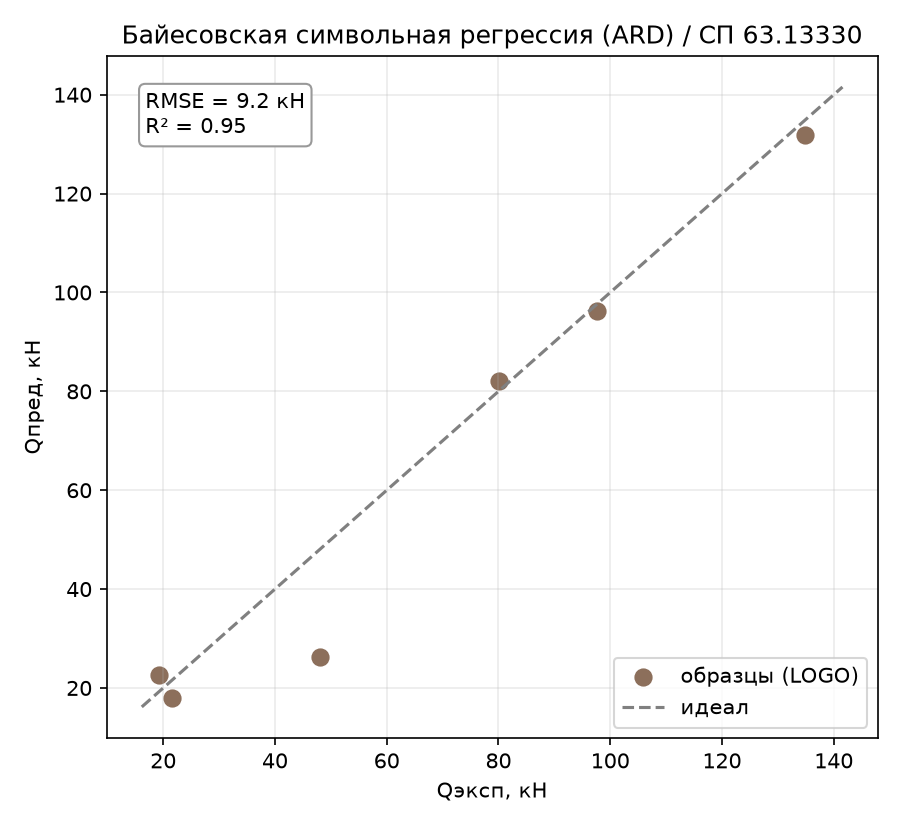
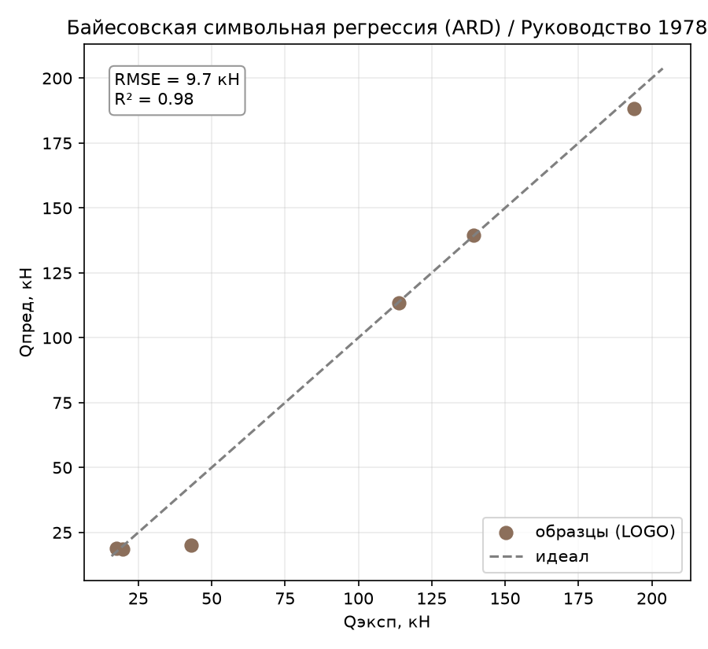
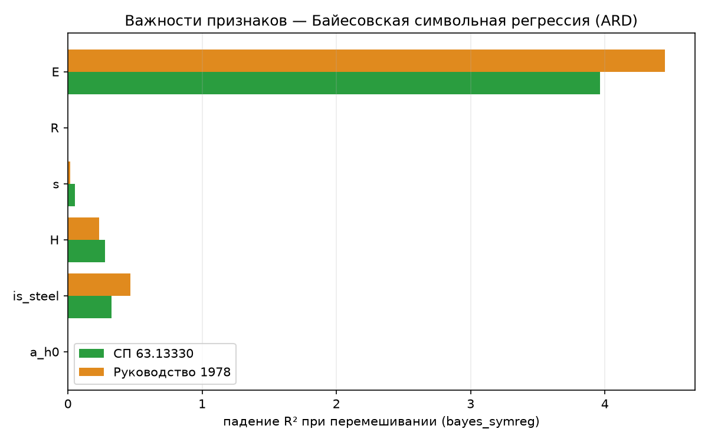

# Байесовская символьная регрессия (ARD): второй метод вывода формулы

Отчёт по второму методу раздела 4.3/4.5 ТЗ (в спецификации явно упомянута
«байесовская символьная регрессия» отдельным пунктом раздела 4.5). В отличие
от генетического программирования (report_13), здесь формула ищется не
эволюцией деревьев выражений, а **разреженной байесовской регрессией** (ARD —
Automatic Relevance Determination) поверх большого фиксированного словаря
нелинейных термов: модель не придумывает структуру с нуля, а выбирает
подмножество из заранее перечисленных кандидатов и обнуляет незначимые.
Определения метрик и схема оценки — в
[report_01_linear_regression.md](report_01_linear_regression.md).

## 1. Метод

ARD-регрессия — байесовская версия линейной регрессии, где у каждого веса
свой персональный гауссовский приор с обучаемой точностью (precision).
Точность для неинформативных весов при обучении устремляется к бесконечности,
что эквивалентно обнулению веса — модель сама решает, сколько термов оставить,
без явного L1/L2 или ручного отбора признаков (сравни с Lasso, где
разреженность задаётся одним общим `alpha`).

«Символьность» здесь — в словаре термов, а не в структуре поиска: строится
фиксированный набор кандидатов (раздел 2), ARD выбирает линейную комбинацию
из них, а получившиеся ненулевые коэффициенты складываются в читаемую формулу.

## 2. Как работает

Словарь термов ([baesian_symbolic_regression.py](../core/models/sym_regression/baesian_symbolic_regression.py),
`_build_terms`) для 6 признаков строит **36 кандидатов**:

- 6 линейных членов (`H`, `s`, `R`, `E`, `is_steel`, `a/h₀`);
- по 5 квадратов, `sqrt`, `ln` — для всех признаков, кроме `is_steel`
  (бинарный, эти преобразования для него бессмысленны) — итого 15;
- 15 попарных произведений (`H·E`, `H·s`, … — все $C_6^2$ пар).

Все термы стандартизируются (среднее 0, дисперсия 1) перед подачей в
`ARDRegression`, что уравнивает их для байесовского приора. После обучения
термы с коэффициентом ниже `0.02 · max|coef|` отсекаются из **печатной**
формулы (`_REL_THRESHOLD`) — важно: это только косметика для читаемости
текста, само предсказание (`predict()`) использует все термы с их истинными
(пусть и малыми) коэффициентами, отсечение их не касается.

**`threshold_lambda`** — единственный содержательный гиперпараметр ARD:
порог точности (precision), выше которого вес считается нулевым и исключается
из модели уже на уровне обучения (не только печати). Именно он вынесен для
подбора в [baesian_symbolic_regression.py](../core/models/sym_regression/baesian_symbolic_regression.py)
(`BayesianSymbolicRegressionModel`).

## 3. Подбор гиперпараметров

Перебор `threshold_lambda` от 100 до 1 000 000 через
[tools/tune_model.py](../tools/tune_model.py):

| threshold_lambda | СП63 R² | СП63 overfit | РУК78 R² | РУК78 overfit |
|---:|:---:|:---:|:---:|:---:|
| 100 | 0.955 | 0.045 | 0.979 | 0.021 |
| 1 000 | 0.955 | 0.045 | 0.979 | 0.021 |
| 5 000 | 0.951 | 0.049 | **0.979** | **0.021** |
| **10 000 (дефолт sklearn)** | 0.951 | 0.049 | 0.979 | 0.021 |
| 100 000 | 0.951 | 0.049 | 0.979 | 0.021 |
| 1 000 000 | 0.951 | 0.049 | 0.979 | 0.021 |

**Результат практически не зависит от `threshold_lambda`** в диапазоне на
четыре порядка (разброс R² — тысячные доли). Это хороший знак, а не
недостаток: значит, ARD сам уверенно нашёл небольшую группу явно значимых
термов, и их точности (precision) лежат далеко за пределами любого разумного
порога отсечения — модель не «на грани» выбора, в отличие, например, от
`gamma` у SVR (report_10), где результат резко зависел от точного значения.
Оставлен дефолт sklearn `threshold_lambda=10000`.

**Стохастичности нет вовсе.** В отличие от символьной регрессии на gplearn
(report_13, где формула кардинально менялась от `seed` к `seed`),
`ARDRegression` — детерминированный итеративный EM-алгоритм без случайной
инициализации: два независимых запуска `fit()` на одних данных дают
**побитово идентичную** формулу. Проверка по `seed`, обязательная для
report_13, здесь не нужна и не была бы содержательной.

## 4. Результаты

Сравнение со всеми испытанными методами:

| Метрика | Lasso | GBR | symreg | **bayes_symreg** | SVR | KNN | GPR | DE |
|---|:---:|:---:|:---:|:---:|:---:|:---:|:---:|:---:|
| **СП63** $R^2$ | 0.869 | 0.864 | 0.828 | **0.951** | 0.987 | 0.781 | 0.706 | 0.999 |
| СП63 RMSE, кН | 15.10 | 15.35 | 17.27 | 9.24 | 4.79 | 19.52 | 22.61 | 1.51 |
| СП63 within15 | 33 % | 17 % | 67 % | 67 % | 72 % | 33 % | 33 % | 100 % |
| СП63 overfit | 0.109 | 0.136 | 0.060 | 0.049 | 0.013 | 0.219 | 0.294 | 0.001 |
| **РУК78** $R^2$ | 0.812 | 0.833 | 0.832 | **0.979** | 0.967 | 0.825 | 0.779 | 1.000 |
| РУК78 RMSE, кН | 28.65 | 27.01 | 27.05 | 9.65 | 12.01 | 27.60 | 31.02 | 1.19 |
| РУК78 overfit | 0.166 | 0.167 | 0.158 | 0.021 | 0.175 | 0.221 | 0.294 | 0.000 |

**Байесовская символьная регрессия — второй-третий результат в работе**,
обходит все «чёрные ящики» (SVR — только на СП63, а на РУК78 обходит и его:
0.979 против 0.967) и оба других метода вывода формулы (Lasso, gplearn
symreg). Уступает только DE — а на РУК78 разрыв с ним меньше, чем у любого
другого метода в работе, кроме DE/CMA-ES между собой.

*Рисунок 1 – Байесовская символьная регрессия, эксперимент–предсказание (по профилям), СП 63.13330*

*Рисунок 2 – Байесовская символьная регрессия, эксперимент–предсказание (по профилям), Руководство 1978*

Итоговые формулы (латексифицированы без ошибок, тем же конвертером, что и
Lasso/symreg/DE):

- **СП63**: $Q_\text{дв} = 235.9 + 5.394\times10^{-6}\cdot H\cdot E - 33.21\cdot M + 0.0272\cdot H\cdot s - 56.4\cdot \ln(H) - 1.338\times10^{-5}\cdot s\cdot E$
- **РУК78**: $Q_\text{дв} = 435 + 8.235\times10^{-6}\cdot H\cdot E - 63.15\cdot M - 106.6\cdot \ln(H) + 0.01854\cdot H\cdot s + 0.1863\cdot H$

## 5. Поведение метода

### 5.1. Overfit — второй лучший в работе

`overfit = 0.049` (СП63) и `0.021` (РУК78) — уступает только SVR на СП63 и
вообще никому на РУК78 (лучший результат среди всех методов кроме DE).
Байесовская регуляризация ARD эффективно ограничивает число активных термов,
не давая модели выучить все 5 обучающих профилей наизусть, несмотря на то,
что размерность словаря (36 термов) больше, чем число обучающих точек.

### 5.2. Формула читаема и правдоподобна — в отличие от report_13

В противоположность report_13 (символьная регрессия gplearn), здесь формула
**компактна и интерпретируема без дополнительной проверки**: 5–6 термов,
никаких патологий вроде деления на бинарный признак или искусственных
вычитаний. Обе формулы согласованно используют `H·E`, `is_steel`, `ln(H)`,
`H·s` — устойчивый, физически правдоподобный набор (высота и модуль
упругости — ключевые инженерные величины для несущей способности). Ни `R`,
ни `a/h₀` в формулу не вошли ни на одной цели — согласуется с permutation
importance (раздел 5.3), в отличие от gplearn-формулы, где `a/h₀`
присутствовал, но не работал (ложный терм, report_13, раздел 6.2). Здесь
такого разрыва между «что в формуле» и «что реально важно» нет.

### 5.3. Важности признаков

Permutation importance ([tools/importances.py](../tools/importances.py)):

*Рисунок 3 – Permutation importance байесовской символьной регрессии по обеим целям*

| Признак | СП63 | РУК78 |
|---------|:----:|:-----:|
| `E` | 3.966 | 4.447 |
| `is_steel` | 0.324 | 0.467 |
| `H` | 0.277 | 0.231 |
| `s` | 0.051 | 0.017 |
| `R` | **0.000** | **0.000** |
| `a/h₀` | **0.000** | **0.000** |

Седьмое независимое подтверждение: **`a/h₀` не влияет на $Q_\text{дв}$** — и
единственный метод в работе, где это видно и в самой формуле (терм просто
отсутствует), а не только в апостериорной проверке важности. `E` доминирует
здесь заметно сильнее, чем у остальных методов — потому что входит сразу в
два взаимодействия (`H·E`, `s·E`), и перемешивание `E` ломает оба сразу.

### 5.4. Разбор по профилям — впервые не «сталь H=200»

| Профиль | СП63 RMSE | РУК78 RMSE |
|---|:---:|:---:|
| **композит H=200** | **21.75** | **22.89** |
| сталь H=200 | 2.98 | 5.71 |
| композит H=150 | 3.64 | 1.03 |
| композит H=160 | 3.32 | 1.23 |
| сталь H=140 | 1.88 | 0.20 |
| сталь H=160 | 1.35 | 0.18 |

Впервые за шесть отчётов (report_09–13) худший профиль — **не** «сталь H=200»,
а **«композит H=200»**, причём с большим отрывом (21.8–22.9 кН против 1–6 кН
у остальных пяти). При этом «сталь H=200» — тот самый неизменно проблемный
профиль у всех прочих методов — здесь предсказан одним из лучших (3.0–5.7 кН).
Правдоподобное объяснение: формула построена вокруг `H·E` и `is_steel` как
переключателя уровня — для стали (`is_steel=1`) член `-33.21·M`
(или `-63.15·M`) сдвигает базовый уровень, откалиброванный по имеющимся
стальным профилям, а для композита (`is_steel=0`) предсказание держится
почти целиком на `H·E` и `ln(H)`; когда в LOGO-фолде исключается композит
H=200 — самый крупный композитный профиль, — единственная опорная точка для
экстраполяции композитной ветки на большие `H` пропадает, и линейная по
термам модель промахивается сильнее, чем на стали (где профилей чуть больше
информации о работе переключателя `is_steel` остаётся даже при исключении
одного). Это не противоречит выводу об общей сложности крайних по `H`
профилей (see report_09–13) — просто здесь ошибка перераспределилась на
другую ветку модели.

## 6. Выводы

- **Один из лучших методов в работе**: $R^2$ 0.95/0.98, второй-третий
  результат после DE, обходит SVR на РУК78 и все остальные методы вывода
  формулы (Lasso, gplearn symreg) на обеих целях.
- **Лучший overfit-профиль среди методов вывода формулы** (0.049/0.021) —
  байесовская регуляризация ARD эффективно справляется с разреженным отбором
  термов даже когда словарь кандидатов (36) больше выборки.
- **Не чувствителен к своему единственному гиперпараметру** (`threshold_lambda`
  меняется на 4 порядка почти без эффекта) и **полностью детерминирован** —
  прямая противоположность report_13 (gplearn), где и подбор шумный, и
  формула нестабильна между `seed`. Ключевой практический вывод по всему
  разделу 4.3: если словарь кандидатных термов можно разумно ограничить
  заранее (как здесь — простые преобразования шести физических величин),
  байесовский отбор термов даёт настолько же стабильный, но более точный
  результат, чем свободный генетический поиск структуры формулы.
- **Формула компактна, читаема и не содержит ложных термов** — в отличие от
  report_13, где `a/h₀` попал в выражение, но не влиял на предсказание, здесь
  такого разрыва нет: то, что в формуле, то и важно по permutation importance.
- **Седьмое независимое подтверждение физики**: `a/h₀` иррелевантен во всех
  испытанных семействах методов, и впервые — не только по важности, но и по
  прямому отсутствию в самой формуле.
- **Единственное расхождение с общим паттерном работы**: худший профиль здесь
  — «композит H=200», а не неизменное для всех прочих методов «сталь H=200» —
  повод при сведении итоговой таблицы (раздел 5/6.7 ТЗ) явно отметить, что
  «трудный профиль» зависит от структуры конкретной модели, а не является
  универсальным свойством данных.

Воспроизведение. Прогон: `python entrypoint/single/bayesian_symbolic_regression.py`
(обе цели, `threshold_lambda=10000` — дефолт). Подбор:
`python tools/tune_model.py --model bayes_symreg --grid threshold_lambda=100,1000,5000,10000,50000,100000,1000000`.
Важности: `python tools/importances.py --model bayes_symreg --plot`.
