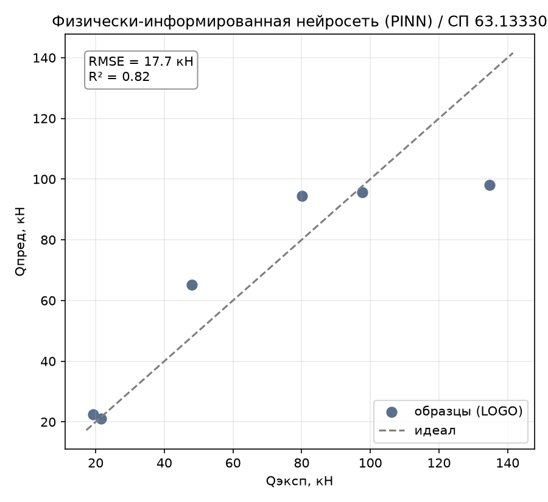
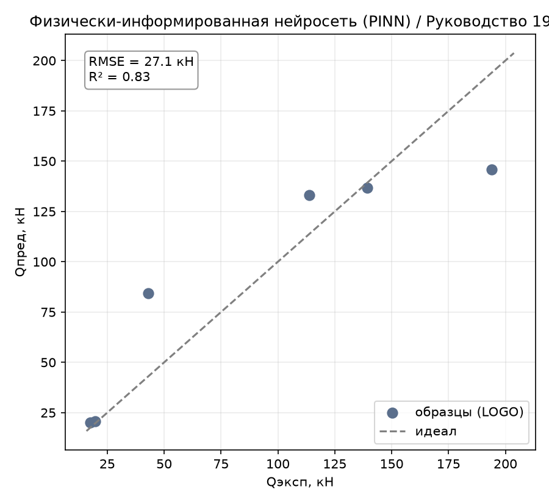
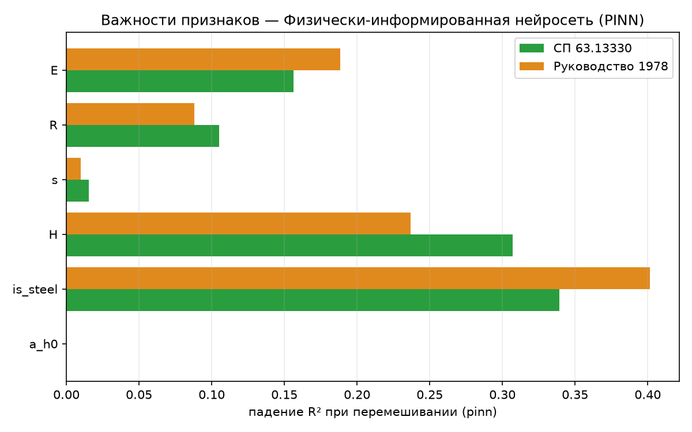

# Физически-информированная нейросеть (PINN)

Отчёт по первому методу раздела 4.4 ТЗ «Физически-информированные и
современные нейросети». В отличие от всех предыдущих методов, PINN не просто
подгоняется под данные — в функцию потерь добавлены штрафы за нарушение
известных физических свойств зависимости, даже там, где обучающих точек нет.
Определения метрик и схема оценки — в
[report_01_linear_regression.md](report_01_linear_regression.md).

## 1. Метод

Обычная MLP (полносвязная сеть, `Linear → Tanh`, по умолчанию два скрытых
слоя по 64 нейрона) обучается на сумме двух потерь:

- **`data_loss`** — обычная MSE на обучающих точках, как у любой нейросети;
- **`phys_loss`** — штраф на случайных точках-коллокациях внутри диапазона
  признаков (не обязательно совпадающих с реальными образцами), где
  проверяются два физических свойства $Q_\text{дв}$:
  1. **монотонность** — вклад двутавра не может убывать с ростом высоты `H`,
     толщины стенки `s` или прочности `R` ($\partial Q/\partial x \geq 0$
     для этих трёх признаков, штраф `torch.relu(-grad)²` на нарушение);
  2. **неотрицательность** — $Q_\text{дв} \geq 0$ везде, не только на
     обучающих точках.

Никакого уравнения в частных производных здесь нет (в этой задаче его и
неоткуда взять) — «физика» в терминологии ТЗ сведена к мягким инженерным
ограничениям на форму функции, что для задачи табличной регрессии (в отличие
от классических PINN для PDE) — обоснованное упрощение.

## 2. Как работает

Реализация — [pinn.py](../core/models/neural/pinn.py) (`PINNModel`,
`torch`). Прежде чем строить пайплайн, слегка отрефакторил присланный код —
без изменения логики:

- **Исправлен `set_seed()`.** Раньше `PINNModel` не переопределял метод
  `BaseModel.set_seed()` — вызов `get_model('pinn').set_seed(seed)` (именно
  так `core/evaluation/runner.py` прокидывает seed в LOGO) тихо игнорировался,
  и модель всегда использовала seed, зафиксированный при конструировании.
  Без этой правки честная проверка стабильности по seed (раздел 3) была бы
  невозможна.
- **Именованные индексы вместо магических чисел.** `_MONOTONE_UP_IDX = (2, 3, 4)`
  завязывало условие монотонности на конкретный порядок `cfg.FEATURES
  ["a_h0", "is_steel", "H", "s", "R", "E"]` без единого пояснения — при
  малейшей перестановке признаков ограничение тихо применилось бы не к тем
  переменным. Заменено на явное `_MONOTONE_UP_FEATURES = ("H", "s", "R")` +
  `cfg.FEATURES.index(...)`, с комментарием, почему именно эти три.
- Мелкая уборка (пустые строки-комментарии).

Логика физических потерь, архитектура сети и точки коллокации не менялись.

## 3. Подбор гиперпараметров: работает ли физика вообще?

Главный вопрос для PINN — не просто «какое значение параметра лучше», а
**помогают ли физические ограничения в принципе**, ведь `phys_weight=0`
превращает модель в обычный MLP («нейросеть предыдущего поколения» из
формулировки ТЗ 4.4 — естественная база для сравнения).

| phys_weight | СП63 R² | СП63 overfit |
|---:|:---:|:---:|
| 0 (обычный MLP) | 0.790 | 0.210 |
| 0.05 | 0.816 | 0.184 |
| 0.1 | 0.818 | 0.182 |
| 0.3 | 0.820 | 0.180 |
| 1.0 | 0.821 | 0.179 |
| 2.0 – 5.0 | 0.821 – 0.824 | 0.176 – 0.179 |
| 10.0 | 0.823 | 0.177 |

**Физика помогает, и чётко монотонно** — рост от `phys_weight=0` до `≈1`
даёт устойчивый прирост R² (0.790→0.821) и снижение overfit (0.210→0.179),
дальше — плато (прирост в третьем знаке до `phys_weight=10`). Подтверждено на
второй цели: РУК78 `phys_weight=0` → R²=0.815, `phys_weight=1.0` → R²=0.832.
Выбран **`phys_weight=1.0`** — почти весь эффект, без искусственно большого
веса.

**Стабильность по seed** (сеть инициализируется случайно, точки коллокации
тоже случайны на каждой эпохе): 3 прогона LOGO на СП63 —
`R² = [0.821, 0.847, 0.813]`, mean=0.827, std=**0.014**. Заметно устойчивее,
чем генетическое программирование (report_13: std≈0.03–0.035) — обучение
нейросети градиентным спуском воспроизводимее, чем эволюционный поиск
структуры формулы, на этой задаче можно доверять результату с одного `seed`.

Итоговые параметры, зашитые в модель ([pinn.py](../core/models/neural/pinn.py)):
`hidden=(64, 64), epochs=1500, lr=5e-3, phys_weight=1.0`.

## 4. Результаты

Сравнение со всеми испытанными методами:

| Метрика | Lasso | GBR | symreg | **PINN** | bayes_symreg | SVR | KNN | GPR | DE |
|---|:---:|:---:|:---:|:---:|:---:|:---:|:---:|:---:|:---:|
| **СП63** $R^2$ | 0.869 | 0.864 | 0.828 | **0.821** | 0.951 | 0.987 | 0.781 | 0.706 | 0.999 |
| СП63 RMSE, кН | 15.10 | 15.35 | 17.27 | 17.66 | 9.24 | 4.79 | 19.52 | 22.61 | 1.51 |
| СП63 within15 | 33 % | 17 % | 67 % | 50 % | 67 % | 72 % | 33 % | 33 % | 100 % |
| СП63 overfit | 0.109 | 0.136 | 0.060 | 0.179 | 0.049 | 0.013 | 0.219 | 0.294 | 0.001 |
| **РУК78** $R^2$ | 0.812 | 0.833 | 0.832 | **0.832** | 0.979 | 0.967 | 0.825 | 0.779 | 1.000 |
| РУК78 RMSE, кН | 28.65 | 27.01 | 27.05 | 27.10 | 9.65 | 12.01 | 27.60 | 31.02 | 1.19 |
| РУК78 overfit | 0.166 | 0.167 | 0.158 | 0.168 | 0.021 | 0.175 | 0.221 | 0.294 | 0.000 |

PINN садится в ту же «крепкую середину», что и gplearn-символьная регрессия —
практически идентичный РУК78 (0.832 у обоих), чуть слабее на СП63. Обходит
KNN и GPR, но не дотягивает до Lasso/GBR, не говоря об SVR/bayes_symreg/DE.
`overfit` — худший среди методов раздела 4.3–4.4 кроме KNN/GPR: 6 профилей
для сети с двумя скрытыми слоями по 64 нейрона (несколько тысяч параметров) —
принципиально мало данных, физические ограничения помогают (раздел 3), но не
компенсируют разрыв полностью.

*Рисунок 1 – PINN, эксперимент–предсказание (по профилям), СП 63.13330*

*Рисунок 2 – PINN, эксперимент–предсказание (по профилям), Руководство 1978*

## 5. Поведение метода

### 5.1. «Поджатие к среднему» — как у KNN

На рассеянии (Рисунок 1) видно то же ограничение, что и у KNN (report_11):
самый крупный профиль (135 кН эксп.) предсказан всего в ~98 кН. Причина здесь
другая — `Tanh`-активации по построению насыщаются за пределами диапазона,
на котором обучались, поэтому сеть слабо экстраполирует выше максимума
обучающих `H`/`E`/`R` в LOGO-фолде — структурное ограничение архитектуры, не
устранённое физическими потерями (они регуляризуют форму внутри диапазона
коллокации, а не поведение за его пределами).

### 5.2. Overfit — умеренный, физика явно снижает разрыв

`overfit = 0.179` (СП63) / `0.168` (РУК78) — хуже Lasso/GBR/symreg/bayes_symreg,
но заметно лучше «обычного MLP» без физики (`phys_weight=0`: overfit 0.210 на
СП63, раздел 3). Это ключевой практический результат раздела 4.4: физические
ограничения работают как регуляризатор — не заменяют нехватку данных, но
частично её компенсируют, ровно как обещает философия PINN из ТЗ.

### 5.3. Важности признаков

Permutation importance ([tools/importances.py](../tools/importances.py)):

*Рисунок 3 – Permutation importance PINN по обеим целям*

| Признак | СП63 | РУК78 |
|---------|:----:|:-----:|
| `is_steel` | 0.339 | 0.402 |
| `H` | 0.307 | 0.237 |
| `E` | 0.156 | 0.189 |
| `R` | 0.105 | 0.088 |
| `s` | 0.015 | 0.010 |
| `a/h₀` | **0.000** | **0.000** |

Восьмое независимое подтверждение: **`a/h₀` не влияет на $Q_\text{дв}$** —
и здесь картина важностей самая «сбалансированная» среди всех методов:
задействованы все пять оставшихся признаков в разумных пропорциях (в отличие,
например, от GPR или bayes_symreg, где 1–2 признака подавляли остальные).
Возможное объяснение — монотонность по `H`, `s`, `R` встроена в обучение явно,
поэтому сеть не может полностью «выключить» ни один из них, как это делают
методы без такого ограничения.

### 5.4. Разбор по профилям

Худший профиль — снова (седьмой раз из восьми предсказательных методов)
**сталь H=200** (RMSE 36.8 кН на СП63, 48.1 кН на РУК78). Второй худший на
РУК78 — «композит H=200» (41.2 кН) — тот самый профиль, что был безусловно
худшим у bayes_symreg (report_14); здесь оба крайних по `H` профиля дают
сопоставимо большую ошибку, что соответствует поведению сети, насыщающейся
за пределами диапазона (раздел 5.1) вне зависимости от материала.

## 6. Выводы

- **Физика в функции потерь работает и измеримо** — не косметика: переход от
  `phys_weight=0` к `1.0` даёт устойчивый прирост R² и снижение overfit на
  обеих целях, дальше — плато. Это прямое экспериментальное подтверждение
  идеи PINN из ТЗ на этой задаче.
- **Результат — крепкая середина**, на уровне gplearn-символьной регрессии
  (report_13): $R^2$ 0.82/0.83, обходит KNN/GPR, но не дотягивает до линейного
  класса и тем более до SVR/bayes_symreg/DE — при всего 6 профилях сеть с
  тысячами параметров остаётся дорогим инструментом относительно объёма
  данных, даже с регуляризацией физикой.
- **Стабильнее генетического поиска**: разброс R² по seed (std≈0.014)
  заметно ниже, чем у gplearn (std≈0.03–0.035, report_13) — градиентное
  обучение MLP воспроизводимее эволюционного поиска структуры формулы на
  этой задаче.
- **Не экстраполирует за пределы обучающего диапазона** («поджатие к
  среднему» — тот же эффект, что у KNN, но по другой причине: насыщение
  `Tanh`) — общее ограничение нейросетевых методов на такой малой выборке,
  независимо от физических штрафов.
- **Восьмое независимое подтверждение физики**: `a/h₀` иррелевантен во всех
  испытанных семействах методов; здесь же — самое равномерное распределение
  важностей среди оставшихся признаков благодаря встроенной монотонности.
- **Мелкий рефакторинг** попутно исправил реальный баг (`set_seed()` не
  переопределялся — без этого проверка стабильности по seed была бы
  невозможна) и снял хрупкую зависимость физических ограничений от порядка
  признаков в конфиге.
- **Практический вывод:** PINN оправдывает идею («физика помогает») лучше,
  чем «превосходит остальные методы» — это ожидаемый и информативный
  результат для раздела 4.4 ТЗ: встраивание физических ограничений — рабочий
  приём регуляризации малых нейросетей, но не замена нехватки данных, и не
  конкурент точным методам вывода формулы (bayes_symreg, DE), которым для
  той же задачи вообще не нужны тысячи параметров.

Воспроизведение. Прогон: `python entrypoint/single/pinn.py` (обе цели,
`phys_weight=1.0`). Подбор:
`python tools/tune_model.py --model pinn --grid phys_weight=0,0.05,0.1,0.3,1.0,2.0,5.0,10.0`.
Важности: `python tools/importances.py --model pinn --plot`.
