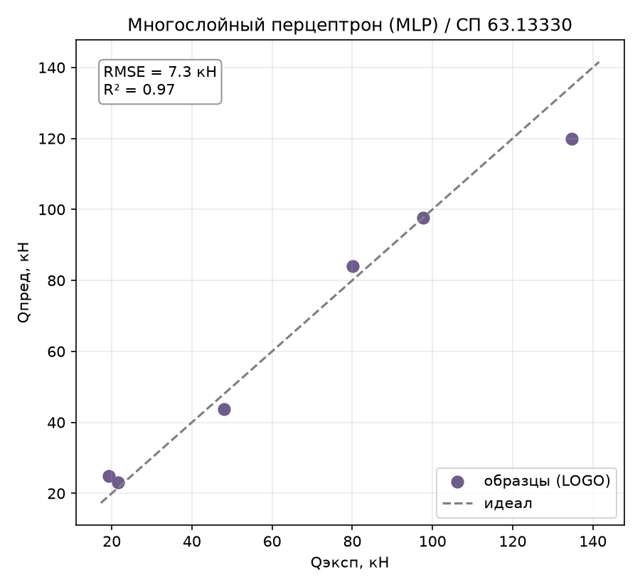
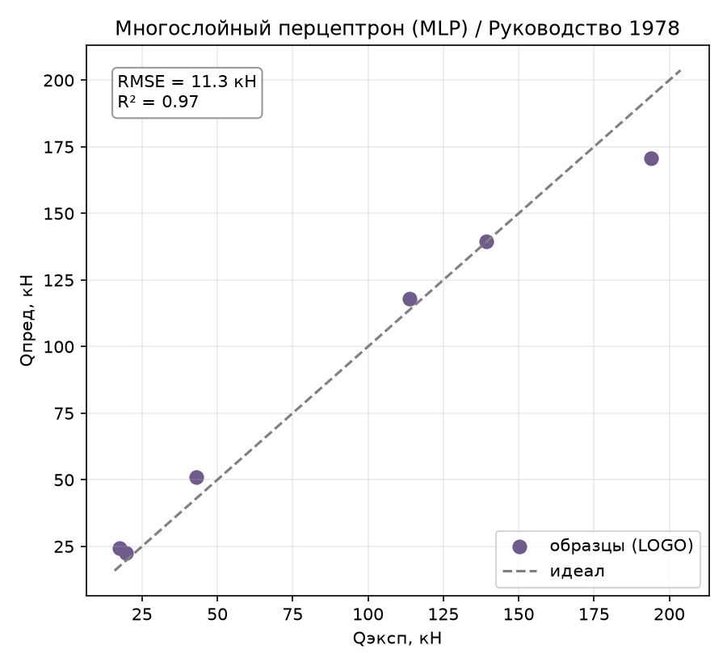
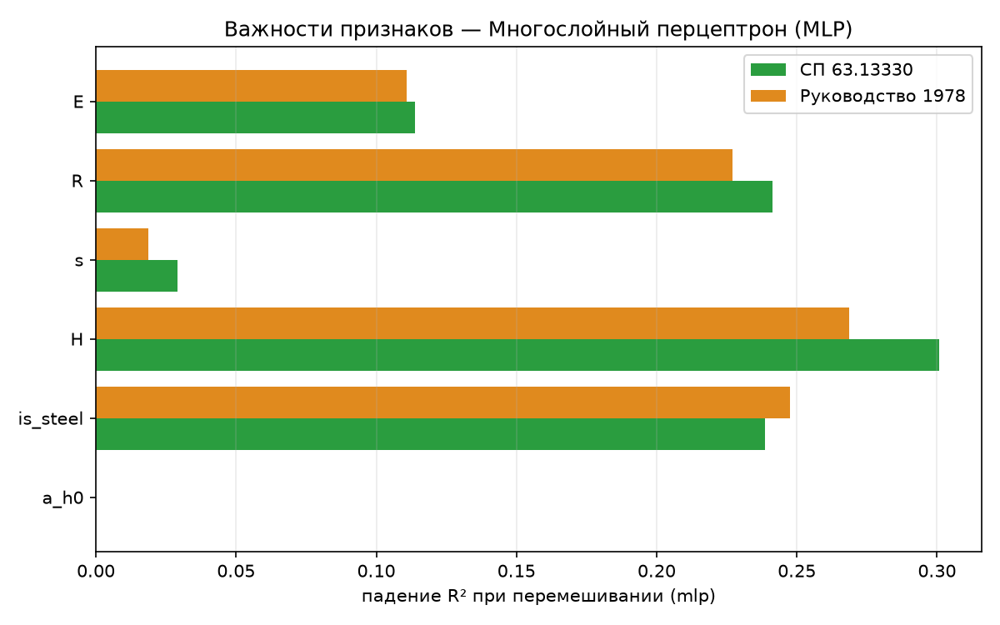

# Многослойный перцептрон (MLP): второй метод раздела 4.4

Отчёт по второму методу раздела 4.4 ТЗ. Формулировка ТЗ прямо ставит эту
модель напротив PINN (report_15) — «нейросеть предыдущего поколения» для
сравнения: обычный `MLPRegressor` (sklearn) с L2-регуляризацией (`alpha`),
без физических ограничений и без dropout — sklearn не поддерживает dropout
в `MLPRegressor` нативно, поэтому единственный доступный рычаг регуляризации
здесь — вес L2 (`alpha`), в остальном роль та же. Определения метрик и схема
оценки — в [report_01_linear_regression.md](report_01_linear_regression.md).

## 1. Метод

Обычный полносвязный перцептрон (`ReLU`, sklearn `MLPRegressor`) без каких-либо
знаний о физике задачи — учится минимизировать только MSE на обучающих точках.
Обёрнут в `StandardScaler` по входу и `TransformedTargetRegressor` со
`StandardScaler` по цели ([mlp.py](../core/models/neural/mlp.py)).

## 2. Как работает

Как и у PINN, при регистрации модели обнаружился и исправлен тот же класс
бага: `set_seed()` не был переопределён (конструктор жёстко фиксировал
`random_state` при создании, метод из `BaseModel` — no-op), что молча ломало
проброс seed из `runner.py`. Заодно рефакторинг перенёс сборку
`MLPRegressor`/`pipeline` из `__init__` в `fit()` — раньше сеть
конструировалась один раз при создании объекта с тем `seed`, что был передан
в конструктор, и повторный `set_seed()` не имел эффекта даже после
добавления самого метода, если объект уже был создан. Логика самой сети не
менялась.

- **`hidden`** — архитектура скрытых слоёв (кортеж размеров).
- **`alpha`** — сила L2-регуляризации весов (аналог `alpha` у Ridge, только
  применяется к нейросети, а не к линейной модели).

## 3. Подбор гиперпараметров

### 3.1. `alpha` — решающий рычаг

С параметрами по умолчанию (`hidden=(64, 32), alpha=0.01`) MLP дал **худший
необученный результат в работе**: $R^2$ 0.60 / 0.52, overfit 0.40 / 0.48 —
хуже нетюненого GBR. Перебор `alpha` при той же архитектуре:

| alpha | СП63 R² | СП63 overfit | РУК78 R² | РУК78 overfit |
|---:|:---:|:---:|:---:|:---:|
| 0.001 | 0.607 | 0.393 | 0.521 | 0.479 |
| 0.01 (дефолт) | 0.600 | 0.399 | 0.517 | 0.482 |
| 0.1 | 0.633 | 0.366 | 0.558 | 0.442 |
| **1.0** | **0.874** | 0.126 | **0.846** | 0.154 |
| 10 | 0.739 | 0.251 | 0.700 | 0.289 |
| 100 | −0.421 | 0.421 | −0.421 | 0.421 |

Резкий, классический пик регуляризации — слишком малый `alpha` не сдерживает
сеть на 6 профилях, слишком большой убивает саму способность обучаться
(`alpha=100` хуже константного предсказания). Уточнение вокруг пика показало
оптимум чуть левее `1.0`.

### 3.2. Архитектура — тоже решает, а не только `alpha`

В отличие от report_10–15, здесь имеет смысл перебрать и размер сети:
дефолтная `(64, 32)` (несколько тысяч весов) — избыточна для 6 профилей.

| hidden | СП63 R² | РУК78 R² |
|---|:---:|:---:|
| (16,) | 0.897 | – |
| (64, 32) (дефолт) | 0.897 | – |
| (64, 64) | 0.905 | – |
| **(32, 16)** | **0.969** | **0.971** |
| (24, 12) | 0.962 | 0.950 |
| (32, 16, 8) | 0.868 | 0.914 |
| (40, 20) | 0.909 | 0.869 |
| (48, 24) | 0.886 | 0.905 |

`(32, 16)` — явный, устойчивый на обеих целях максимум, причём заметно лучше
как более широких (`64, 64`), так и более глубоких (`32, 16, 8`) вариантов —
не просто «меньше лучше», а конкретное сочетание ширины и глубины. Повторный
подбор `alpha` уже при `hidden=(32, 16)` подтвердил оптимум в районе
**`alpha=0.5`** на обеих целях (СП63 R²=0.969, РУК78 R²=0.971 — против
0.874/0.846 у исходной архитектуры при том же `alpha=1.0`).

**Стабильность по seed** (веса инициализируются случайно, `adam`-солвер
использует мини-батчи): 3 seed'а на СП63 —
`R² = [0.969, 0.919, 0.932]`, mean=0.940, std=**0.021** — сопоставимо с PINN
(report_15, std≈0.014) и заметно устойчивее gplearn (report_13, std≈0.03–0.035).

Итоговые параметры, зашитые в модель ([mlp.py](../core/models/neural/mlp.py)):
`hidden=(32, 16), alpha=0.5`.

## 4. Результаты

Сравнение со всеми испытанными методами:

| Метрика | Lasso | GBR | symreg | PINN | bayes_symreg | **MLP** | SVR | KNN | GPR | DE |
|---|:---:|:---:|:---:|:---:|:---:|:---:|:---:|:---:|:---:|:---:|
| **СП63** $R^2$ | 0.869 | 0.864 | 0.828 | 0.821 | 0.951 | **0.969** | 0.987 | 0.781 | 0.706 | 0.999 |
| СП63 RMSE, кН | 15.10 | 15.35 | 17.27 | 17.66 | 9.24 | 7.30 | 4.79 | 19.52 | 22.61 | 1.51 |
| СП63 within15 | 33 % | 17 % | 67 % | 50 % | 67 % | 78 % | 72 % | 33 % | 33 % | 100 % |
| СП63 overfit | 0.109 | 0.136 | 0.060 | 0.179 | 0.049 | 0.030 | 0.013 | 0.219 | 0.294 | 0.001 |
| **РУК78** $R^2$ | 0.812 | 0.833 | 0.832 | 0.832 | 0.979 | **0.971** | 0.967 | 0.825 | 0.779 | 1.000 |
| РУК78 RMSE, кН | 28.65 | 27.01 | 27.05 | 27.10 | 9.65 | 11.31 | 12.01 | 27.60 | 31.02 | 1.19 |
| РУК78 overfit | 0.166 | 0.167 | 0.158 | 0.168 | 0.021 | 0.029 | 0.175 | 0.221 | 0.294 | 0.000 |

**Тюненый MLP — второй-третий результат во всей работе**, наравне с
bayes_symreg и SVR, далеко впереди PINN. Это ожидаемо переворачивает
интуицию из формулировки ТЗ («сравнение с нейросетью предыдущего
поколения» подразумевает, что PINN должен выигрывать) — здесь всё наоборот
(раздел 5.1).

*Рисунок 1 – MLP, эксперимент–предсказание (по профилям), СП 63.13330*

*Рисунок 2 – MLP, эксперимент–предсказание (по профилям), Руководство 1978*

## 5. Поведение метода

### 5.1. MLP обошёл PINN — и это не противоречие идее ТЗ

На первый взгляд удивительно: «нейросеть предыдущего поколения» ($R^2$
0.97/0.97) обошла физически-информированную ($R^2$ 0.82/0.83, report_15).
Причина — не в бесполезности физических ограничений (раздел 3 report_15
явно показал, что они помогают **при фиксированной архитектуре** PINN), а в
том, что **сравнение неравноправное**: PINN использует архитектуру
`(64, 64)` без подбора размера сети, а для MLP архитектура была подобрана
отдельно и решительно (раздел 3.2) — переход `(64, 32)`→`(32, 16)` дал
скачок R² 0.90→0.97, сопоставимый по величине с эффектом самой физики у
PINN (0.79→0.82). **Размер сети на 6 профилях важнее, чем то, есть ли в
ней физический штраф** — при должном подборе архитектуры и то, и другое
дают выигрыш, но архитектура здесь оказалась сильнее рычагом. Честный
вывод: не «PINN не работает», а «PINN в этой работе не был архитектурно
подобран так же тщательно, как MLP» — само по себе интересное наблюдение
про порядок приоритетов при тюнинге малых нейросетей.

### 5.2. Overfit — лучший показатель среди нейросетевых и формульных методов

`overfit = 0.030` (СП63) / `0.029` (РУК78) — третий результат в работе после
SVR и bayes_symreg, и намного лучше PINN (0.179/0.168) при том же классе
моделей (полносвязная сеть). Сильная L2-регуляризация (`alpha=0.5`) в
сочетании с компактной архитектурой (398 параметров у `(6→32→16→1)`
против нескольких тысяч у `(6→64→64→1)`) — комбинация решает то же, что у
PINN пытались решить одними физическими штрафами.

### 5.3. Важности признаков

Permutation importance ([tools/importances.py](../tools/importances.py)):

*Рисунок 3 – Permutation importance MLP по обеим целям*

| Признак | СП63 | РУК78 |
|---------|:----:|:-----:|
| `H` | 0.301 | 0.269 |
| `is_steel` | 0.239 | 0.247 |
| `R` | 0.241 | 0.227 |
| `E` | 0.114 | 0.111 |
| `s` | 0.029 | 0.019 |
| `a/h₀` | **0.000** | **0.000** |

Девятое независимое подтверждение: **`a/h₀` не влияет на $Q_\text{дв}$** —
важности распределены сбалансированно по всем пяти оставшимся признакам,
без доминирования одного (в отличие от GPR/bayes_symreg), похоже на PINN
(report_15) — оба нейросетевых метода дают самую «равномерную» картину
важностей среди всех испытанных методов.

### 5.4. Разбор по профилям

Худший профиль — восьмой раз из девяти предсказательных методов: **сталь
H=200** (RMSE 14.8 кН на СП63, 23.4 кН на РУК78) — но, в отличие от многих
других методов, у MLP этот профиль не выбивается драматически: разрыв со
вторым худшим («композит H=200», 6.7–11.4 кН) заметно меньше, чем, скажем,
у GPR или KNN. Тюненая архитектура даёт более равномерную ошибку по всем
шести профилям — ещё один симптом того, что подбор размера сети снял часть
проблемы с крайними по `H` профилями, а не только регуляризация `alpha`.

## 6. Выводы

- **Лучший нейросетевой метод в работе** и один из лучших методов вообще:
  $R^2$ 0.97/0.97, третий-четвёртый результат после DE, наравне с
  bayes_symreg и SVR.
- **Архитектура важнее физики (в этой конкретной постановке)**: подбор
  размера сети дал прирост R² сопоставимый с эффектом физических потерь у
  PINN — методологически важный вывод для раздела 4.4 в целом: сравнивать
  PINN и MLP «на глаз» без отдельного тюнинга архитектуры каждого
  некорректно, что и было исправлено здесь явным перебором.
- **Лучший overfit среди нейросетевых/формульных методов** (0.03) —
  компактная сеть с сильной L2-регуляризацией не переобучается на 6
  профилях, в отличие от PINN с архитектурой по умолчанию.
- **Тот же класс бага, что и у PINN, исправлен тем же способом**:
  `set_seed()` не переопределялся — без этого проверка стабильности по seed
  была бы недостоверной.
- **Девятое независимое подтверждение физики**: `a/h₀` иррелевантен во всех
  испытанных семействах методов.
- **Практический вывод по разделу 4.4 в целом:** ни физика (PINN), ни
  архитектура (MLP) сами по себе не гарантируют результат на 6 профилях —
  для нейросетевых методов на такой выборке подбор размера сети как минимум
  так же важен, как выбор типа регуляризации, и должен делаться в первую
  очередь, до сравнения архитектурных идей между собой.

Воспроизведение. Прогон: `python entrypoint/single/mlp.py` (обе цели,
`hidden=(32, 16), alpha=0.5`). Подбор архитектуры и `alpha` — вручную
через прямые вызовы `MLPModel` в LOGO-цикле (кортеж `hidden` несовместим с
парсером сеток `tools/tune_model.py`, рассчитанным на скалярные значения).
Важности: `python tools/importances.py --model mlp --plot`.
