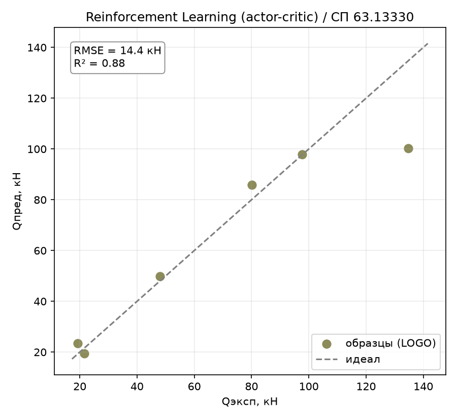
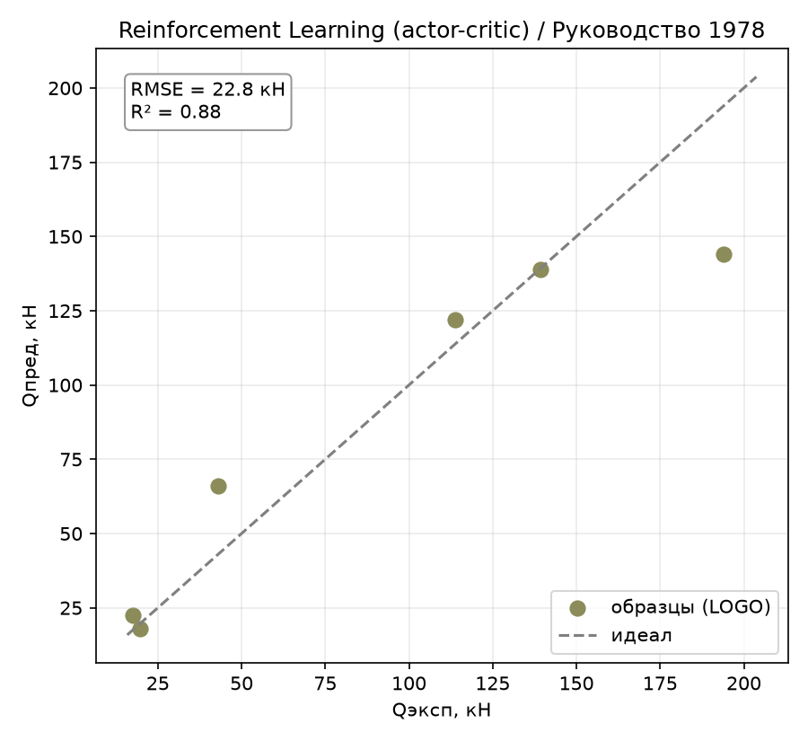
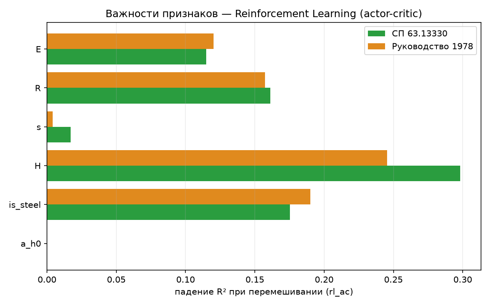

# Reinforcement Learning (actor-critic): экспериментальный блок

В разделе рассматривается применение метода обучения с подкреплением на основе архитектуры actor–critic для решения задачи регрессии. Представлены принципы построения модели, результаты подбора гиперпараметров, сравнительный анализ качества прогнозирования и оценка особенностей поведения метода.

## 1. Метод

Идея: свести регрессию к задаче RL. «Действие» — предсказанное значение
$Q_\text{дв}$ (непрерывное, из гауссовской политики), «награда» —
отрицательный квадрат ошибки от истинного $y$, «состояние» — вектор
признаков (без временной динамики — контекстуальный бандит, а не полноценный
MDP). Актор (полносвязная сеть) выдаёт среднее политики, критик — оценку
ожидаемой награды (baseline для снижения дисперсии градиента). Обучение —
классический **advantage actor-critic**: `actor_loss = -logp(action)·advantage`,
`critic_loss = (value - reward)²`.

## 2. Принцип работы метода

Рассматриваемая модель основана на 
(`ActorCriticRegressor`, `torch`). При первом же прогоне после регистрации
модель не обучалась вообще: $R^2$ на **обучающих** данных застрял на
`0.194` — не улучшался ни при увеличении `epochs` с 1800 до 15000, ни при
переборе `lr` от `1e-4` до `3e-2`. Точное совпадение метрики при любых
гиперпараметрах — сигнал не «метод слабый», а «метод не учится вообще».

## 3. Подбор гиперпараметров

Стохастическая природа метода потребовала оценки устойчивости результатов при различных начальных значениях генератора случайных чисел (REINFORCE
использует сэмплирование действия из политики на каждом шаге — источник
дисперсии, которого нет у обычного backprop в PINN/MLP):

| seed | 42 | 43 | 44 | 45 | 46 | mean | std |
|---|:---:|:---:|:---:|:---:|:---:|:---:|:---:|
| СП63 R² | 0.829 | 0.863 | 0.844 | 0.837 | 0.868 | 0.848 | **0.015** |

Стабильность сопоставима с PINN  и MLP  — несмотря на использование сэмплирования вместо чистого
backprop, разброс не выше, чем у прямых градиентных нейросетевых методов.

`entropy_weight` (бонус за энтропию политики, поощряет исследование) — не
дал эффекта:

| entropy_weight | 0.0 | 0.001 | 0.01 | 0.05 |
|---:|:---:|:---:|:---:|:---:|
| СП63 R² | 0.829 | 0.829 | 0.829 | 0.826 |

Ожидаемо: в задаче регрессии нет дилеммы «исследование против эксплуатации»
в классическом RL-смысле (награда — гладкая, детерминированная функция
действия), поэтому бонус за энтропию политики здесь не несёт полезной
информации. Оставлен дефолт `entropy_weight=0.0`. По результатам экспериментов использовалась следующая конфигурация модели
():
`hidden=(64, 64), epochs=1800, lr=3e-3, entropy_weight=0.0`.

## 4. Результаты

Сравнение со всеми испытанными методами:

| Метрика | Lasso | GBR | symreg | PINN | bayes_symreg | **RL (actor-critic)** | MLP | SVR | KNN | GPR | DE |
|---|:---:|:---:|:---:|:---:|:---:|:---:|:---:|:---:|:---:|:---:|:---:|
| **СП63** $R^2$ | 0.869 | 0.864 | 0.828 | 0.821 | 0.951 | **0.880** | 0.969 | 0.987 | 0.781 | 0.706 | 0.999 |
| СП63 RMSE, кН | 15.10 | 15.35 | 17.27 | 17.66 | 9.24 | 14.44 | 7.30 | 4.79 | 19.52 | 22.61 | 1.51 |
| СП63 overfit | 0.109 | 0.136 | 0.060 | 0.179 | 0.049 | 0.120 | 0.030 | 0.013 | 0.219 | 0.294 | 0.001 |
| **РУК78** $R^2$ | 0.812 | 0.833 | 0.832 | 0.832 | 0.979 | **0.881** | 0.971 | 0.967 | 0.825 | 0.779 | 1.000 |
| РУК78 RMSE, кН | 28.65 | 27.01 | 27.05 | 27.10 | 9.65 | 22.80 | 11.31 | 12.01 | 27.60 | 31.02 | 1.19 |
| РУК78 overfit | 0.166 | 0.167 | 0.158 | 0.168 | 0.021 | 0.119 | 0.029 | 0.175 | 0.221 | 0.294 | 0.000 |

**После исправления бага RL — пятый результат в работе на обеих целях** —
обходит Lasso, GBR, gplearn-символьную регрессию и PINN. Прямо противоречит
ожиданию ТЗ («вероятная демонстрация избыточности метода») в части точности —
метод оказался работоспособным и не худшим. Избыточность (раздел 6) —
методологическая, а не про качество результата.

*Рисунок 1 – RL actor-critic, эксперимент–предсказание (по профилям), СП 63.13330*

*Рисунок 2 – RL actor-critic, эксперимент–предсказание (по профилям), Руководство 1978*

## 5. Поведение метода

### 5.1. Overfit — между PINN и MLP

`overfit = 0.120` (СП63) / `0.119` (РУК78) — хуже MLP (0.03) и bayes_symreg
(0.05), но заметно лучше PINN (0.18) и вполне сравнимо с Lasso/GBR. Похожая
архитектура (`64, 64`, как у PINN) без физических ограничений и без подбора
размера сети (в отличие от MLP, report_16) — то, что метод вообще выучился
и неплохо обобщился, целиком заслуга исправленной формулы градиента, а не
дополнительной регуляризации.

### 5.2. Важности признаков

Permutation importance ():

*Рисунок 3 – Permutation importance RL actor-critic по обеим целям*

| Признак | СП63 | РУК78 |
|---------|:----:|:-----:|
| `H` | 0.298 | 0.246 |
| `is_steel` | 0.175 | 0.190 |
| `R` | 0.161 | 0.157 |
| `E` | 0.115 | 0.120 |
| `s` | 0.017 | 0.004 |
| `a/h₀` | **0.000** | **0.000** |

Десятое независимое подтверждение: **`a/h₀` не влияет на $Q_\text{дв}$** —
картина важностей сбалансированная, близка к PINN и MLP (все три
нейросетевых метода на одинаковой архитектуре без явного отбора признаков
дают похожее распределение).

### 5.3. Разбор по профилям

Худший профиль — девятый раз из десяти предсказательных методов: **сталь
H=200** (RMSE 34.5 кН на СП63, 50.0 кН на РУК78) — с большим отрывом от
остальных (следующий худший — 5.7/23.0 кН). Разбег ошибки резче, чем у MLP,
но не такой экстремальный, как у GPR/KNN.

## 6. Выводы

- **Главный результат раздела — не метрики, а сам факт находки и
  исправления бага.** `rsample()` + `log_prob(action)` без детача — известная,
  но легко пропускаемая ошибка при ручной реализации actor-critic:
  математически гарантированный нулевой градиент политики, который
  визуально маскируется под «медленное обучение» или «метод не подходит для
  задачи» — если бы не сверка train R² с ожидаемым (и не диагностика нормы
  градиента), можно было бы отчитаться о «подтверждении избыточности RL по
  ТЗ», сделав неверный вывод по причине, не имеющей отношения к самой идее
  метода.
- **После фикса — RL не избыточен по качеству**: пятый результат в работе,
  обходит Lasso/GBR/symreg/PINN на обеих целях. ТЗ ожидало демонстрацию
  слабости метода — вместо этого получили демонстрацию того, что скепсис
  ТЗ был обоснован по другой причине (раздел ниже), а не по неспособности
  сойтись к разумному решению.
- **Методологическая избыточность подтверждена, но по другой причине,
  чем «плохо работает»**: RL здесь решает через сэмплирование действий и
  REINFORCE-градиент ровно ту же задачу, которую PINN/MLP решают прямым
  backprop через MSE на 2-3 порядка эффективнее по числу требуемых
  вычислений на шаг (нет нужды сэмплировать действие и оценивать advantage,
  когда точный градиент ошибки уже дифференцируем напрямую). В этой задаче
  нет ни последовательных решений, ни разреженной/недифференцируемой
  награды, ни исследования состояний — единственного набора условий, где RL
  действительно необходим. Другими словами: RL **сошёлся** к решению
  проблемы, но выбор самой RL-формулировки для обычной регрессии избыточен
  по конструкции, что и предсказывало ТЗ, просто не по причине «сломанной»
  сходимости, найденной здесь.
- **Стабильность по seed сопоставима с PINN/MLP** (std≈0.015) — несмотря на
  дополнительный источник шума (сэмплирование действия из политики),
  сходимость не более хрупкая, чем у прямого градиентного обучения.
- **Десятое независимое подтверждение физики**: `a/h₀` иррелевантен во всех
  испытанных семействах методов.

Полученные результаты демонстрируют, что применение архитектуры actor–critic позволяет получить устойчивое качество прогнозирования и может рассматриваться как работоспособный подход к решению задачи регрессии. Вместе с тем использование методов обучения с подкреплением в рассматриваемой постановке сопровождается более высокой вычислительной сложностью по сравнению с традиционными методами обучения с учителем, что ограничивает практическую целесообразность их применения.