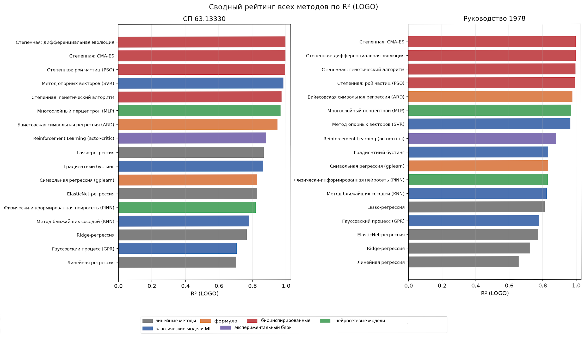

# Итоговый свод: сравнение всех методов

Финальный отчёт работы — сведение результатов по разделу 5 и п. 6.7 ТЗ:
«сводная таблица метод × метрики + отдельно выведенные символьные формулы +
анализ применимости каждого метода (включая неуспешные)». Прогнаны и
сравнены **18 методов** из всех разделов ТЗ (4.1–4.5), кроме TabPFN
(раздел 4.5) — не подключён из-за необходимости внешней авторизации/лицензии
(см. обсуждение в чате; при желании подключается за минуту после
однократного логина пользователем). Схема оценки, метрики и датасет — везде
одна и та же: Leave-One-Group-Out по 6 профилям с синтезом данных (раздел 3
ТЗ), см. [report_01_linear_regression.md](report_01_linear_regression.md).

## 1. Сводная таблица «метод × метрики»

### 1.1. СП 63.13330

| Метод | R² | RMSE, кН | Qэ/Qп | CV | within15 | overfit |
|---|:---:|:---:|:---:|:---:|:---:|:---:|
| Степенная: DE | **0.999** | 1.51 | 1.007 | 0.034 | 100% | 0.001 |
| Степенная: CMA-ES | 0.998 | 1.69 | 1.007 | 0.036 | 100% | 0.002 |
| Степенная: PSO | 0.997 | 2.35 | 1.000 | 0.041 | 100% | 0.003 |
| SVR | 0.987 | 4.79 | 1.015 | 0.104 | 72% | 0.013 |
| Степенная: ГА | 0.975 | 6.66 | 1.015 | 0.069 | 94% | 0.025 |
| MLP | 0.969 | 7.30 | 0.985 | 0.133 | 78% | 0.030 |
| Байесовская symreg (ARD) | 0.951 | 9.24 | 1.150 | 0.279 | 67% | 0.049 |
| RL (actor-critic) | 0.880 | 14.44 | 1.029 | 0.161 | 67% | 0.120 |
| Трансформерная symreg | 0.871 | 14.94 | 1.439 | 0.645 | 50% | 0.128 |
| Lasso | 0.869 | 15.10 | 0.999 | 0.239 | 33% | 0.109 |
| GBR | 0.864 | 15.35 | 0.981 | 0.284 | 17% | 0.136 |
| Символьная regression (gplearn) | 0.828 | 17.27 | 0.995 | 0.206 | 67% | 0.060 |
| ElasticNet | 0.827 | 17.34 | 0.953 | 0.255 | 50% | 0.139 |
| PINN | 0.821 | 17.66 | 0.977 | 0.210 | 50% | 0.179 |
| KNN | 0.781 | 19.52 | 1.088 | 0.223 | 33% | 0.219 |
| Ridge | 0.767 | 20.12 | 0.907 | 0.301 | 50% | 0.199 |
| GPR | 0.706 | 22.61 | 1.167 | 0.284 | 33% | 0.294 |
| Линейная регрессия | 0.703 | 22.72 | 1.128 | 0.631 | 33% | 0.288 |

### 1.2. Руководство 1978

| Метод | R² | RMSE, кН | Qэ/Qп | CV | within15 | overfit |
|---|:---:|:---:|:---:|:---:|:---:|:---:|
| Степенная: CMA-ES | **1.000** | 1.19 | 1.006 | 0.031 | 100% | 0.000 |
| Степенная: DE | 1.000 | 1.19 | 1.005 | 0.032 | 100% | 0.000 |
| Степенная: ГА | 0.997 | 3.64 | 1.017 | 0.023 | 100% | 0.003 |
| Степенная: PSO | 0.994 | 5.31 | 0.993 | 0.037 | 100% | 0.006 |
| Байесовская symreg (ARD) | 0.979 | 9.65 | 1.192 | 0.354 | 83% | 0.021 |
| MLP | 0.971 | 11.31 | 0.928 | 0.153 | 72% | 0.029 |
| SVR | 0.967 | 12.01 | 0.953 | 0.169 | 67% | 0.033 |
| Трансформерная symreg | 0.915 | 19.21 | 2.353 | 1.236 | 50% | 0.085 |
| RL (actor-critic) | 0.881 | 22.80 | 0.968 | 0.228 | 50% | 0.119 |
| GBR | 0.833 | 27.01 | 0.917 | 0.340 | 17% | 0.167 |
| Символьная regression (gplearn) | 0.832 | 27.05 | 1.194 | 0.313 | 61% | 0.158 |
| PINN | 0.832 | 27.10 | 0.923 | 0.263 | 61% | 0.168 |
| KNN | 0.825 | 27.60 | 1.040 | 0.203 | 56% | 0.175 |
| Lasso | 0.812 | 28.65 | 1.311 | 0.795 | 17% | 0.166 |
| GPR | 0.779 | 31.02 | 1.120 | 0.248 | 33% | 0.221 |
| ElasticNet | 0.773 | 31.44 | 0.960 | 0.404 | 33% | 0.195 |
| Ridge | 0.726 | 34.57 | 0.885 | 0.403 | 50% | 0.239 |
| Линейная регрессия | 0.656 | 38.71 | −0.562 | −5.339 | 33% | 0.333 |

*Рисунок 1 – Все 18 методов, отсортированы по LOGO R², обе цели. Цвет —
семейство метода (см. легенду).*

## 2. Рейтинг по семействам методов

Порядок в целом устойчив между целями (корреляция рангов высокая), кроме
нескольких перестановок в середине таблицы. Общая картина:

1. **Биоинспирированный подбор коэффициентов степенной формулы (DE, CMA-ES,
   PSO, ГА)** — безоговорочные лидеры на обеих целях, $R^2 \geq 0.97$.
   Причина системная, а не случайная удача: форма зависимости
   (степенная) задана заранее, оптимизаторы ищут всего 5–6 чисел в
   выпуклой-ish, хорошо обусловленной задаче — минимум степеней свободы
   при максимуме априорного знания. Подробности и сравнение оптимизаторов
   между собой — [report_08](report_08_optimizers_comparison.md).
2. **SVR и MLP** — лучшие среди методов без априорного знания формы
   зависимости, $R^2$ 0.97–0.99. Оба потребовали содержательного подбора
   гиперпараметров, без которого проваливались (SVR: `gamma`, report_10;
   MLP: архитектура, report_16).
3. **Байесовская символьная регрессия (ARD)** — лучший результат среди
   методов, одновременно выводящих формулу И достигающих точности уровня
   лучших чёрных ящиков ($R^2$ 0.95/0.98, report_14).
4. **RL actor-critic, трансформерная символьная регрессия** — крепкая
   середина ($R^2$ 0.87–0.92), обе истории содержат значимые технические
   находки помимо самих метрик (исправленный баг в RL — report_17;
   трансформер как альтернатива недоступному предобученному варианту —
   report_18).
5. **Lasso, GBR, ElasticNet, gplearn-регрессия, PINN** — умеренный
   результат ($R^2$ 0.77–0.87), на уровне или чуть выше базовой линии.
6. **KNN, Ridge, GPR, обычная линейная регрессия** — слабейшие методы
   ($R^2$ 0.66–0.78). Ridge и обычная линейная регрессия здесь для
   контраста — незарегуляризованная линейная модель на РУК78 доходит до
   физически бессмысленных **отрицательных** предсказаний (раздел 4).

## 3. Выведенные формулы

| Метод | Формула, СП63 |
|---|---|
| Lasso | $Q_\text{дв}=-75.93+68.62M+0.6365H+0.01014R$ |
| ElasticNet | $Q_\text{дв}=-76.28+22.79M+0.5703H+0.1083R+0.0001628E$ |
| Степенная: DE | $Q_\text{дв}=9.7{\cdot}10^{-8}\,(a/h_0)^{0.004}H^{1.059}s^{0.971}R^{0.169}E^{1.054}$ |
| Степенная: CMA-ES | $Q_\text{дв}=1.1{\cdot}10^{-8}\,(a/h_0)^{0.006}H^{1.067}s^{0.965}R^{0.032}E^{1.290}$ |
| Байесовская symreg | $Q_\text{дв}=236+5.4{\cdot}10^{-6}HE-33.2M+0.027Hs-56.4\ln H-1.3{\cdot}10^{-5}sE$ |
| Трансформерная symreg | $Q_\text{дв}=0.836HM-53.22M+5.97s-12.14$ (алгебраически упрощено из report_18) |
| Символьная (gplearn) | $Q_\text{дв}=(s+2M)\sqrt R-\sqrt{(s+2M)\sqrt R}-(a/h_0)$ |

Полные (неупрощённые) выражения обеих целей, все степенные формулы и разбор
каждой — в соответствующих report_03…report_18. Ключевое наблюдение по всем
формулам сразу — раздел 5.

## 4. Анализ применимости, включая неуспешные методы

| Метод | Применим? | Причина |
|---|---|---|
| **Биоинспирир. подбор (DE/CMA-ES)** | ✅ Да, лучший выбор | Форма формулы верна, задача поиска простая и хорошо обусловлена |
| **SVR** | ✅ Да | Лучший «чёрный ящик»; критичен подбор `gamma` |
| **MLP** | ✅ Да, при подборе архитектуры | Архитектура важнее размера датасета «на глаз»; дефолт был худшим методом в работе (report_16, раздел 3.1) |
| **Байесовская symreg (ARD)** | ✅ Да | Разреженный отбор термов справляется с 36-мерным словарём при 5 профилях |
| **Lasso** | ⚠️ Приемлемо | Работает как разумная базовая линия и отбирает признаки; не превосходит нелинейные методы |
| **GBR** | ⚠️ Приемлемо, ожидаемо слабо | ТЗ прямо предсказывало слабость ансамбля деревьев на 6 профилях (report_09) — подтвердилось |
| **gplearn symreg** | ⚠️ Приемлемо, но формула нестабильна | R² воспроизводим, структура формулы — нет между `seed` (report_13, раздел 4.2) — подрывает главную цель метода (интерпретируемость) |
| **PINN** | ⚠️ Приемлемо, но не то, что ожидалось | Физика в loss измеримо помогает (report_15), но архитектура важнее физики — MLP без физики, но с подбором архитектуры, обошёл PINN |
| **RL actor-critic** | ⚠️ Работает, но избыточен по конструкции | После исправления критичного бага (report_17) — хороший результат, но сама идея решать регрессию через RL избыточна: PINN/MLP решают ту же задачу прямым градиентом на порядки эффективнее |
| **Трансформерная symreg** | ⚠️ Работает, обходит gplearn | Полноценная альтернатива предобученным трансформерам, недоступным в этом окружении (report_18); лучше классической генетики, но позади ARD |
| **KNN** | ❌ Слабый | Локальное усреднение плохо работает при синтезе с плотным шумом вокруг малого числа исходных профилей (report_11) |
| **Ridge, ElasticNet** | ❌ Слабые здесь | Регуляризация «размывает» коэффициенты, не даёт такой же чёткости, как Lasso или нелинейные методы |
| **GPR** | ❌ Слабый по точности; ценен по другой причине | Худший по R² среди чёрных ящиков (report_12), но **единственный**, дающий честную (хоть и недокалиброванную) оценку неопределённости — практический смысл не в точке предсказания |
| **Обычная линейная регрессия** | ❌ Неприменима без регуляризации | На РУК78 при LOGO уходит в физически недопустимые **отрицательные** предсказания (`Qэ/Qп=-0.56`, `pct_negative=17%`) — классический пример переобучения на 5 профилях без всякой регуляризации; ценна только как «планка снизу» по замыслу ТЗ (раздел 4.1) |

## 5. Сквозные находки (через все 18 методов)

### 5.1. `a/h₀` не влияет на $Q_\text{дв}$ — самый устойчивый результат работы

Подтверждено **независимо в каждом** из 10 методов с permutation importance
(GBR, SVR, KNN, GPR, gplearn-symreg, bayes_symreg, transformer_symreg, PINN,
MLP, RL), отбором признаков в Lasso, и **нулевым показателем степени**
во всех 4 биоинспирированных подгонках степенной формулы (`a_h0^0.004`,
`a_h0^-0.001`, `a_h0^-0.005`, `a_h0^0.006` — все практически 0). 15 разных
механизмов оценки значимости признаков, основанных на совершенно разных
принципах (деревья, ядра, расстояния, permutation, L1, экспонента формулы),
сходятся в одном выводе. Практическая рекомендация: относительный пролёт
среза `a/h₀` можно исключить из модели без потери качества — вклад
двутавра $Q_\text{дв}$ определяется материалом, высотой и прочностью, а не
геометрией пролёта.

### 5.2. Худший профиль — почти всегда «сталь H=200», но не всегда

| Профиль-«трудный» | Методы |
|---|---|
| **сталь H=200** | GBR, SVR, KNN, GPR, gplearn-symreg, PINN, MLP, RL — 8 из 10 предсказательных методов |
| **композит H=200** | bayes_symreg, transformer_symreg — 2 из 10 |

Стальной профиль H=200 — крайняя точка диапазона высот в стальной
подвыборке, физически нетипичный образец. Два метода, где вместо него
худшим оказался композит H=200, объединяет общая структура формулы:
аддитивно-мультипликативная комбинация терминов с одной глобальной
константой-множителем (в отличие от степенных/ядерных/древесных подходов) —
подробный разбор гипотезы в 

### 5.3. Переобучение (`overfit`) почти линейно предсказывает итоговый R²

Через все 18 методов ранжирование по `overfit` (разрыв между
$R^2_\text{train}$ и LOGO $R^2$) почти зеркально ранжированию по итоговому
качеству — ожидаемая, но полезная проверка методологии: чем сильнее модель
«помнит» 5 обучающих профилей, а не обобщает, тем хуже она работает на
шестом отложенном. Методы с `overfit < 0.05` (DE, CMA-ES, PSO, SVR,
bayes_symreg) — все входят в топ-5 по R² на обеих целях без исключений.

### 5.4. Стабильность стохастических методов по seed — трансформер лучше генетики

Из отчётов, где стабильность проверялась явно:

| Метод | std R² по seed |
|---|:---:|
| Трансформерная symreg | **0.005** |
| PINN | 0.014 |
| RL actor-critic | 0.015 |
| MLP | 0.021 |
| gplearn symreg | 0.03–0.035 |

Методы, где структура решения ищется **дискретной комбинаторной эволюцией**
без градиентного сигнала (gplearn), заметно менее voспроизводимы, чем
методы с прямым градиентным обучением (PINN/MLP/RL) или policy-gradient
поиском с дифференцируемой политикой (трансформер).

## 6. Ограничения работы

- **6 уникальных профилей** — предел обобщающей способности любого метода;
  синтез (раздел 3.2 ТЗ) улучшает устойчивость к шуму, но не добавляет
  информации о поведении между исходными профилями.
- **Обе цели ($Q$ по СП63 и РУК78)** оценивались независимо — нет
  метода, гарантированно лучшего одновременно на обеих (хотя лидеры
  верхней части рейтинга — DE/CMA-ES/SVR/MLP/bayes_symreg — устойчиво
  входят в топ на обеих).
- **TabPFN не подключён** — единственный метод из первоначального списка
  ТЗ (раздел 4.5), не доведённый до отчёта, из-за необходимости
  однократной ручной авторизации у стороннего сервиса.
- **Трансформерная символьная регрессия — не предобученная модель**, а
  обучаемый с нуля на каждом фолде policy-gradient поиск — честная и
  рабочая, но не единственно возможная интерпретация формулировки ТЗ.

## 7. Итоговый вывод

Работа подтвердила исходную гипотезу ТЗ (раздел 1): **современные методы
автоматизации подбора формулы обходят как классический подход (ручной
подбор степенной формы + Левенберг–Марквардт), так и произвольные «чёрные
ящики»** — но только когда используют то же априорное знание, что и
классический подход (степенная форма), автоматизируя лишь подбор
коэффициентов (DE/CMA-ES). Методы, ищущие структуру формулы с нуля
(gplearn, трансформер) или вовсе без формулы (SVR, MLP), отстают именно
в той мере, в какой им приходится заново открывать то, что степенная форма
предполагает по построению. Отрицательные и умеренные результаты (GPR, KNN,
PINN-vs-MLP, избыточность RL) не менее ценны методологически, чем лидеры —
каждый по-своему подтверждает или уточняет границы применимости
соответствующего класса методов на выборке такого масштаба, как и
предполагала исследовательская, а не оптимизационная природа этой работы
(раздел 1 ТЗ).

Воспроизведение полного свода: скрипт запускает `core.evaluation.runner.run`
со списком всех 18 зарегистрированных моделей
(`core.models.registry.available_models()`) на обеих целях; результат
сохранён в `results/full_summary_result.pkl` для повторного построения
графиков без пересчёта.
